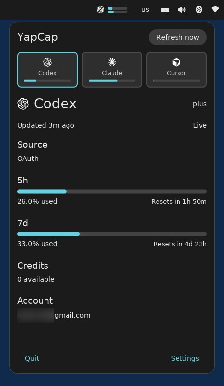

<div align="center">

# YapCap

**A native COSMIC panel applet that shows local usage state for Codex, Claude Code, and Cursor.**



[](https://github.com/TopiCsarno/yapcap/actions/workflows/ci.yml)
[](https://github.com/TopiCsarno/yapcap/releases/latest)
[](LICENSE)

[Report a bug](https://github.com/TopiCsarno/yapcap/issues)

</div>

---


## What it does

YapCap lives in your COSMIC panel and reads local credentials to show how much of your AI coding quota you've used this session, week, or billing cycle — without sending anything to a third party.

- **Codex** — 5-hour and weekly windows, credit balance
- **Claude Code** — session utilization and reset time
- **Cursor** — plan usage and billing cycle end

All data is fetched directly from the provider APIs using credentials already on your machine. No telemetry, no cloud sync, no account needed beyond the ones you already have.

## Requirements

- Pop!_OS (or another distro running COSMIC)
- At least one of: Codex, Claude Code, or Cursor logged in locally
- Rust toolchain (stable) only if you build from source

## Install

### install with apt (recommended)

Download the `.deb` package from the [latest release](https://github.com/TopiCsarno/yapcap/releases/latest), then install it:

```bash
sudo apt install ./yapcap_*.deb
```

Restart your COSMIC session (or log out and back in) so the panel picks up the new applet, then add **YapCap** from the panel applet picker.

### Binary tarball + install script

Download the binary tarball from the [latest release](https://github.com/TopiCsarno/yapcap/releases/latest), extract it, and run the included installer:

```bash
tar -xzf yapcap-*-x86_64-linux.tar.gz
cd yapcap-*-x86_64-linux
./install.sh
```

The script installs the bundled release binary to `~/.local/bin/yapcap-cosmic` and registers the desktop entry and icon under `~/.local/share/`.

### From source

This path requires a local Rust toolchain.

```bash
git clone https://github.com/TopiCsarno/yapcap
cd yapcap
./install.sh
```

For source checkouts, the script builds the release binary before installing it.

## Providers

### Codex
Reads OAuth token from `~/.codex/auth.json` and calls `chatgpt.com/backend-api/wham/usage`.

### Claude Code
Reads OAuth token from `~/.claude/.credentials.json` (scope `user:profile`) and calls `api.anthropic.com/api/oauth/usage`.

### Cursor
Imports the `WorkosCursorSessionToken` cookie from a supported local browser and calls `cursor.com/api/usage-summary`. Supported browsers: Brave, Chrome, Edge, Firefox.

## Configuration

| Path | Purpose |
| --- | --- |
| `~/.config/yapcap/config.toml` | Per-provider enable flags, browser selection |
| `~/.cache/yapcap/snapshots.json` | Last successful response per provider |
| `~/.local/state/yapcap/logs/yapcap.log` | Log output |

Browser selection can be overridden per-run with `YAPCAP_CLAUDE_BROWSER` or `YAPCAP_CURSOR_BROWSER` (`brave`, `chrome`, `edge`, `firefox`).

To hide a provider you don't use, open the popup → **Settings** and toggle it off. The change is written straight to `config.toml`:

```toml
codex_enabled = true
claude_enabled = true
cursor_enabled = false
```

Disabled providers are hidden from the popup entirely.

## Updates

YapCap checks GitHub for a newer release on startup and surfaces the result in **Settings → About**. If a new version is available, the About section shows a link to the release page. No automatic download or install — just a nudge so you know to pull.

## Privacy

YapCap reads local files and talks directly to provider APIs over HTTPS. It does not send data anywhere else. Logs avoid credentials, cookies, and bearer tokens — if you find one leaking, that's a bug, please file it.

## Troubleshooting

- **Applet doesn't appear after install** — restart the COSMIC session (log out and back in).
- **"Auth required" on Codex or Claude** — log in with the respective CLI to refresh the OAuth token.
- **Cursor shows no data** — make sure you're logged in to `cursor.com` in a supported browser, then quit that browser so YapCap can read its cookie DB.
- **Stale data** — a transient refresh failure keeps the last good snapshot visible and marks it stale. Click refresh once the network or provider is back.

Logs at `~/.local/state/yapcap/logs/yapcap.log` are usually the fastest way to see what's going on.

## Limitations

- COSMIC only. No GNOME, KDE, or tray fallback.
- Three providers only. Not designed to be extensible.
- No historical charts, notifications, or cost analytics.
- Cursor cookie import requires the browser to be closed (its cookie DB is locked while running).

## License

MIT — see [LICENSE](LICENSE).
