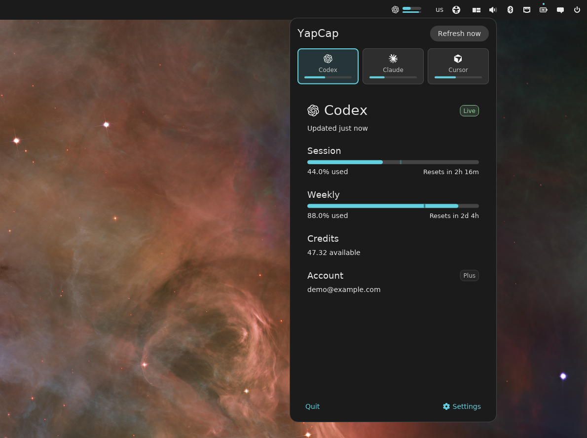
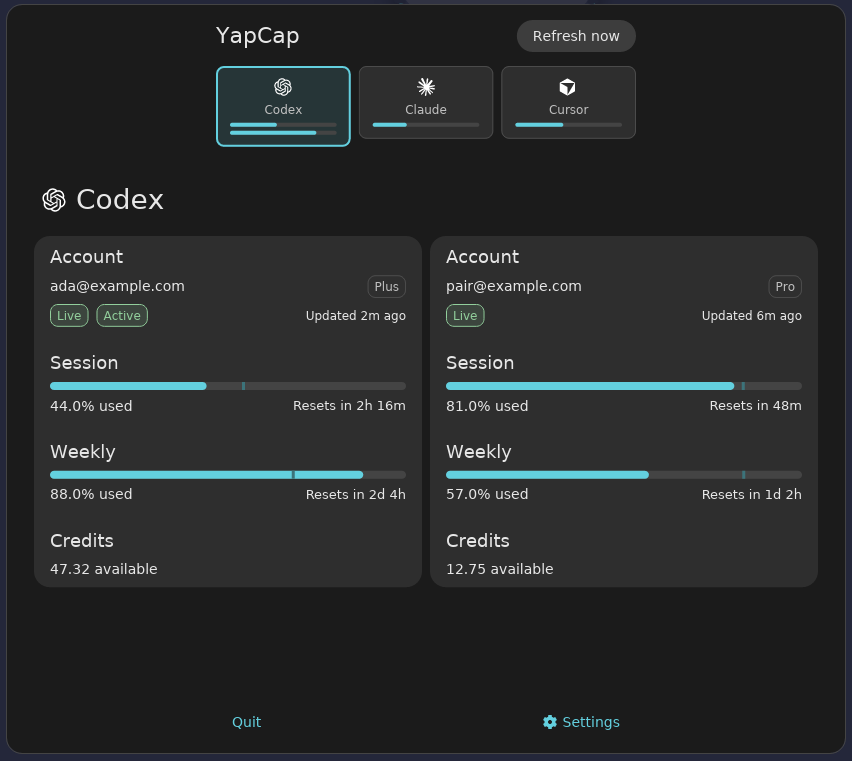
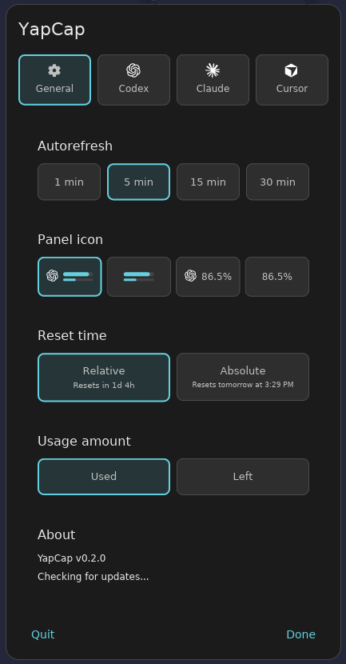
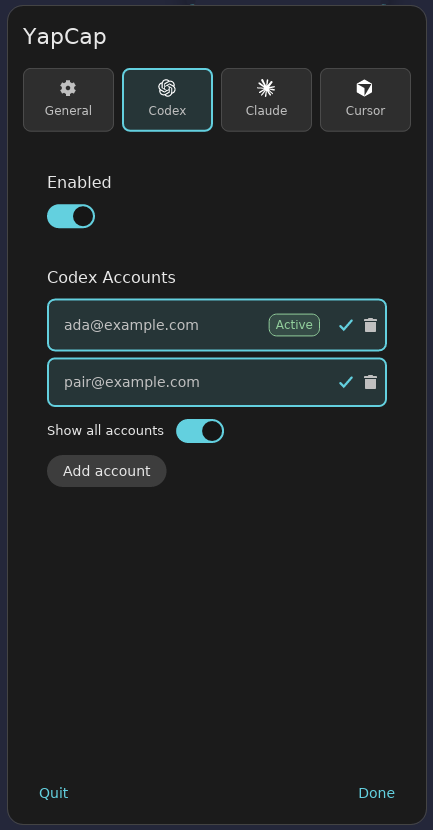
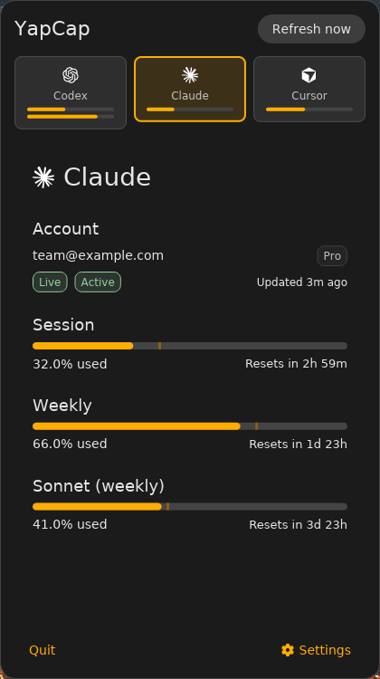
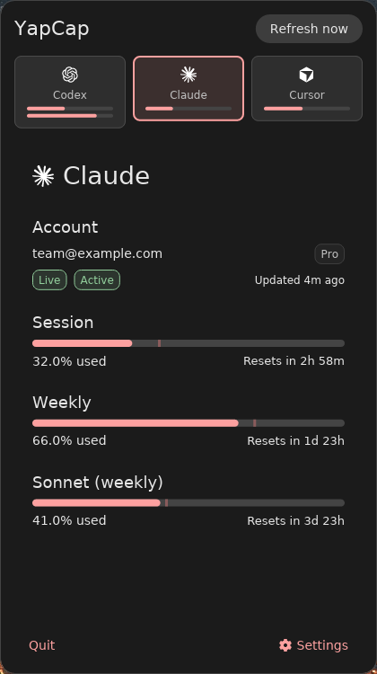
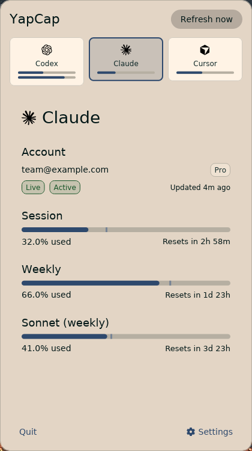
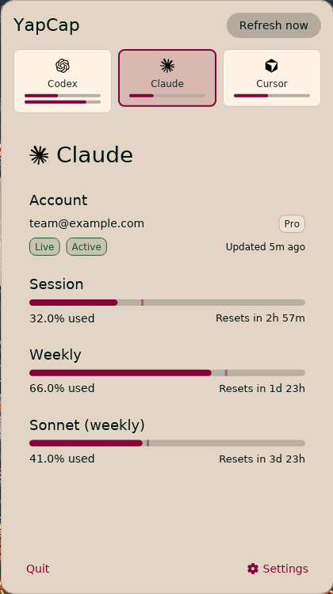

<div align="center">

# YapCap

**A native COSMIC panel applet that tracks AI coding quota for Codex, Claude Code, and Cursor.**



[](https://github.com/TopiCsarno/yapcap/actions/workflows/ci.yml)
[](https://github.com/TopiCsarno/yapcap/releases/latest)
[](LICENSE)

[Report a bug](https://github.com/TopiCsarno/yapcap/issues)

</div>

---

## What it does

YapCap lives in your COSMIC panel and shows how much of your AI coding quota you've used — without sending anything to a third party. All data is fetched directly from provider APIs using credentials already on your machine. No telemetry, no cloud sync, no separate account needed.

## Highlights

- **Three providers**
    - **Codex** — 5h/weekly windows + credits
    - **Claude Code** — session/weekly/extra usage
    - **Cursor** — plan usage + billing cycle end
- **Multi-account view** — add, switch, and remove accounts per provider. Turn on **Show all accounts** to lay out each selected account side by side in the popup and show one usage-bar group per account in the panel.
- **In-app login** — guided login flows for Codex, Claude, and Cursor without leaving YapCap or opening a terminal
- **Auto-discovery** — on first launch, imports existing Codex and Claude CLI credentials and Cursor browser sessions automatically
- **Configurable panel** — logo+bars, bars only, logo+%, or %-only; used/left toggle; relative or absolute reset times

## Screenshots

<table>
<tr>
<td align="center" valign="top" colspan="2" width="50%">

<strong>Popup — usage detail</strong><br />
Multi-account view: two Codex columns with <strong>Show all accounts</strong> on.<br /><br />


</td>
<td align="center" valign="top" width="25%">

<strong>Settings — General</strong><br />


</td>
<td align="center" valign="top" width="25%">

<strong>Settings — Accounts</strong><br />


</td>
</tr>
<tr>
<td colspan="4" align="center">

<strong>COSMIC system theme</strong><br />
YapCap follows your COSMIC system theme—the popup and panel pick up light or dark mode and accent colors from your desktop appearance settings.

</td>
</tr>
<tr>
<td align="center" valign="top" width="25%">

</td>
<td align="center" valign="top" width="25%">

</td>
<td align="center" valign="top" width="25%">

</td>
<td align="center" valign="top" width="25%">

</td>
</tr>
</table>

## Install

### apt (Debian/Ubuntu/Pop!\_OS)

```bash
sudo apt install ./yapcap_*.deb
```

### rpm (Fedora/openSUSE)

```bash
sudo rpm -i ./yapcap_*.rpm
```

Download packages from the [latest release](https://github.com/TopiCsarno/yapcap/releases/latest).

### From source

Requires COSMIC development dependencies and a Rust toolchain.

```bash
git clone https://github.com/TopiCsarno/yapcap
cd yapcap
just install
```

## Quickstart

1. After installing, restart your COSMIC session (log out and back in).
2. Add **YapCap** from the panel applet picker.
3. On first launch, YapCap auto-imports accounts it can find — Codex from `~/.codex`, Claude from `~/.claude`, and Cursor from any supported browser (Brave, Chrome, Edge, Firefox).
4. Click the panel button to open the popup.
5. To add more accounts or switch between them, open the popup → **Settings → [Provider]**.

---

## Accounts

Each provider supports multiple accounts. Manage them from the popup under **Settings → [Provider]**.

- **Add account** — triggers the provider's own login flow (Codex CLI browser login, `claude auth login`, or an isolated managed browser profile for Cursor) without leaving YapCap.
- **Switch account** — tap any account row to make it active; the panel and popup update immediately.
- **Remove account** — deletes only YapCap's copy of the credentials. Your original browser profiles and CLI configs are never touched.

Each provider keeps at most one account per email address.

## Panel styles

Configured under **Settings → General**:

| Style | What's shown |
| --- | --- |
| Logo + bars | Provider icon and two compact usage bars (default) |
| Bars only | Two usage bars, no icon |
| Logo + percent | Provider icon and the headline window as a percentage |
| Percent only | Headline percentage only |

## Display options

Also under **Settings → General**:

- **Usage format** — show quota as *used* (how much you've consumed) or *left* (how much remains).
- **Reset time format** — relative durations (`Resets in 2d 4h`) or absolute local times (`Resets Wednesday at 8:25 AM`).
- **Auto-refresh interval** — how often YapCap polls the provider APIs in the background.

Usage bars include a pace indicator: a vertical marker shows expected usage for the elapsed portion of the window so you can see at a glance whether you're running ahead or behind.

## Updates

YapCap checks GitHub for a new release on startup. If one is available, a red dot appears on the Settings icon and a link to the release page appears in **Settings → About**. No automatic download or install.

## Privacy

YapCap reads local credential files and calls provider APIs directly over HTTPS. For Claude Code it may run `claude auth status --json` to trigger a credential refresh; Claude Code manages its own OAuth flow. Logs never contain credentials, bearer tokens, or cookie values — if you find one leaking, please file a bug.

## Troubleshooting

- **Applet doesn't appear after install** — restart the COSMIC session (log out and back in).
- **Auth error on Codex** — open **Settings → Codex** and use the re-authenticate action, or run `codex login` in a terminal.
- **Auth error on Claude** — open **Settings → Claude** and add or re-authenticate the account. YapCap will run `claude auth login` for you.
- **Cursor shows no data** — quit your browser first (its cookie database is locked while running), then click **Refresh now**. If the session has expired, use **Settings → Cursor → Re-auth**.
- **Stale data** — a transient failure keeps the last good snapshot visible and marks it stale. Click **Refresh now** once the network or provider is back.

Logs at `~/.local/state/yapcap/logs/yapcap.log` are the fastest way to diagnose issues.

## File locations

| Path | Purpose |
| --- | --- |
| `~/.config/cosmic/com.topi.YapCap/v*/` | Settings (provider toggles, accounts, display options) |
| `~/.cache/yapcap/snapshots.json` | Cached usage state (loaded on startup) |
| `~/.local/state/yapcap/`{`codex`,`claude`,`cursor`}`-accounts/` | Managed credential copies |
| `~/.local/state/yapcap/logs/yapcap.log` | Log output |

## Limitations

- COSMIC only. No GNOME, KDE, or tray fallback.
- No historical charts, notifications, or cost analytics.
- Three providers only for now.

## License

MPL-2.0 — see [LICENSE](LICENSE).
