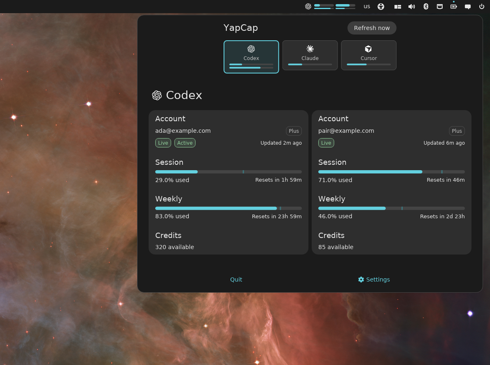
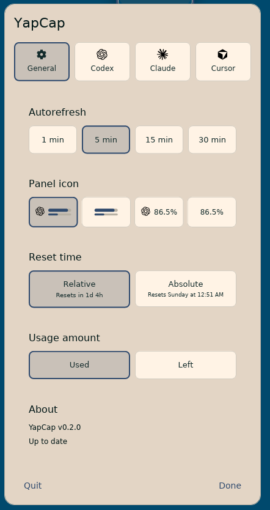
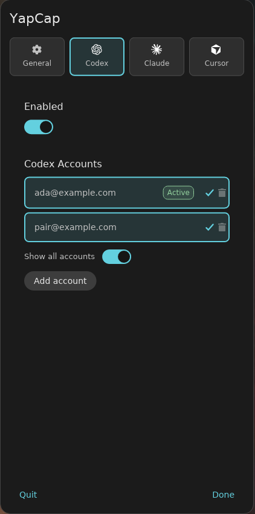
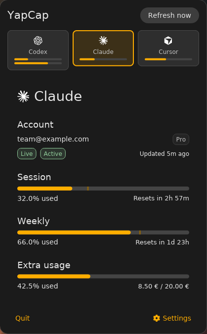
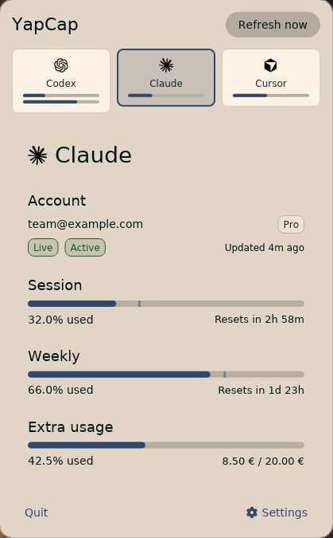
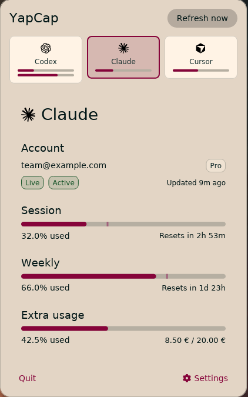

<div align="center">

# YapCap

**A native COSMIC panel applet that tracks AI coding quota for Codex, Claude Code, Cursor, Antigravity, Gemini, GitHub Copilot, Minimax, Z.AI Coding Plan, Kimi for Coding, OpenCode Go, and Grok.**



[](https://github.com/TopiCsarno/yapcap/actions/workflows/ci.yml)
[](https://github.com/TopiCsarno/yapcap/releases/latest)
[](LICENSE)

[Report a bug](https://github.com/TopiCsarno/yapcap/issues)

</div>

---

## What it does

YapCap lives in your COSMIC panel and shows how much of your AI coding quota you've used — without sending anything to a third party. All data is fetched directly from provider APIs using accounts you add in YapCap. No telemetry, no cloud sync, no separate account needed.

## Highlights

- 🤖 **Providers**
    - **Codex** — 5h/weekly windows + credits
    - **Claude** — session/weekly/extra usage
    - **Cursor** — total, Auto/Composer, and API usage
    - **Antigravity** — grouped Gemini and Claude/GPT model quota (5h + weekly)
    - **Gemini** — Pro / Flash / Lite quota bars (OAuth accounts only)
    - **GitHub Copilot** — Free chat/completions, paid premium interactions, or credits and spend for token-based billing
    - **Minimax** — API key usage tracking
    - **Z.AI Coding Plan** — global personal quota with 5-hour, weekly, and optional MCP windows
    - **Kimi for Coding** — API key usage tracking with weekly and rate-limit windows
    - **OpenCode Go** — API key usage tracking with 5-hour, weekly, and monthly windows
    - **Grok** — subscription usage shown as a weekly window + available prepaid credits
- 👥 **Multi-account support** — add, switch, and remove accounts per provider. The popup pages through stored accounts one at a time, while accounts marked for panel visibility can appear side-by-side as compact panel cells.
- 🔎 **Automatic discovery** — detected providers appear automatically, provider availability updates live, and an empty setup opens Manage providers. Gemini remains opt-in and must be enabled manually.
- 🔐 **In-app login** — guided browser login for Codex, Claude, Antigravity, Gemini, Copilot, and Grok; API-key forms for Minimax, Z.AI, Kimi, and OpenCode Go; Cursor scans the local IDE state.
- 🔑 **OpenCode integration** — compatible keys can optionally prefill Minimax, Z.AI, Kimi, and OpenCode Go forms; Codex and Copilot offer explicit OAuth imports. Credentials are copied only after confirmation and are never synchronized with OpenCode.
- ✅ **Active badge** — matches the host account for Codex, Claude, Cursor, Gemini, OpenCode Go, and Grok. Minimax and Kimi only mark legacy environment-source accounts when the corresponding environment key is present. Copilot, Antigravity, and Z.AI have no host Active badge.
- ⚙️ **Configurable panel** — logo+bars, bars only, logo+%, or %-only; used/left toggle; relative or absolute reset times.

## Screenshots

<table>
<tr>
<td align="center" valign="top" width="33%">


</td>
<td align="center" valign="top" width="33%">


</td>
<td align="center" valign="top" width="33%">


</td>
</tr>
<tr>
<td align="center" valign="top" width="33%">


</td>
<td align="center" valign="top" width="33%">


</td>
<td align="center" valign="top" width="33%">


</td>
</tr>
<tr>
<td align="center" valign="top" width="33%">


</td>
<td align="center" valign="top" width="33%">


</td>
<td align="center" valign="top" width="33%">


</td>
</tr>
</table>

<table>
<tr>
<td align="center" valign="top" width="50%">

<strong>Settings — General</strong><br />


</td>
<td align="center" valign="top" width="50%">

<strong>Settings — Accounts</strong><br />


</td>
</tr>
</table>

**COSMIC system theme** — YapCap follows your COSMIC system theme; the popup and panel pick up light or dark mode and accent colors from your desktop appearance settings.

<table>
<tr>
<td align="center" valign="top" width="25%">

</td>
<td align="center" valign="top" width="25%">

</td>
<td align="center" valign="top" width="25%">

</td>
<td align="center" valign="top" width="25%">

</td>
</tr>
</table>

## Install

### COSMIC Store (recommended)

Install **YapCap** from the COSMIC Store and receive automatic updates. 

If you prefer the command line and have the COSMIC Flatpak remote configured:

```bash
flatpak remote-add --if-not-exists --user cosmic https://apt.pop-os.org/cosmic/cosmic.flatpakrepo
flatpak install --user cosmic io.github.TopiCsarno.YapCap
```

### apt (Debian/Ubuntu/Pop!\_OS)

```bash
sudo apt install ./yapcap_*.deb
```

### rpm (Fedora/openSUSE)

```bash
sudo rpm -i ./yapcap_*.rpm
```

Download packages from the [latest release](https://github.com/TopiCsarno/yapcap/releases/latest).

### From source

Requires COSMIC development dependencies, a Rust toolchain, and `just`. The [CI workflow](.github/workflows/ci.yml) lists the system packages used for Ubuntu builds. `just install` installs under `~/.local` and adds YapCap to the panel configuration.

```bash
git clone https://github.com/TopiCsarno/yapcap
cd yapcap
just install
```

## Quickstart

1. After installing, go to COSMIC Settings app → Desktop → Panel → Configure panel applets
2. Add **YapCap** from the panel applet picker.
3. Click the panel button to open the popup. Detected providers appear automatically, except Gemini, which must be enabled manually.
4. Open **Manage providers** (the header's list icon) to enable any provider, including one that was not detected. Return to the popup and select its provider tab; use the arrow controls to reach tabs beyond the six visible slots.
5. Use the provider's setup action to add its first account. Once connected, **Manage accounts** on the account card opens account settings; the card's arrows switch between saved accounts.

## Accounts

Each provider supports multiple accounts. Select its popup tab and open **Manage accounts** on the account card, or use the setup action when no account has been added yet.

- **Add account** — starts Codex, Claude, Antigravity, Gemini, or Grok browser OAuth, GitHub Copilot device login, Minimax/Z.AI/Kimi/OpenCode Go API-key entry, or Cursor IDE scanning. Claude asks you to paste the browser's authorization code back into YapCap. Grok also offers explicit import from the Grok CLI.
- **Switch account** — select an account row or use the account card's arrows to change the active account shown in the popup. This does not switch the host tool's account or its Active badge.
- **Remove account** — deletes only YapCap's copy of the credentials. Provider accounts and host app configs are never touched.

To show accounts in the COSMIC panel, open **Settings → Accounts** and enable
**Show this account in the panel** for each account you want to display. Each
marked account appears as a compact cell beside the others. Panel visibility
is separate from the active account radio selection: the radio selection
controls the active account and popup, while the per-account toggle controls
which accounts appear in the panel. If no accounts are selected, the panel
shows the YapCap app icon.

Codex, Claude, Cursor, Antigravity, and Gemini keep at most one account per provider identity. Copilot keeps at most one account per GitHub numeric user id and displays the current GitHub username. Minimax, Z.AI, Kimi, and OpenCode Go use unique user-provided labels and reject duplicate API keys.

### Grok

Sign in through the browser or explicitly import credentials from `~/.grok/auth.json`. Restore repeats that import for an existing account. YapCap stores its own credential copy under `<state-root>/yapcap/grok-accounts/<id>/` and refreshes managed tokens without writing back to the CLI. An imported access token without a refresh token eventually requires sign-in or another import. Detection uses the `.grok` directory/auth-file marker; it does not sign you in automatically.

Grok accounts and the host Active badge match by provider user ID, falling back to normalized email. Team metadata is stored but is not a separate account-identity key.

Usage comes from `https://cli-chat-proxy.grok.com/v1/billing?format=credits`. The parser prefers the shared subscription `creditUsagePercent`, falls back to the `GrokBuild` product percentage, and uses zero when neither is present. It labels the window **Weekly**, assumes a seven-day duration, and uses `currentPeriod.end` when supplied. These are the current parser's assumptions, not independently verified quota guarantees. Positive prepaid balances appear as available credits; parsed on-demand cap/usage data is not rendered as a Grok extra-usage meter.

### Z.AI Coding Plan

Enable **Z.AI Coding Plan** in **Manage providers**, select its popup tab, and enter
an API key through the account setup action. YapCap stores only non-secret account metadata in COSMIC
configuration; the key belongs to the YapCap-managed account directory under
`<state-root>/yapcap/zai-accounts/<id>/api_key.txt`.

When adding or reauthenticating, YapCap may prefill a usable typed API key from
OpenCode's local `~/.local/share/opencode/auth.json`, checking `zai-coding-plan`
before `zai`. This is a
one-time read-only prefill: YapCap never writes to or synchronizes with
OpenCode, and it has no environment-key fallback. A key is stored locally after
save without remote validation.

Automatic Z.AI detection is content-aware: a usable typed API entry at either
OpenCode key is required; a bare auth file, malformed entry, or non-API entry is
not treated as detected.

YapCap reads the global personal Coding Plan quota from the fixed endpoint
`https://api.z.ai/api/monitor/usage/quota/limit`. The primary request uses
`Bearer <key>` and only a 401 receives one raw-key retry; 5xx responses are not
retried with raw authorization. Usage is shown as **5 Hour**, **Weekly**, and
optional **MCP** windows in that order. MCP has its own label and no assumed
calendar duration. An MCP-only response is valid, but the UI reports Coding
Plan usage as unavailable rather than fabricating token or weekly usage. OAuth,
alternate endpoints or hosts, region/team/promotional scopes, and fixed monthly
duration are not supported.

## Panel styles

Configured under **Settings** (the header's gear icon):

| Style | What's shown |
| --- | --- |
| Logo + bars | Provider icon and one or two compact usage bars (default) |
| Bars only | One or two usage bars, no icon |
| Logo + percent | Provider icon and the primary panel window as a percentage |
| Percent only | Primary panel window as a percentage only |

The panel normally uses the first two windows. Cursor shows Total plus API usage; Antigravity uses the first two five-hour model-group windows when available. Without accounts on any enabled provider, the panel shows the YapCap icon.

## Display options

Also under **Settings**:

- **Usage format** — show quota as *used* (how much you've consumed) or *left* (how much remains).
- **Reset time format** — relative durations (`Resets in 2d 4h`) or absolute local times (`Resets Wednesday at 8:25 AM`).
- **Auto-refresh interval** — how often YapCap polls the provider APIs in the background.

Popup usage bars include a pace indicator when the window has a duration and a future reset time: a vertical marker shows expected usage for the elapsed portion of the window so you can see at a glance whether you're running ahead or behind.

## Updates

YapCap checks GitHub for a new release on startup, retrying failed checks with backoff. If one is available, a red dot appears on the **About** info icon and a link to the release page appears on the **About** page. No automatic download or install.

The Flatpak build updates automatically through the COSMIC Store.

## Privacy

YapCap stores provider credentials under YapCap-owned account storage and calls provider APIs directly over HTTPS. Claude OAuth refresh uses Anthropic’s token endpoint. Codex login uses YapCap's own browser OAuth flow and loopback callback; it does not launch the Codex CLI. Release checks contact GitHub's API. Logs should never contain credentials, bearer tokens, or cookie values — if you find one leaking, please file a bug.

## File locations

**Native** (typical XDG defaults):

| Path | Purpose |
| --- | --- |
| `~/.config/cosmic/io.github.TopiCsarno.YapCap/v600/` | Settings (provider toggles, accounts, display options) |
| `~/.cache/yapcap/snapshots.json` | Former cached usage state; current builds leave it on disk but do not load it |
| `~/.local/state/yapcap/<provider>-accounts/` | Managed credential copies (`<provider>` is one of `codex`, `claude`, `cursor`, `antigravity`, `gemini`, `copilot`, `minimax`, `zai`, `kimi`, `opencode-go`, `grok`) |
| `~/.local/state/yapcap/logs/yapcap.log.YYYY-MM-DD` | Daily log output |

**Flatpak** (`io.github.TopiCsarno.YapCap`): YapCap account state and logs live only under `~/.var/app/io.github.TopiCsarno.YapCap/data/yapcap/`. Old Flatpak snapshot caches under `~/.var/app/io.github.TopiCsarno.YapCap/cache/yapcap/` may remain on disk but are no longer active runtime state. The manifest mounts host `~/.config/cosmic` read-write for COSMIC app settings (not `xdg-config/cosmic`, for compatibility with Flatpak path resolution).

## Limitations

- COSMIC only. No GNOME, KDE, or tray fallback.
- **No Active badge for Copilot, Antigravity, or Z.AI.** These adapters do not
  implement host-active-account detection. Selecting an account in YapCap does
  not establish which account an external tool is using.
- **Gemini OAuth only.** Add a Gemini account through YapCap's Google browser
  login. API-key and Vertex AI usage are not metered by this integration;
  YapCap's managed login is independent of the gemini-cli authentication mode.
- **One Gemini project per account.** YapCap uses the `cloudaicompanionProject`
  returned by Google's `loadCodeAssist`, or a `gen-lang-client` project found
  through Cloud Resource Manager when that field is absent. It does not display
  all GCP projects or offer a project picker.
- **Kimi uses API keys.** Add a Kimi for Coding account with its API key; an
  optional one-time prefill can come from OpenCode's local `auth.json`, but the
  file is never read during usage refresh.

## License

MPL-2.0 — see [LICENSE](LICENSE).
