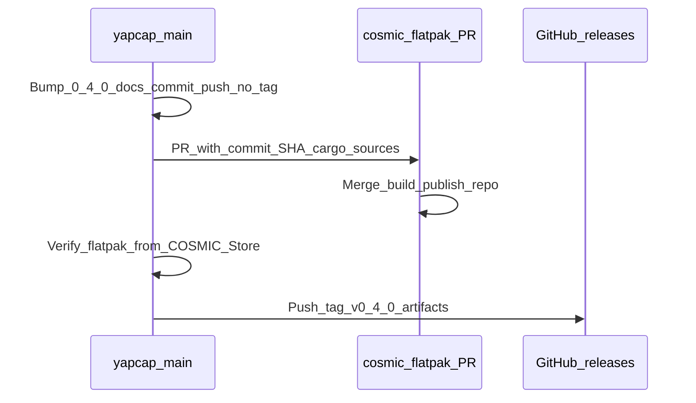

# YapCap v0.4.0 — release and COSMIC Store submission

Plan: ship v0.4.0 on `main` without a tag first, align Flatpak with [pop-os/cosmic-flatpak](https://github.com/pop-os/cosmic-flatpak) (BaseApp, offline Rust, `cargo-sources.json`, pinned git commit in the **store** PR), open the store PR using that commit, verify install from the COSMIC Store after merge, then tag to trigger GitHub release artifacts.

**Local Flatpak:** The repo manifest at `packaging/com.topi.YapCap.json` matches that model (BaseApp, `id`, offline cargo, `git` + `cargo-sources.json`, `CosmicSettingsDaemon`, Flathub deps). `just flatpak-install` runs an incremental `flatpak-build` then exports to `./repo` and user-installs. Use `just flatpak-install-only` to re-export/install without invoking `flatpak-builder`; `just flatpak-build-clean` forces a full rebuild.

## Checklist

- [x] Bump version to 0.4.0 in `Cargo.toml` and `Cargo.lock`; update `docs/spec.md` status line and date; `docs/qa.md` version line.
- [x] Reconcile flatpak manifest path (`packaging/`, `tests/flatpak_manifest.rs`, `justfile`, README, `docs/spec.md`).
- [ ] Restore or replace standalone `docs/flatpak.md` if you still want a dedicated packaging how-to (README + `docs/spec.md` cover the flow).
- [ ] **README and screenshots:** treat `README.md` as the main project pitch (see [Documentation, README, and screenshots](#documentation-readme-and-screenshots)); add COSMIC Store install instructions; replace `resources/screenshots/` assets with current UI and fix all image links in the README.
- [ ] **AppStream screenshots:** when new images exist under `resources/screenshots/`, update **`resources/app.metainfo.xml`** `<screenshots>` (which files are default vs extras, `image` URLs for `raw/main` on GitHub, and captions) so the store gallery matches the release; run **`appstreamcli validate`** on the metainfo.
- [x] **`packaging/com.topi.YapCap.json`** / **Flatpak UX:** cosmic-flatpak-style manifest (`id`, `com.system76.Cosmic.BaseApp` / `stable`, offline `cargo`, primary **`git`** source for `TopiCsarno/yapcap` + **`cargo-sources.json`**, `finish-args` with `CosmicSettingsDaemon`, Cursor/Codex read-only paths). **`just flatpak-build`** incremental, **`--install-deps-from=flathub`**. **`just flatpak-install`** depends on **`flatpak-build`** then export + install; **`flatpak-install-only`** / **`flatpak-build-clean`** as documented. Tests in `tests/flatpak_manifest.rs`.
- [x] AppStream `<releases>` for 0.4.0 in `resources/app.metainfo.xml`; bump entries when shipping new versions.
- [x] `just check`, `cargo test`, `cargo fmt`; local **`just flatpak-install`** verified against compliant manifest.
- [ ] Commit and push v0.4.0 to `origin/main` **without** tag; record the **exact** tip commit SHA (e.g. `git rev-parse origin/main` after push) — this is the revision everything else pins to.
- [ ] **Cosmic-flatpak PR must use that SHA:** In `pop-os/cosmic-flatpak`, the module’s `git` source needs `"commit": "<full-sha>"` matching `main` at v0.4.0 (add `"tag": "v0.4.0"` too if reviewers expect it). Regenerate `cargo-sources.json` from `Cargo.lock` **at that same commit** — not from an earlier `dev` checkout. Do **not** rely on a moving `branch` in the store manifest.
- [ ] Open PR to `pop-os/cosmic-flatpak`: add `app/com.topi.YapCap/` with manifest + `cargo-sources.json` (fork layout); pinned `git` URL + **`commit`** (and optional `tag`); PR body explains `--share=network`, `~/.config/Cursor:ro`, `~/.codex/auth.json:ro`, and DBus/secret needs; address review on permissions and BaseApp.
- [ ] After merge and propagation: verify YapCap from COSMIC Store / cosmic remote (`docs/qa.md` Flatpak section).
- [ ] Push annotated tag `v0.4.0` on **the same commit as above** (the `main` release SHA) to trigger `release.yml`; confirm GitHub Release artifacts (tarball, `.deb`, `.rpm`, checksums).

## Documentation, README, and screenshots

### README as the storefront

`README.md` is what GitHub visitors and packagers see first. For v0.4.0 it should read as a short **advertisement**: one tight paragraph on what YapCap does and why it matters (COSMIC panel, local credentials, three providers, no telemetry), then **Install** paths in a sensible order for most users.

- **COSMIC Store (recommended once listed):** add a first-class subsection with steps that match the real Store UX on COSMIC (e.g. open COSMIC Store, search for YapCap or browse panel applets, install; then log out/in or add the applet from the panel). Wording can stay generic until the listing is live; after verification, tighten names and menus to match what users actually see.
- **Keep other channels** (Flatpak manual / `.deb` / `.rpm` / from source) below or in a “Other install options” area so Store users are not buried in developer commands.
- **Badges:** keep CI/release badges accurate; add or adjust copy so the Store path is not contradicted elsewhere on the page.

### Screenshots

The README’s screenshot table references files under `resources/screenshots/`. For a credible v0.4.0 release:

- Recapture **hero and feature shots** from a current build (same aspect and quality as existing assets where possible).
- Use a representative **theme** (and multi-account / settings shots if those are selling points).
- Replace files **in place** (same filenames) when you want stable README URLs on `main`, or update README paths if you rename files.
- Update **`resources/app.metainfo.xml`** `<screenshots>` (`image` URLs and `<caption>` text) so store listings stay in sync; see checklist item **AppStream screenshots**.
- Quickstart and troubleshooting in the README should still match what the screenshots show.

### Other documentation

- `docs/spec.md`: bump “as-built” version/date when behavior or packaging expectations change; screenshots are not required there unless you add a visual section.
- `docs/qa.md`: align version header and any screenshot-driven manual checks with the new assets and Store install path.
- `resources/app.metainfo.xml`: optional screenshot `<screenshot>` entries for AppStream/Store listings are separate from README paths; add or refresh if the COSMIC Store surfaces them from metainfo.

## How `pop-os/cosmic-flatpak` expects apps

Upstream’s [justfile](https://github.com/pop-os/cosmic-flatpak/blob/master/justfile) runs `flatpak-builder` with `--sandbox`, `--require-changes`, `--install-deps-from=flathub`, and GPG signing — modules use **offline** Rust builds, not build-time crates.io access.

Rust pattern (e.g. `com.github.bgub.CosmicExtAppletPomodoro`):

- Top-level **`id`**, **`runtime-version` `25.08`**, **`base`:** `com.system76.Cosmic.BaseApp`, **`base-version`:** `stable`**, **`org.freedesktop.Sdk.Extension.rust-stable`**.
- **Module `sources`:** primary **`git`** (URL + **pinned `commit`** in the store repo; tag optional) + **`cargo-sources.json`** from `Cargo.lock`.
- **Build commands:** `cargo --offline fetch` then `cargo --offline build --release`.
- **`finish-args`:** typically `--share=ipc`, `--socket=wayland`, optional `--socket=fallback-x11`, `--device=dri`, `--talk-name=com.system76.CosmicSettingsDaemon`, `--filesystem=~/.config/cosmic:rw`, and `--share=network` when needed. YapCap adds read-only `~/.config/Cursor` and `~/.codex/auth.json` (document in the store PR).

## YapCap repo vs cosmic-flatpak PR

| Topic | In this repo (`packaging/`) | In `pop-os/cosmic-flatpak` PR |
| --- | --- | --- |
| Manifest | `com.topi.YapCap.json` — aligned with patterns above | Copy / mirror under `app/com.topi.YapCap/` |
| `git` source | `branch: dev` for day-to-day builds from GitHub | Replace with **`commit`** (and optional **`tag`**) matching **`main`** at v0.4.0 |
| `cargo-sources.json` | Committed; regenerate when `Cargo.lock` changes | Must match **`Cargo.lock` at the pinned commit** |
| Build / install | `just flatpak-build`, `just flatpak-install`, etc. | Upstream `just build <app-id>` |

## Release and tag sequencing

`.github/workflows/release.yml` runs on `v*` tags only, so `.deb` / `.rpm` / tarball appear after the final tag — consistent with delaying GitHub “Release” notifications until the store path is verified.

## Config and lockfile

- If `cosmic_config::Config` changes in 0.4.0, bump `#[version = …]` in `src/config.rs` per `docs/spec.md`; otherwise leave unchanged.
- Regenerate `cargo-sources.json` from the **exact** `Cargo.lock` at the pinned commit (for the cosmic-flatpak PR, and in this repo whenever the lockfile changes).
