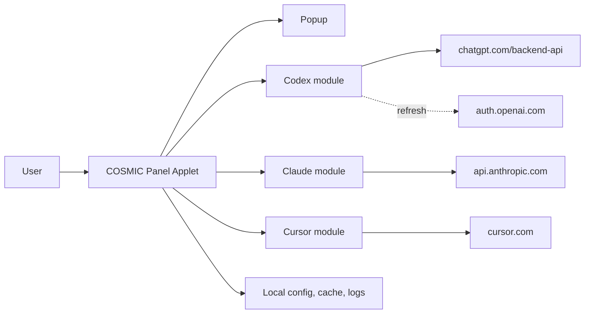
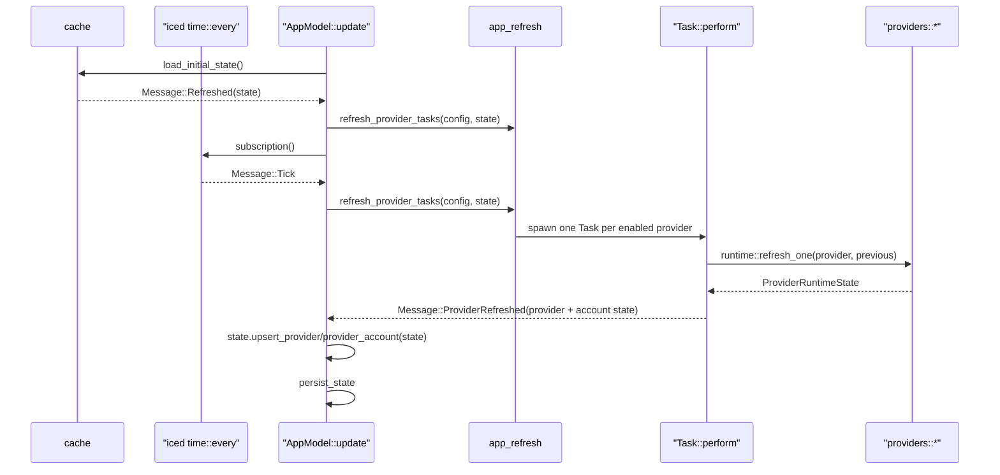

# YapCap — COSMIC Panel Applet Architecture

**Status:** As-built v0.2 · **Last updated:** 2026-04-24 (account state reconciled with config and cache)

## Document Metadata

| Field | Value |
| --- | --- |
| Status | Describes current main branch |
| Target desktop | COSMIC |
| Target language | Rust (edition 2024) |
| Target runtime | libcosmic applet runtime |
| Providers | Codex, Claude Code, Cursor |

## Document Map

| Area | Subsections |
| --- | --- |
| 1. Product Definition | 1.1 Scope and Non-Goals<br>1.2 Supported Sources |
| 2. Architecture | 2.1 System Context<br>2.2 Crate Layout<br>2.3 Runtime and Message Flow |
| 3. Providers | 3.1 Codex<br>3.2 Claude<br>3.3 Cursor |
| 4. Auth, Browser Cookies, and Config | 4.1 OAuth Credential Files<br>4.2 Browser Cookie Import<br>4.3 Configuration |
| 5. Data Model | 5.1 UsageSnapshot<br>5.2 ProviderRuntimeState and Health<br>5.3 Stale/Fresh Rules |
| 6. Persistence, Logging, Paths | |
| 7. User Interface | 7.1 Panel<br>7.2 Popup |
| 8. Localization | |
| 9. Testing | |

## 1. Product Definition

### 1.1 Scope and Non-Goals

- YapCap is a native Linux COSMIC panel applet that shows local usage state for Codex, Claude Code, and Cursor.
- Ships only on COSMIC. No GNOME, KDE, tray, or generic indicator paths exist.
- Reads locally available credentials and caches. No user account, no cloud sync, no telemetry.
- Out of scope: additional providers, historical charts, notifications, plugin architecture, doctor command, secret vault, alternative DEs.

### 1.2 Supported Sources

| Provider | Primary | Fallback |
| --- | --- | --- |
| Codex | Active Codex account resolved from YapCap-managed `auth.json` | Codex OAuth token refresh via `auth.openai.com/oauth/token` (one retry on 401/403 when `refresh_token` exists) |
| Claude | Active Claude account resolved from YapCap-managed `.credentials.json` | Claude Code credential refresh via `claude auth status --json` |
| Cursor | `WorkosCursorSessionToken` cookie from a local browser | — |

Claude, Codex, and Cursor all use YapCap-managed account storage. There is no
web-cookie path for Claude and no forced-source environment variable.

## 2. Architecture

### 2.1 System Context



### 2.2 Crate Layout

Single-crate workspace. Binary:

- `yapcap` — the released applet, driven by libcosmic's applet runtime.

Binary-only modules (`src/`, compiled only into the applet binary):

| Module | Purpose |
| --- | --- |
| `app` | `AppModel`, `Message`, libcosmic `Application` impl. Panel button, popup open/close, tick scheduling. |
| `app_refresh` | Dispatches one `Task::perform` per enabled provider. |
| `popup_view` | `popup_content` renders the popup. Tabs, status badge, usage bars, cost block. All strings via `fl!()`. |
| `provider_assets` | Embedded SVG icon handles; dark/light variant selection. |
| `i18n` | `fl!()` macro, `i18n_embed` loader wired to `i18n/en/yapcap.ftl`. |

Library modules (`src/`, also usable from tests):

| Module | Purpose |
| --- | --- |
| `app_state` | Methods on `AppState` for provider upsert and "mark refreshing." |
| `runtime` | `refresh_one(provider)`, `refresh_provider(...)`, `load_initial_state`, `persist_state`. |
| `providers::codex` | Codex account import/discovery, managed login/reauth, OAuth usage fetch, and refresh-on-401/403 under `src/providers/codex/`. |
| `providers::claude` | Managed account discovery/login under `src/providers/claude/`, OAuth usage fetch, and credential refresh via `claude auth status`. |
| `providers::cursor` | Cursor web API via imported browser cookie. |
| `auth` | Parses `~/.codex/auth.json` and Claude Code `.credentials.json`. |
| `browser` | Chromium AES-GCM/CBC cookie decrypt; Firefox cookies.sqlite read. |
| `config` | COSMIC config entry, provider toggles, browser choice, browser profile discovery. |
| `cache` | Load/save `snapshots.json`. |
| `model` | `UsageSnapshot`, `ProviderRuntimeState`, `ProviderHealth`, `AuthState`, `AppState`. |
| `updates` | GitHub release check; `UpdateStatus` and debug-only update simulation. |
| `usage_display` | Shared "expired window" percent/label formatting. |
| `logging` | `tracing` subscriber + file appender init. |
| `error` | `thiserror` enums: `AppError` and per-subsystem types. |

### 2.3 Runtime and Message Flow

The applet is a libcosmic `Application`. Messages flow:



- On startup, `Message::Refreshed` loads cached state and immediately dispatches a refresh for enabled providers.
- On a brand-new config, YapCap does one provider-visibility initialization pass:
  it imports or discovers any locally available accounts, enables providers
  that have at least one usable account, and disables providers that do not.
  After Cursor browser discovery finishes, that auto-init mode is marked
  complete so later launches preserve the user’s explicit provider toggles.
- `Message::Tick` fires on a fixed interval (`refresh_interval_seconds.max(10)`).
- `Message::RefreshNow` is the popup's "Refresh now" button and uses the same dispatcher.
- Account switching marks and refreshes only the selected provider instead of dispatching a global refresh.
- Provider HTTP calls use a shared `reqwest::Client` with a 5s connect timeout and 20s total request timeout.
- Refresh dispatch runs only when the provider is enabled and its account resolver is `Ready`.
- Per-provider results arrive independently; the popup rerenders on each.
- `runtime::refresh_provider_account` keeps the previous account snapshot on error so the UI never drops data on a transient failure. It instead flips the account's `ProviderHealth::Error`.

## 3. Providers

### 3.1 Codex

Codex account import and discovery:

- On startup, if `CODEX_HOME` or `~/.codex` contains a usable `auth.json`,
  YapCap imports that Codex home into YapCap-managed storage unless a managed
  account with the same normalized email already exists.
- Managed accounts are read from `Config.codex_managed_accounts`; each entry
  points at an isolated Codex home and is valid only when that home's
  `auth.json` parses.
- Codex account identity is the normalized email from `id_token`
  (`trim + ASCII lowercase`). `provider_account_id` is stored only as
  non-identity metadata for display, diagnostics, and compatibility.
- If multiple managed Codex entries share the same normalized email, YapCap
  auto-merges them down to one surviving config entry, preferring the active
  account when one is active and otherwise preferring the most recently
  updated/authenticated usable account.
- The active resolver uses the persisted id when it resolves to a valid source,
  otherwise auto-selects exactly one valid source, otherwise reports
  `SelectionRequired` or `LoginRequired`.
- Account display labels are derived from the `email` claim in each account's
  `id_token` at discovery time; stored config labels are not used for display.
- After import, YapCap uses only the copied managed Codex home under
  `~/.local/state/yapcap/codex-accounts/<id>/`. Import copies only the auth
  material YapCap needs (`auth.json`), not an entire ambient Codex home.
  `CODEX_HOME`/`~/.codex` is not treated as a live account source. Ambient
  `CODEX_HOME` is import-only.
- If a managed Codex entry matches the ambient Codex email but its managed home
  has been deleted or is no longer readable, startup import repairs that
  managed entry by repopulating its managed home from the ambient Codex home
  instead of treating the stale config entry as already imported.

Managed Codex add-account flow:

- Settings exposes `Add account` under the Codex accounts card.
- YapCap creates a private pending Codex home under
  `~/.local/state/yapcap/codex-accounts/pending-<id>/`.
- The pending home gets a `config.toml` containing
  `cli_auth_credentials_store = "file"` so Codex writes `auth.json` locally.
- YapCap runs `codex login` with `CODEX_HOME` set to that pending home,
  captures stdout/stderr, and streams any detected login URL into the popup.
  The browser is opened automatically by the Codex CLI; YapCap offers
  `Open Browser` as a fallback if a URL is detected in the output.
- The UI shows `Cancel` while login is running. Cancel aborts the login task and
  immediately returns the account controls to the normal add-account state.
- On successful CLI exit, YapCap validates `auth.json`, attempts one Codex usage
  request (non-fatal if it fails), then either commits the pending home into a
  new stable managed account directory or reuses the existing managed account
  id/home when the normalized email already exists.
- Successful managed Codex refreshes hydrate non-secret config metadata such as
  email and provider account id, and clear the old provider-level legacy
  snapshot once an account-scoped snapshot exists.
- Managed Codex accounts show a re-authenticate action only when the active
  stored credentials require user action. Re-auth runs the same pending-home
  login flow and then swaps the pending home into the existing managed account
  directory while keeping the same account id.
- On cancel, failure, or task abort, the pending directory is removed.
- Rename is still future work.

Usage request: `GET https://chatgpt.com/backend-api/wham/usage` with:

- `Authorization: Bearer <tokens.access_token>`
- `ChatGPT-Account-Id: <tokens.account_id>` (when present)

Response shape (subset consumed):

- `rate_limit.primary_window.used_percent` / `reset_at` → 5h window.
- `rate_limit.secondary_window.used_percent` / `reset_at` → 7d window.
- `credits.balance` (string or number, nullable) → parsed into a `ProviderCost { units: "credits" }`; null or absent balance is silently ignored.

OAuth refresh (one retry):

- If the usage endpoint returns HTTP 401 or 403 and `tokens.refresh_token` exists in the active account's `auth.json`, YapCap calls `POST https://auth.openai.com/oauth/token` with `grant_type=refresh_token` and the Codex client id, updates that same `auth.json`, and retries the usage request once.
- If no refresh token is available, YapCap reports an actionable error prompting the user to run `codex login`.

### 3.2 Claude

Claude account discovery:

- Managed accounts are read from `Config.claude_managed_accounts`; each entry
  points at an isolated Claude config directory and is valid only when that
  directory's `.credentials.json` parses.
- The active resolver uses the persisted id when it resolves to a valid source,
  otherwise auto-selects exactly one valid source, otherwise reports
  `SelectionRequired` or `LoginRequired`.
- Startup account sync reattaches YapCap-managed `claude-accounts/<id>/`
  directories that contain valid `.credentials.json` but are missing from
  `claude_managed_accounts`, and imports a non-managed Claude config directory
  (same resolution as the CLI: `CLAUDE_CONFIG_DIR` when set and non-empty,
  otherwise `~/.claude`) into managed storage when that directory is outside
  YapCap’s state tree and carries the `user:profile` OAuth scope—mirroring
  Codex’s external-home import.
  YapCap-managed Claude storage is minimal: it keeps `.credentials.json` and
  prunes unrelated files or directories from managed account dirs.
  That import skips adding a managed copy when a managed account already has
  the same OAuth access token, or the same normalized email (from CLI status
  or, when needed, from a JWT-shaped access token payload).
- After that, startup runs `claude auth status --json` for managed accounts to
  hydrate local organization / subscription metadata and email when the CLI
  returns it. If email is still missing (CLI unavailable, timeout, or JSON
  without `email`), YapCap reads `.credentials.json` and derives email from a
  JWT-shaped access token when present (including two-part header.payload
  tokens, nested JSON string values with `@`, the `sub` claim when it is an
  email, and optional `idToken` / `id_token`). If it is still missing, YapCap
  performs blocking OAuth profile requests with the stored token (and on HTTP
  401 runs `claude auth status` once to refresh credentials, then retries):
  `GET /api/oauth/account` (`email_address`), then `GET /api/oauth/profile`
  (`account.email`), then `GET /api/oauth/usage` (`email`).
  It then dedupes to at most one managed account per normalized email.
- Managed Claude add-account uses `claude auth login --claudeai` with
  `CLAUDE_CONFIG_DIR` set to a pending YapCap-owned config directory. On
  successful credential validation, YapCap reads `claude auth status --json`,
  prunes the managed directory down to `.credentials.json`, commits that
  directory into `~/.local/state/yapcap/claude-accounts/<id>/`, and stores
  only non-secret account metadata in config.
- Managed Claude account labels follow the account email address when available.
- After a successful Claude usage fetch, `UsageSnapshot.identity.email` is filled
  from the usage JSON `email` field when present, else `claude auth status --json`,
  else a JWT-shaped access token’s email claim; the main provider panel and account
  runtime label use that email for display. Settings account rows also prefer
  snapshot or config email over the generic managed label.
- Successful Claude refreshes hydrate managed-account subscription metadata when
  available and clear any legacy provider-level Claude snapshot once an
  account-scoped snapshot succeeds.

Primary: `GET https://api.anthropic.com/api/oauth/usage` with:

- `Authorization: Bearer <claudeAiOauth.accessToken>`
- `anthropic-beta: oauth-2025-04-20`
- Token must carry scope `user:profile`; otherwise `MissingProfileScope` is returned before the request.
- Before the request, YapCap checks `claudeAiOauth.expiresAt`. If the access token expires within 5 minutes, it runs `claude auth status --json` with `CLAUDE_CONFIG_DIR` set to the active account config directory, then reloads `.credentials.json`.
- If the usage endpoint returns HTTP 401, YapCap runs `claude auth status --json` once for the active account, reloads `.credentials.json`, and retries the usage request once.

Response shape:

- `five_hour.utilization` / `resets_at` → Session window (utilization is 0..100).
- `seven_day.utilization` / `resets_at` → Weekly window.
- `seven_day_sonnet` / `seven_day_opus` / `seven_day_cowork` → model-specific weekly windows (Max plan only; null on Pro).
- `extra_usage.utilization` → Extra window.
- `extra_usage.used_credits` / `monthly_limit` → `ProviderCost` (both fields divided by 100).
- `extra_usage.currency` → cost display units (e.g. `"EUR"`); defaults to `"$"` if absent.

Claude usage windows are partially tolerant because the endpoint can return null fields for inactive or account-specific windows. A window with no `utilization` is skipped. A window with `utilization` but no `resets_at` is kept without reset metadata. For the `five_hour` session window, `utilization = 0` with `resets_at = null` is treated in display code as a reset/inactive session and labeled `Reset`. If both primary windows are absent after normalization, the provider returns `NoUsageData`.

Usage fallback: none. Claude usage is OAuth-only because the CLI does not expose reliable machine-readable usage data.

Credential refresh is delegated to Claude Code. YapCap shells out directly to the `claude` binary, without a shell, and lets Claude Code manage its own OAuth refresh flow and credential file. YapCap does not call Claude's private token endpoint directly.

HTTP 401 surfaces as `ClaudeError::Unauthorized` after the one refresh retry fails (user action required). HTTP 429 surfaces as `ClaudeError::RateLimited` and is marked transient so the badge shows "Stale" rather than "Error."

### 3.3 Cursor

Account model:

- All Cursor accounts are managed by YapCap and stored under
  `~/.local/state/yapcap/cursor-accounts/<storage-id>/`, where `storage-id` is an
  opaque string (`cursor-<millis>-<pid>` for manual login commits, `cursor-<16
  hex>` derived deterministically from normalized email when migrating configs
  that predate stored ids, or another `cursor-…` id for browser-imported
  accounts). Directory names do not embed the email address.
- Email is the canonical identity for deduplication and UI. Accounts without a
  confirmed email are never persisted.
- At most one managed account exists per normalized email
  (`trim + ASCII lowercase`).
- Each managed account directory uses one layout regardless of whether it came
  from startup discovery or manual add:
  - `account.json` stores non-secret metadata.
  - `session/` stores persisted auth material owned by YapCap.
- Runtime account ids use the prefix `cursor-managed:` plus the same opaque
  `storage-id` as the on-disk directory name (not the email).
- On startup sync, legacy `active_cursor_account_id` values that still used
  `cursor-managed:<email>` are rewritten to the opaque id for the matching
  account. Legacy email-shaped account directories are moved onto the opaque
  path for that email’s stable migration id.

Browser auto-import (runs asynchronously on startup):

- YapCap scans every profile directory for all supported browsers.
- For each profile whose cookie database is readable, YapCap extracts the
  Cursor session cookie and calls `GET https://cursor.com/api/auth/me`.
- If a valid email is returned, YapCap imports that session into the managed
  account directory for the normalized email and marks the credential source
  as `imported_browser_profile`.
- Discovery updates the existing managed account for the same email instead of
  creating a sibling account.
- Imported accounts use YapCap-owned session state under `session/`; YapCap
  does not keep the original browser profile as the long-term source of truth.
  Discovery also rewrites any existing manual-login account for that email onto
  the same canonical stored-cookie layout.
- Startup cleanup removes malformed Cursor account directories from config, and
  unsupported legacy token-only Cursor accounts are dropped instead of being
  migrated.

Managed login flow (add account):

- Settings exposes `Add account` under the Cursor accounts card.
- Launches the browser chosen by `config.cursor_browser` with
  `--user-data-dir=<pending-profile-root>/profile` and opens the Cursor usage
  page.
- Waits for a valid Cursor session cookie to appear in the pending profile.
- On success, Cursor identity must include an email. YapCap renames the pending
  directory into the managed account root named after the login flow’s opaque
  id, writes `account.json`, persists the cookie header under `session/`, and
  stores non-secret metadata in config (including that id and normalized email)
  with the same `imported_browser_profile` layout used by discovery.
- Manual add for an existing email replaces or updates the same managed
  account directory instead of creating a second account.
- On cancel, failure, or task abort, the pending directory is removed.

Usage fetch:

- Both imported and manual accounts go through the same refresh pipeline.
- YapCap reads the cached cookie header from `session/`.
- Legacy `managed_profile` accounts remain readable during lazy migration by
  falling back to `profile/Default/Cookies` when no stored cookie header exists.
- Sends the session cookie in one `Cookie` header to:
  - `GET https://cursor.com/api/usage-summary`
  - `GET https://cursor.com/api/auth/me`
- Maps:
  - `individualUsage.plan.totalPercentUsed` → primary window.
  - `autoPercentUsed` → secondary dimension.
  - `billingCycleEnd` → `reset_at`.
  - `membershipType` → `identity.plan`.
- No OAuth fallback; if the managed session is missing or unauthorized, the
  provider reports `LoginRequired` and does not try to re-import from the
  original browser.

Account removal: deletes the managed directory. User-owned browser profiles
are never touched.

## 4. Auth, Browser Cookies, and Config

### 4.1 OAuth Credential Files

`auth::load_codex_auth`:

- Respects `CODEX_HOME`, otherwise `~/.codex`.
- Reads `auth.json` and extracts `tokens.access_token` and `tokens.account_id`.

`auth::load_claude_auth`:

- Reads `.credentials.json` and extracts `claudeAiOauth.{accessToken, scopes, subscriptionType, expiresAt}`.

YapCap can write managed Codex `auth.json` files when refreshing OAuth tokens,
and it can run `codex login` or `claude auth status --json`, which may cause
those CLIs to update their own credential files. Errors are typed (`AuthError`
/ provider errors) and bubble up as `requires_user_action = true` when user
login or local CLI repair is needed.

### 4.2 Browser Cookie Import

Chromium family (Brave / Chrome / Edge):

- Copy `Cookies` SQLite file to a tempfile (the live DB is locked by the running browser).
- Look up Cursor session cookies for `cursor.com`, `www.cursor.com`,
  `cursor.sh`, and `authenticator.cursor.sh`, accepting exact, leading-dot,
  and subdomain host matches.
- Candidate cookie names are `WorkosCursorSessionToken`,
  `__Secure-next-auth.session-token`, and `next-auth.session-token`.
- If the stored `value` column is non-empty, use it as plaintext (older blobs).
- Otherwise decrypt `encrypted_value`:
  - `v10` / `v11` prefix → AES-CBC with a PBKDF2(secret, salt="saltysalt", iters=1, 16B key) key derived from the browser's Safe Storage secret. The single iteration is mandated by OSCrypt compatibility, not a mistake.
  - Alternative GCM blobs are decrypted with AES-GCM.
- Safe Storage secret is retrieved via `secret-service` using the per-browser application name (`brave`, `chrome`, `Microsoft Edge`). Some secret-service implementations (KWallet, COSMIC) append trailing terminators; those are stripped before key derivation.

Firefox:

- Locates `cookies.sqlite` via `profiles.ini`. The `[Install<hash>]` section's `Default=` path takes precedence over any legacy `Default=1` profile entry.
- Accepts both `~/.mozilla/firefox` and `~/.config/mozilla/firefox` (XDG/Flatpak layouts).
- Reads the cookie value directly; Firefox does not encrypt cookies at rest.

Browser profile discovery:

- Chromium-family browsers discover every profile directory under the browser root that contains a `Cookies` database, with `Default` tried first and other profiles tried in sorted order.
- Firefox discovers profiles from `profiles.ini` in priority order: install default, profile default, then remaining profile paths.
- YapCap auto-imports all profiles where the Cursor session cookie is present
  and the identity API returns an email. Chromium and Firefox discovery both
  import into the same managed account layout; the on-disk directory is keyed by
  an opaque id while normalized email selects the single managed account row.
- Browser cookie tests should use synthetic SQLite fixtures under `fixtures/browser` instead of real browser databases.

### 4.3 Configuration

Provider settings are stored through the COSMIC template's `cosmic_config`
entry for app ID `com.topi.YapCap`. The `#[version = N]` on `Config` is part of
that integration: settings live under `…/cosmic/com.topi.YapCap/vN/`, so raising
`N` starts a new on-disk directory and avoids loading incompatible serialized
state from an older schema. YapCap does not copy or merge from other `v*`
folders; remove stale dirs yourself if you want to reclaim disk space, or copy
files manually if you need to salvage values after a version bump.

The template rebuild intentionally expands
the existing `Config` entry instead of carrying over the old standalone TOML
config file. The settings keep the same user-facing function as before:
refresh interval, provider enable toggles, Cursor browser selection, and log
level. The reset time format controls whether usage windows show relative reset
durations or absolute local reset times. The usage amount format controls
whether usage windows are presented as percent used or percent left.

```toml
refresh_interval_seconds = 300
reset_time_format = "relative"
usage_amount_format = "used"
panel_icon_style = "logo_and_bars"
provider_visibility_mode = "auto_init_pending"
codex_enabled = true
claude_enabled = true
cursor_enabled = true
active_codex_account_id = null
codex_managed_accounts = []
active_claude_account_id = null
claude_managed_accounts = []
active_cursor_account_id = null
cursor_managed_accounts = []
cursor_browser = "brave"
cursor_profile_id = null
log_level = "info"
```

- `reset_time_format` ∈ `relative | absolute`. `relative` shows reset durations such as `Resets in 2d 2h`; `absolute` shows local reset labels such as `Resets tomorrow at 8:25 AM` or `Resets Wednesday at 12:00 PM`.
- `usage_amount_format` ∈ `used | left`. `used` shows labels and usage bars as consumed quota; `left` flips them to remaining quota.
- `panel_icon_style` ∈ `logo_and_bars | bars_only | logo_and_percent | percent_only`. The default shows the selected provider logo and two compact usage bars, `bars_only` hides the logo, `logo_and_percent` shows the selected provider logo with the first applet usage window as a one-decimal percentage, and `percent_only` shows only that percentage with enough width for `100.0%`. In settings, the percent-only preview shows a sample percentage with a tooltip explaining that it shows the first usage percentage in the panel.
- `provider_visibility_mode` ∈ `auto_init_pending | user_managed`. New installs begin in `auto_init_pending` until the first startup discovery pass finishes; existing installs and later runs use `user_managed`.
- `cursor_browser` ∈ `brave | chrome | chromium | edge | firefox` (also accepts `microsoft-edge`).
- `cursor_profile_id = null` means automatic profile discovery.
- If `cursor_profile_id` is set, Cursor cookie import uses only that discovered profile.
- `YAPCAP_CURSOR_BROWSER` overrides `cursor_browser` at runtime.
- The refresh interval is clamped to a 10-second floor at subscription time.
- `active_codex_account_id` is a preference, not proof that credentials exist.
  It resolves to `Ready` only when a matching managed account source is valid.
- `codex_managed_accounts` stores non-secret metadata only: id, label,
  managed Codex home path, optional email/provider account id, and timestamps.
  There is at most one managed account per normalized email.
- `active_claude_account_id` is a preference, not proof that credentials exist.
  It resolves to `Ready` only when a matching managed Claude account source is
  valid.
- `claude_managed_accounts` stores non-secret metadata only: id, label, Claude
  config directory path, optional identity metadata, subscription type, and
  timestamps.
  There is at most one managed account per normalized email.
- `active_cursor_account_id` is a preference, not proof that credentials exist.
  It stores `cursor-managed:<storage-id>` (opaque folder name, not the email)
  and resolves to `Ready` only when that account's session cookie can be read
  and the Cursor API responds successfully.
- `cursor_managed_accounts` stores non-secret metadata only: opaque `id`,
  canonical email, label, managed account root path, credential source, optional
  browser metadata, optional identity metadata, plan, and timestamps. There is
  at most one managed account per normalized email.
- `cursor_profile_id` is a legacy field, currently unused.
- Account add/remove, login that adds a managed account, active-account
  selection, and COSMIC `watch_config` updates all re-run the same merge from
  config into in-memory `AppState` and rewrite the snapshot cache, so the
  managed account rows, UI account lists, and on-disk state stay consistent.

## 5. Data Model

The runtime state is intentionally layered. `AppState` is the cacheable root,
each provider has one `ProviderRuntimeState`, and account-owned
`ProviderAccountRuntimeState` entries hold successful `UsageSnapshot` values
with a dynamic number of usage windows.

```text
AppState
  updated_at
  providers: Vec<ProviderRuntimeState>
  provider_accounts: Vec<ProviderAccountRuntimeState>
    |
    +-- ProviderRuntimeState
          provider: ProviderId
          enabled / is_refreshing
          active_account_id
          account_status
          legacy_display_snapshot
          error

    +-- ProviderAccountRuntimeState
          provider: ProviderId
          account_id
          label
          health: ProviderHealth
          auth_state: AuthState
          source_label
          last_success_at
          error
          snapshot: Option<UsageSnapshot>
            |
            +-- UsageSnapshot
                  provider: ProviderId
                  source
                  updated_at
                  headline: UsageHeadline(usize)
                    |
                    +-- index into windows
                  windows: Vec<UsageWindow>
                  provider_cost: Option<ProviderCost>
                  identity: ProviderIdentity

UsageWindow
  label
  used_percent
  reset_at
  reset_description
```

`ProviderRuntimeState` describes provider enablement, active-account selection,
refresh activity, and legacy display data from older caches.
`ProviderAccountRuntimeState` describes account health and owns the provider's
last successful usage payload normalized into YapCap's common shape.
`UsageHeadline` is a newtype index into `windows` that says which window should
drive the status line and headline percentage.

### 5.1 UsageSnapshot

```rust
struct UsageSnapshot {
    provider: ProviderId,          // Codex | Claude | Cursor
    source: String,                // "OAuth" | "RPC" | "Brave" | ...
    updated_at: DateTime<Utc>,
    headline: UsageHeadline,       // index into windows for the panel badge
    windows: Vec<UsageWindow>,     // variable-length; providers push what they have
    provider_cost: Option<ProviderCost>,
    identity: ProviderIdentity,    // email, account_id, plan, display_name
}

struct UsageWindow {
    label: String,                 // "Session" | "Weekly" | "Sonnet" | "Extra"
    used_percent: f64,
    reset_at: Option<DateTime<Utc>>,
    window_seconds: Option<i64>,
    reset_description: Option<String>,
}

struct ProviderCost { used: f64, limit: Option<f64>, units: String }
```

`UsageSnapshot::applet_windows` returns the first two windows for the panel bars for Codex and Claude; for Cursor it returns **Total** and **API** (skipping Auto + Composer on the thin bar). The popup iterates all windows dynamically. Usage windows with both `reset_at` and `window_seconds` show a subtle pace indicator in the popup: the current usage remains the filled bar, a vertical accent marker inside the bar shows expected usage for the elapsed portion of the window, and hovering the bar reveals whether usage is on pace, ahead, or has room.

### 5.2 ProviderRuntimeState and Health

```rust
enum ProviderHealth { Ok, Error }
enum AuthState     { Ready, ActionRequired, Error }
enum AccountSelectionStatus { Ready, LoginRequired, SelectionRequired, Unavailable }

struct ProviderRuntimeState {
    provider: ProviderId,
    enabled: bool,
    active_account_id: Option<String>,
    account_status: AccountSelectionStatus,
    is_refreshing: bool,
    legacy_display_snapshot: Option<UsageSnapshot>,
    error: Option<String>,
}

struct ProviderAccountRuntimeState {
    provider: ProviderId,
    account_id: String,
    label: String,
    health: ProviderHealth,
    auth_state: AuthState,
    source_label: Option<String>,
    last_success_at: Option<DateTime<Utc>>,
    snapshot: Option<UsageSnapshot>,
    error: Option<String>,
}
```

- `refresh_provider_account` on Ok: clears account `error`, sets `health = Ok`, `auth_state = Ready`, updates `last_success_at`.
- On Err: preserves the previous account `snapshot` and `last_success_at`, sets account `health = Error`, and classifies `auth_state` via `AppError::requires_user_action`.
- Provider request failures that indicate YapCap cannot establish a network connection show `No internet connection. Showing cached data; information is not up to date.` instead of the raw provider request failure. Cached snapshots remain visible and stale.
- Transient errors (`ClaudeError::RateLimited`) are logged at `warn` instead of `error`.

### 5.3 Stale/Fresh Rules

`STALE_AFTER = 10 minutes` governs the popup status badge.

| Condition | Badge |
| --- | --- |
| `!enabled` | Disabled |
| `is_refreshing` | Refreshing |
| account selection `LoginRequired` | Login |
| account selection `SelectionRequired` | Select |
| active account `health=Ok`, snapshot present, `now - last_success_at < STALE_AFTER` | Live |
| snapshot present, any other condition | Stale |
| active account `health=Error`, no snapshot | Error |
| active account `health=Ok`, no snapshot | … |

`ProviderRuntimeState::status_line` applies the same rule and appends `(stale)` to the headline line when appropriate. This prevents "Live · Updated 21 hours ago" on cold-start from the cache.

## 6. Persistence, Logging, Paths

All paths come from `config::paths()`:

- Config: managed by `cosmic_config` under app ID `com.topi.YapCap` (not a hand-rolled file)
- Snapshot cache: `~/.cache/yapcap/snapshots.json`
- Logs: `~/.local/state/yapcap/logs/yapcap.log`

Snapshot cache serializes `AppState` (providers + account states +
`updated_at`) via `serde_json`. It is rewritten whenever any provider or
account state changes and loaded on startup so the popup has something to show
while the immediate startup refresh runs.

Logging uses `tracing` with `tracing-subscriber` `EnvFilter` and `tracing-appender` for the log file. No credentials, bearer tokens, or cookie values are logged.

Log level is hardcoded to `"info"` in `main` because config is not available before the applet loop starts. `RUST_LOG` still overrides this at runtime. A `config.log_level` field exists but currently has no effect until a future restart-aware approach is added.

`tracing_appender::non_blocking` returns a `WorkerGuard` that must stay alive for background log flushing. It is held in `main` as `let _log_guard`; the applet runtime blocks until process exit so the guard lives for the full process lifetime.

## 7. User Interface

### 7.1 Panel

- A single button using the configured panel icon style: selected provider icon plus two compact usage bars, bars only, selected provider icon plus the first applet usage window percentage, or only that percentage.
- Installed panel applets launch through `cosmic::applet::run` with `LaunchMode::Panel`; the panel view wraps the button in `core.applet.autosize_window` so COSMIC can size the applet surface around the rectangular icon-plus-bars content.
- Local `cargo run` launches through `cosmic::app::run` with `LaunchMode::Standalone`; `applet_settings()` gives the standalone preview the same calculated button dimensions without using the applet autosize wrapper.
- Both launch modes share the same button sizing helpers. The usage bar width is at least `suggested_height * APPLET_BAR_WIDTH_HEIGHT_MULTIPLIER`.
- The bars use `UsageSnapshot::applet_windows()` and `usage_display::displayed_amount_percent`; in `left` mode, fully-elapsed windows render as 100% left after the reset.
- Clicking toggles the popup.
- Provider icons have a Default (dark panel) and Reversed (light panel) SVG variant. `provider_assets::provider_icon_variant()` calls `cosmic::theme::is_dark()` at render time to select the correct variant. Note: full white-theme icon polish is deferred.
- YAPCAP subscribes to the active COSMIC theme config and theme mode config so accent and light/dark changes trigger an immediate redraw while the process is running.

### 7.2 Popup

`popup_view::popup_content`:

- Header: "YapCap" + "Refresh now" button.
- Navigation row:
  - provider detail: one tab per enabled provider with its icon and headline percent;
  - settings: category tabs for General, Codex, Claude, and Cursor, using a theme-symbolic gear icon for General and provider icons for provider settings.
- Provider and settings tabs, segmented option buttons, and selected account rows use a soft accent fill and accent border; settings section wrappers around titles and bodies stay visually neutral (layout only).
- Body panel (scrollable): shows either the selected provider details or the selected settings category.
  - Provider view is rendered as a stack of consistent cards (summary, usage windows, cost/credits, account, and error/source state).
  - Provider settings categories put the provider enable toggle first. When a provider is disabled, the provider-specific settings below that toggle are dimmed and non-interactive.
  - General settings contains app-wide settings such as Autorefresh segmented interval buttons, panel icon style preview buttons, reset time format, usage amount format, and about/update status. If the startup update check fails, YapCap keeps retrying in the background with exponential backoff and shows the latest detailed failure plus the next retry delay in About. Error state also shows a manual "Check again" action.
  - When an update is available, a small red notification dot appears next to the main Settings gear icon, on the General settings tab, and next to the About section title. Hovering the tab or About dot shows "Update available".
  - Debug builds can force the About update-available state with `YAPCAP_DEBUG_UPDATE_AVAILABLE`. Values `1`, `true`, `yes`, and empty string use `v9.9.9`; any other value is treated as the release version. Debug builds can also simulate offline HTTP with `YAPCAP_DEBUG_OFFLINE`; values `0`, `false`, `no`, and `off` disable it, while any other present value enables it. Debug builds can simulate an expired Cursor managed session with `YAPCAP_DEBUG_CURSOR_EXPIRED_COOKIE`; the same false-value parsing disables it, and any other present value writes a debug-only invalid managed session override for existing Cursor accounts so the UI behaves as though the stored session expired. Re-authenticating the account replaces that managed state and clears the simulated issue. `YAPCAP_DEMO` (debug only; inert in release) applies a fixed synthetic `AppState` for screenshots, skips the default startup `Task` batch, makes provider-refresh a no-op, skips writing the snapshot cache, and re-applies after each in-app `reconcile` on config updates.
  - Provider account cards list currently valid account sources as separate selector rows with a selected outline/checkmark, a row press to make an account active, and account action icons. Long account labels are truncated in-row and reveal the full label on hover. Codex add-account login opens the browser from the Settings flow, and Codex re-authentication appears only after an auth failure that requires user action. Claude add-account runs the Claude Code auth flow from Settings. Cursor add-account launches an isolated managed Chromium-family browser profile and waits for a valid Cursor cookie. Cursor accounts that need user action show a `Re-auth needed` badge plus a per-account refresh action in Settings, and the provider status text tells the user to go to Settings and reauthenticate. Codex, Claude, and Cursor account removal deletes only YapCap-owned account homes/config dirs/profile roots. Cursor accounts are always managed and displayed with the email address as the account label; browser-auto-imported accounts and login-created accounts appear the same in the UI. If no accounts remain for a provider, the provider detail shows an empty state pointing the user to Settings.
- Footer: "Quit" + "Settings" / "Done". The Settings button opens the General
  settings category by default.

The popup width is fixed at 420px. The popup height is fixed for the duration of one open session (chosen conservatively up front, capped at 1080px) to avoid Wayland popup resize/reposition flicker. The body panel scrolls when content exceeds the available space.

Settings writes go through a `cosmic_config::Config` context acquired with the app ID — there is no `config.save()` method. The same context is used in `AppModel::init` and in `Message::SetProviderEnabled`.

## 8. Localization

Most user-visible strings in `popup_view.rs` use the `fl!()` macro backed by `i18n_embed` + `i18n_embed_fl` + Mozilla Fluent. (Some provider-facing status strings are still produced in the model layer.)

- String catalog: `i18n/en/yapcap.ftl` — buttons, section titles, status badges, update-check states, last-updated timestamps, and usage reset labels.
- The `i18n/` directory is compiled into the binary at build time via `rust-embed`; no runtime file access is needed.
- `i18n::init()` in `main` reads the system's requested languages and selects the best match. If no match, falls back to `en`.
- Adding a language requires only creating `i18n/<lang>/yapcap.ftl`; the binary picks it up automatically on a matching system locale.
- Missing Fluent messages are typically caught during development (e.g. by tooling/editor diagnostics), but the safest way to validate coverage is to build and run the app while exercising the UI paths.
- UI helper functions that build elements (`info_block`, `usage_block`, `credit_section`, etc.) take `String` for their title parameter and return `Element<'static, Message>`. This avoids tying the element lifetime to a temporary `fl!()` result.

## 9. Testing

- `cargo test` runs unit and integration tests covering: config defaults, browser profile discovery, browser fixture contracts (Chromium + Firefox), usage display formatting, app-state helpers, model status/headline helpers, all three provider normalizers against JSON fixtures, Claude account discovery, Claude credential refresh with fake CLI binaries, runtime refresh state machine, error classification, update check version parsing, debug update simulation, and app-level state transitions.
- No tests hit real provider APIs. Provider response fixtures under `fixtures/{codex,claude,cursor}/*.json` cover the OAuth response shapes and edge cases.
- Browser cookie fixtures under `fixtures/browser/*.sql` are synthetic and sanitized. Real browser databases must not be committed.
- `cargo clippy` and `cargo fmt --check` are expected clean on main.
- Manual QA should cover: install via `just install`, each provider's auth refresh flow, transient provider failures showing "Stale" not "Error", stale snapshot display on cold-start, settings persistence across restarts, update-check UI states, and dark/light theme icon variants.
