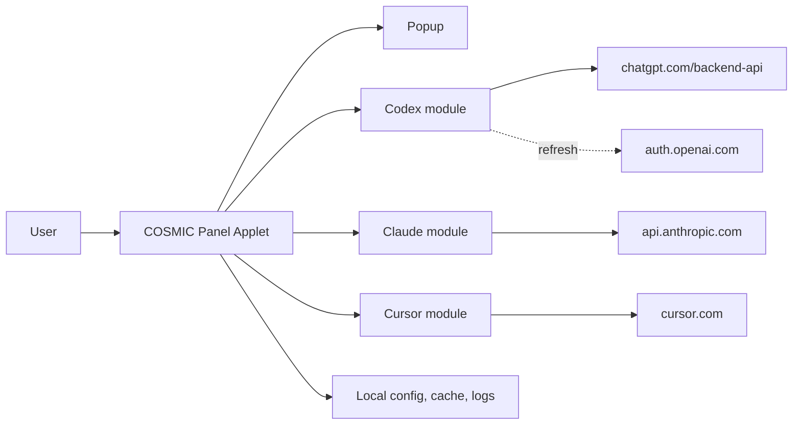
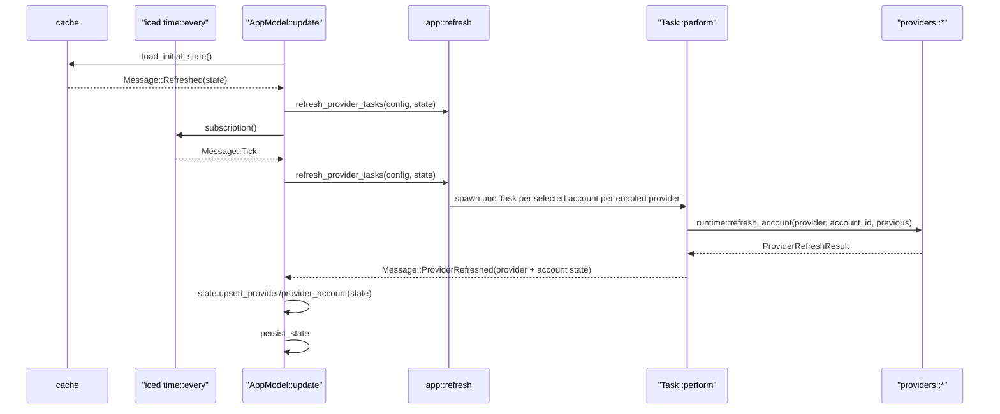

# YapCap — COSMIC Panel Applet Architecture

**Status:** As-built v0.4.0 · **Last updated:** 2026-05-04

## Document Metadata

| Field | Value |
| --- | --- |
| Status | Describes current main branch |
| Target desktop | COSMIC |
| Target language | Rust (edition 2024) |
| Target runtime | libcosmic applet runtime |
| Providers | Codex, Claude Code, Cursor |

## Document Map

| Area | Subsections |
| --- | --- |
| 1. Product Definition | 1.1 Scope and Non-Goals<br>1.2 Supported Sources |
| 2. Architecture | 2.1 System Context<br>2.2 Crate Layout<br>2.3 Runtime and Message Flow |
| 3. Providers | 3.1 Codex<br>3.2 Claude<br>3.3 Cursor |
| 4. Auth and Config | 4.1 OAuth Credential Files<br>4.2 Cursor Token Source<br>4.3 Configuration |
| 5. Data Model | 5.1 UsageSnapshot<br>5.2 ProviderRuntimeState and Health<br>5.3 Stale/Fresh Rules |
| 6. Persistence, Logging, Paths | |
| 7. User Interface | 7.1 Panel<br>7.2 Popup |
| 8. Packaging | |
| 9. Localization | |
| 10. Testing | |

## 1. Product Definition

### 1.1 Scope and Non-Goals

- YapCap is a native Linux COSMIC panel applet that shows local usage state for Codex, Claude Code, and Cursor.
- Ships only on COSMIC. No GNOME, KDE, tray, or generic indicator paths exist.
- Reads locally available credentials and caches. No user account, no cloud sync, no telemetry.
- Out of scope: additional providers, historical charts, notifications, plugin architecture, doctor command, secret vault, alternative DEs.

### 1.2 Supported Sources

| Provider | Primary | Fallback |
| --- | --- | --- |
| Codex | Active Codex account resolved from YapCap-owned `metadata.json`/`tokens.json` | Codex OAuth token refresh via `auth.openai.com/oauth/token` before expiry or once after 401/403 |
| Claude | Active Claude account resolved from YapCap-owned `claude-accounts/<id>/` (`tokens.json`, `metadata.json`) | OAuth access-token refresh via `POST https://console.anthropic.com/v1/oauth/token` (`grant_type=refresh_token`) |
| Cursor | Active Cursor account resolved from YapCap-owned `cursor-accounts/<id>/` (`metadata.json`, `tokens.json`, optional `snapshot.json`) | — |

Claude, Codex, and Cursor all use YapCap-managed account storage. There is no
web-cookie path for Claude and no forced-source environment variable.

## 2. Architecture

### 2.1 System Context



### 2.2 Crate Layout

Single-crate workspace. Binary:

- `yapcap` — the released applet, driven by libcosmic's applet runtime.

Binary-only modules (`src/`, compiled only into the applet binary):

| Module | Purpose |
| --- | --- |
| `app` | `src/app/` module tree. `mod.rs` owns `AppModel`, `Message`, and the libcosmic `Application` impl. Submodules split applet rendering, popup/window sizing, login flows, provider refresh/account actions, popup UI, provider icon assets, host CLI auth file watching (`host_auth_watch`, inotify on Linux), and app-only unit tests. `popup_view.rs` keeps the top-level popup shell and shared widgets, `popup_view/detail.rs` renders provider detail columns, and `popup_view/settings/` splits general settings from provider/account settings rows and login controls. |
| `i18n` | `fl!()` macro, `i18n_embed` loader wired to `i18n/en/yapcap.ftl`. |

Library modules (`src/`, also usable from tests):

| Module | Purpose |
| --- | --- |
| `runtime` | `refresh_one(provider)`, `refresh_provider(...)`, `load_initial_state`, `persist_state`. |
| `providers::registry` | Provider-facing interface used by runtime and UI code. It exposes provider capabilities, account discovery, account deletion, account status refresh, and usage fetch through provider adapters. |
| `providers::adapters` | Provider adapter implementations for Codex, Claude, and Cursor. Each adapter maps the shared provider interface onto provider-specific account and fetch modules. |
| `providers::interface` | Shared provider adapter trait, capability flags, account descriptors, account handles, and async future alias. |
| `providers::codex` | Codex managed login, YapCap-owned account listing, OAuth usage fetch, and refresh-on-401/403 under `src/providers/codex/`. |
| `providers::claude` | Managed native OAuth login and YapCap-owned account listing under `src/providers/claude/`, OAuth usage fetch, token refresh against Anthropic’s OAuth token endpoint (no Claude CLI), and read-only host `~/.claude.json` matching for `system_active_account_id`. |
| `providers::cursor` | Cursor web API via YapCap-owned tokens scanned from Cursor IDE's local SQLite state. |
| `account_storage` | Shared explicit-account storage foundation for provider migrations. It writes account metadata, provider tokens, and per-account cached snapshots as separate JSON files under opaque YapCap-owned account directories. |
| `auth` | Parses JWT identity claims used by Codex OAuth compatibility paths. |
| `config` | COSMIC config entry, provider toggles, and provider account preferences. |
| `cache` | Load/save `snapshots.json`. |
| `model` | `UsageSnapshot`, `ProviderRuntimeState`, `ProviderHealth`, `AuthState`, `AppState`. |
| `updates` | GitHub release check; `UpdateStatus` and debug-only update simulation. |
| `usage_display` | Shared "expired window" percent/label formatting. |
| `logging` | `tracing` subscriber + file appender init. |
| `error` | `thiserror` enums: `AppError` and per-subsystem types. |

### 2.3 Runtime and Message Flow

The applet is a libcosmic `Application`. Messages flow:



- On startup, `Message::Refreshed` loads cached state and immediately dispatches a refresh for enabled providers.
- On a brand-new config, YapCap does one provider-visibility initialization pass:
  all providers stay enabled so providers without accounts surface `Login required`
  instead of disappearing. The auto-init mode is then marked complete so later
  launches preserve the user’s explicit provider toggles.
- `Message::Tick` fires on a fixed interval (`refresh_interval_seconds.max(10)`).
- `Message::RefreshNow` is the popup’s "Refresh now" button and uses the same dispatcher.
- Account switching marks and refreshes only the selected provider instead of dispatching a global refresh.
- Each provider has a persisted `show_all_accounts` setting. When it is off, selecting an account makes that provider single-account and YapCap keeps only one selected account for it. When it is on, the provider can keep multiple selected accounts and render up to four accounts. Enabling it selects at most four account ids per provider: the current active account when still available, then additional stored accounts in stable account order. If older or manually edited state contains more than four selected account ids, the panel and provider detail popup still render only the first four. This is a multi-account selection and rendering cap, not a storage limit.
- Provider HTTP calls use a shared `reqwest::Client` with a 5s connect timeout and 20s total request timeout.
- Refresh dispatch runs only when the provider is enabled and its account resolver is `Ready`.
- When multiple accounts are selected for a provider, `app::refresh` spawns one independent `Task::perform` per account and batches them with `Task::batch`. Results arrive concurrently; the popup rerenders after each individual account completes.
- `runtime::refresh_account` takes an explicit `account_id` and resolves which YapCap-owned account to fetch. If the requested account is not found it falls back to the first available account; if no accounts exist it returns a `LoginRequired` state.
- `runtime::refresh_provider_account` keeps the previous account snapshot on error so the UI never drops data on a transient failure. It instead flips the account’s `ProviderHealth::Error`.

## 3. Providers

### 3.1 Codex

Codex account model:

- Managed accounts are explicit entries in `Config.codex_managed_accounts`.
  Each entry points at a YapCap-owned account directory under
  `~/.local/state/yapcap/codex-accounts/<id>/` with `metadata.json`,
  `tokens.json`, and optional per-account cached snapshots.
- YapCap does not import ambient `CODEX_HOME`/`~/.codex` accounts at startup.
  Legacy `system` selections are dropped during startup sync.
- `discover_accounts` builds the account list from YapCap-owned metadata and
  requires matching stored tokens. Config metadata is not treated as proof that
  credentials exist.
- Codex account identity is the normalized stored account email (`trim + ASCII
  lowercase`). `provider_account_id` is stored only as non-identity metadata for
  API headers, display, diagnostics, and compatibility.
- If multiple managed Codex entries share the same normalized email, YapCap
  auto-merges them down to one surviving config entry, preferring the active
  account when one is active and otherwise preferring the most recently
  updated/authenticated usable account.
- The active resolver uses the persisted id when it resolves to a valid source,
  otherwise auto-selects exactly one valid source, otherwise reports
  `SelectionRequired` or `LoginRequired`.
- Account display labels are derived from stored account email; stored config
  labels are not used for display when metadata is available.
- Add-account flows select the new Codex account immediately in single-account
  mode. In show-all mode they preserve existing selections and append the new
  account when appropriate.
- Host Codex CLI session hint: YapCap read-only reads `~/.codex/auth.json` to set
  `system_active_account_id` (JWT user id vs stored `provider_account_id`) for the
  **Active** badge. An inotify-backed subscription (via the `notify` crate on Linux)
  reapplies Codex reconciliation when that file changes; when the file is missing
  but `~/.codex` exists, the directory is watched for `auth.json` events. Under
  Flatpak, the `~/.codex` / auth path uses the passwd home directory so it stays
  aligned with `finish-args` mounts when `HOME` points at `~/.var/app/...`.

Managed Codex add-account flow:

- Settings exposes `Add account` under the Codex accounts card.
- YapCap starts a localhost callback listener on the official Codex redirect
  port, generates PKCE verifier/challenge and state, opens the Codex
  authorization URL, and streams that URL into the popup as an `Open Browser`
  fallback.
- The authorization URL uses the official public Codex OAuth client id
  `app_EMoamEEZ73f0CkXaXp7hrann`, issuer `https://auth.openai.com`, scope
  `openid profile email offline_access api.connectors.read
  api.connectors.invoke`, `id_token_add_organizations=true`,
  `codex_cli_simplified_flow=true`, and originator `codex_cli_rs`, matching the
  upstream `openai/codex` PKCE login flow.
- The UI shows `Cancel` while login is running. Cancel aborts the login task and
  immediately returns the account controls to the normal add-account state.
- On successful callback, YapCap validates the OAuth state, exchanges the code
  at `https://auth.openai.com/oauth/token` with `grant_type=authorization_code`,
  parses the returned access token, refresh token, `id_token`, expiry, email,
  and ChatGPT account id, attempts one Codex usage request (non-fatal if it
  fails), then stores the account in YapCap-owned account storage. Duplicate
  login by normalized email updates the existing account directory instead of
  creating a duplicate.
- Successful managed Codex refreshes hydrate non-secret config metadata such as
  email and provider account id, and clear the old provider-level legacy
  snapshot once an account-scoped snapshot exists.
- On cancel, failure, or task abort, no account is committed and existing
  account storage is left unchanged.
- Rename is still future work.

Usage request: `GET https://chatgpt.com/backend-api/wham/usage` with:

- `Authorization: Bearer <tokens.access_token>`
- `ChatGPT-Account-Id: <metadata.provider_account_id>` (when present)

Response shape (subset consumed):

- `rate_limit.primary_window.used_percent` / `reset_at` → 5h window.
- `rate_limit.secondary_window.used_percent` / `reset_at` → 7d window.
- `credits.balance` (string or number, nullable) → parsed into a `ProviderCost { units: "credits" }`; null or absent balance is silently ignored.

OAuth refresh:

- If `tokens.expires_at` is within five minutes, YapCap calls `POST
  https://auth.openai.com/oauth/token` with `grant_type=refresh_token` and the
  Codex client id, writes the rotated access token, refresh token, and expiry to
  `tokens.json`, then performs the usage request with the fresh access token.
- If the usage endpoint returns HTTP 401 or 403 and `tokens.json` contains a
  refresh token, YapCap performs the same refresh, persists the rotated tokens,
  and retries the usage request once.
- Refresh HTTP 400, 401, and 403 are permanent re-auth failures
  (`requires_user_action = true`). Refresh HTTP 429, HTTP 5xx, network errors,
  and timeouts are transient and preserve any stale snapshot on the account.
- If no refresh token is available, YapCap reports an actionable login-required
  error.

### 3.2 Claude

Claude account model:

- Accounts are explicit entries in `Config.claude_managed_accounts`. Each entry’s
  `config_dir` points at a YapCap-owned directory under
  `~/.local/state/yapcap/claude-accounts/<id>/` with `metadata.json`,
  `tokens.json`, and optional per-account cached snapshots.
- `discover_accounts` builds the in-app account list from those entries. Email
  and organization prefer values from account `metadata.json` when loadable;
  otherwise config fields apply. When email is present, entries dedupe by
  normalized email.
- Host Claude Code session hint: YapCap read-only reads `~/.claude.json`
  (`oauthAccount.accountUuid`, with `emailAddress` as fallback) to set
  `system_active_account_id` for the **Active** badge against stored metadata.
  UUID matches are authoritative when present; email matching is used only when
  the host config has no usable UUID, so untracked host accounts do not mark a
  tracked account active by email.
  Under Flatpak (`FLATPAK_ID`), that path is resolved with the passwd database
  home directory (`pw_dir`), not `dirs::home_dir` / `$HOME`, so it matches the
  bind-mounted host file even when the sandbox overrides `HOME` to
  `~/.var/app/...`. Under Flatpak, the manifest grants read-only home access so
  the host auth watcher can observe `.claude.json` atomic replacements in the
  home directory. The same host auth watcher as Codex reapplies Claude
  reconciliation when `~/.claude.json` changes. Manual refresh also reapplies
  Codex and Claude host-session reconciliation before usage fetches, so the
  **Active** badge rereads host auth files even if Flatpak file watching misses a
  change.
  YapCap does not import host tokens, host credential trees, or run the `claude`
  CLI for login, refresh, or discovery.
- Add-account uses a native OAuth PKCE flow: browser authorization, token
  exchange against Anthropic’s token endpoint, and commit only after the
  response includes required access and refresh tokens, expiry, scope, and
  account email.
- The login paste field accepts only Claude's copied authentication code format
  (`code#state`). Full callback URLs and raw query strings are rejected with
  code-focused guidance.
- Duplicate login by normalized email updates the existing account’s tokens and
  metadata instead of adding a second account.
- Add-account and single-account selection behavior match other providers:
  new accounts are selected immediately in single-account mode; show-all mode
  preserves existing selections when possible.
- Account labels follow the account email when available.
- After a successful usage fetch, `UsageSnapshot.identity.email` uses the usage
  JSON `email` field when present; otherwise stored account metadata’s email
  when non-empty.

Primary: `GET https://api.anthropic.com/api/oauth/usage` with:

- `Authorization: Bearer <access_token>` (current access token from account `tokens.json`)
- `anthropic-beta: oauth-2025-04-20`
- Token must carry scope `user:profile`; otherwise `MissingProfileScope` is returned before the request.
- Before the request, YapCap preflights token expiry. If `expires_at` is within five minutes, YapCap calls `POST https://console.anthropic.com/v1/oauth/token` with `grant_type=refresh_token`, writes updated tokens to account storage (and updates metadata when the response includes identity fields), then continues with the fresh access token and performs exactly one usage request in that cycle.
- If the usage endpoint returns HTTP 401, YapCap attempts one token refresh via the same OAuth token endpoint, persists new tokens when that succeeds, and retries the usage request once immediately with the fresh access token. If the retry also returns 401, the cycle ends as unauthorized without another refresh attempt.

Response shape:

- `five_hour.utilization` / `resets_at` → Session window (utilization is 0..100).
- `seven_day.utilization` / `resets_at` → Weekly window.
- `seven_day_sonnet` / `seven_day_opus` / `seven_day_cowork` → model-specific weekly windows (Max plan only; null on Pro).
- When present, Claude maps `extra_usage` to `UsageSnapshot.extra_usage`:
  - `is_enabled: false` → `ExtraUsageState::Disabled` (popup: **Extra usage** with **Disabled** subtitle, no progress bar).
  - otherwise → `ExtraUsageState::Active` with bar fill from `utilization`, or from `(used_credits / monthly_limit) * 100` when utilization is omitted; amounts come from `used_credits` / `monthly_limit` / `currency` (credits scaled by dividing by 100; currency defaults to `"$"` if absent). In the popup, formatted amounts separate the number from the rendered symbol with a space (symbols follow common ISO‑4217 mappings such as `$` for USD, `€` for EUR); hovering the amount line shows the three-letter ISO code in a tooltip.

Claude does not populate `UsageSnapshot.provider_cost` (Codex retains `provider_cost` for credits-only display).

Claude usage windows are partially tolerant because the endpoint can return null fields for inactive or account-specific windows. A window with no `utilization` is skipped. A window with `utilization` but no `resets_at` is kept without reset metadata. For the `five_hour` session window, `utilization = 0` with `resets_at = null` is treated in display code as a reset/inactive session and labeled `Reset`. If both primary windows are absent after normalization, the provider returns `NoUsageData`.

Usage fallback: none. Claude usage is fetched only through the OAuth usage endpoint.

All routine access-token refresh uses `POST https://console.anthropic.com/v1/oauth/token` with `grant_type=refresh_token` and the stored refresh token. The Claude CLI is not involved.

HTTP 429 surfaces as `ClaudeError::RateLimited { retry_after_secs: Option<u64> }`, is marked transient, and displays the message "Rate limited by Claude — will retry automatically", optionally appended with "(retry in Xm)" when a `Retry-After` header is present. Token refresh HTTP 4xx errors other than 429 are permanent re-auth failures (`requires_user_action = true`).

**Rate limit backoff:** When a refresh cycle encounters a 429, YapCap records `rate_limit_until` on the per-account state. The value is taken from the `Retry-After` response header when present; otherwise it uses exponential backoff: `300s * 2^(consecutive-1)`, capped at 3600s. Subsequent refresh cycles skip any account where `rate_limit_until > now`. On the next successful refresh, `rate_limit_until` and `consecutive_rate_limits` are cleared. Network/transient failures (connection errors, timeouts) do not update `rate_limit_until` and do not increment the consecutive counter — they leave the stale snapshot visible with an error status without deleting tokens.

### 3.3 Cursor

Account model:

- All Cursor accounts are managed by YapCap and stored under
  `~/.local/state/yapcap/cursor-accounts/<storage-id>/`, where `storage-id` is an
  opaque string (`cursor-<millis>-<pid>` for scan-flow commits, or
  `cursor-<16 hex>` derived deterministically from normalized email when
  normalizing older config rows that predate stored ids). Directory names do not
  embed the email address.
- Email is the canonical identity for deduplication and UI. Accounts without a
  confirmed email are never persisted.
- At most one managed account exists per normalized email
  (`trim + ASCII lowercase`).
- Each managed account directory uses the shared account-storage layout:
  - `metadata.json` stores non-secret account identity.
  - `tokens.json` stores the YapCap-owned token material:
    - `access_token` — raw JWT copied from `cursorAuth/accessToken` in Cursor's
      `state.vscdb` at scan time.
    - `token_id` — the `user_id` portion of the JWT `sub` claim (everything
      after the last `|`, e.g. `auth0|user_abc` → `user_abc`).
    - `expires_at` — decoded from the JWT `exp` claim.
    - `refresh_token` — raw JWT from `cursorAuth/refreshToken`.
  - `snapshot.json` stores the optional per-account cached usage snapshot.
- Runtime account ids use the prefix `cursor-managed:` plus the same opaque
  `storage-id` as the on-disk directory name (not the email).
- On startup sync, legacy `cursor-managed:<email>` selections are rewritten to
  the opaque id for the matching valid shared-storage account.
- YapCap does not scan user browser profiles or auto-import Cursor browser
  sessions. Malformed Cursor account rows and unsupported legacy token-only
  Cursor accounts are dropped instead of being migrated.

Managed login flow (add account):

- Settings exposes `Add account` under the Cursor accounts card.
- YapCap reads `~/.config/Cursor/User/globalStorage/state.vscdb` (read-only;
  under Flatpak, the `~` prefix uses passwd `pw_dir` like §6),
  extracts `cursorAuth/accessToken` and `cursorAuth/refreshToken` from
  `ItemTable`, and decodes the JWT to determine `user_id` and `expires_at`.
- Identity (email, display name, plan) is fetched from
  `GET https://cursor.com/api/auth/me` using the session cookie built from
  the scanned tokens.
- Normal scan failures are action-oriented: a missing state database reports
  that no Cursor account was detected and asks the user to install/log into
  Cursor IDE; missing local auth-token rows report that no Cursor account was
  detected and ask the user to log into Cursor IDE; unauthorized or logout
  responses report that the Cursor session expired and ask the user to log into
  Cursor IDE and scan again. These user-facing scan messages do not expose
  internal `cursorAuth` SQLite key names.
- On success, Cursor identity must include an email. YapCap writes the tokens
  and first usage snapshot into the shared account-storage layout and stores
  non-secret metadata in config (including the opaque id and normalized email).
- Manual add for an existing email replaces or updates the same managed
  account directory instead of creating a second account.

Token storage layout in `tokens.json`:

- `access_token` — the raw Cursor JWT access token.
- `token_id` — the `user_id` extracted from the JWT `sub` claim.
- `expires_at` — UTC expiry decoded from the JWT `exp` claim.
- `refresh_token` — the raw Cursor refresh token.

Token refresh:

- Before each usage fetch, YapCap checks whether `expires_at ≤ now + 5 min`.
- If so, it calls `POST https://www.cursor.com/api/auth/refresh` with the
  refresh token, writes the rotated tokens to `tokens.json`, and proceeds with
  the fresh access token.
- HTTP 4xx responses other than 429 to the refresh endpoint are permanent
  failures (`TokenRefreshLogout`); the provider reports `LoginRequired`. HTTP
  429 and network errors are transient; YapCap proceeds with the stale token
  and reports the error without clearing the account.

Usage fetch:

- YapCap builds the `WorkosCursorSessionToken` request cookie header as
  `WorkosCursorSessionToken=<token_id>%3A%3A<access_token>`.
- Sends the session cookie in one `Cookie` header to:
  - `GET https://cursor.com/api/usage-summary`
  - `GET https://cursor.com/api/auth/me`
- Maps:
  - `individualUsage.plan.totalPercentUsed` → primary window.
  - `autoPercentUsed` → secondary dimension.
  - `billingCycleEnd` → `reset_at`.
  - `membershipType` → `identity.plan`.
- HTTP 401 from the usage endpoint marks the account `LoginRequired`.

Account removal: deletes the managed directory. Cursor's own config files are
never modified.

## 4. Auth and Config

### 4.1 OAuth Credential Files

Codex native login:

- Runs the OAuth authorization-code with PKCE flow directly from YapCap, using
  the upstream `openai/codex` public client id, callback shape, scope, and token
  endpoint.
- Extracts email, ChatGPT account id, and expiry metadata from returned JWT
  claims where available, then stores access and refresh tokens in
  YapCap-owned `tokens.json`.

Claude OAuth material lives only under YapCap-owned account directories as
`tokens.json` (see §3.2). YapCap does not read Claude Code `.credentials.json`.

Codex and Claude OAuth material used by normal refresh lives under YapCap-owned
account directories as `tokens.json`. Provider errors bubble up as
`requires_user_action = true` when user login is needed.

### 4.2 Cursor Token Source

Cursor tokens are read directly from Cursor's own SQLite state database at
`~/.config/Cursor/User/globalStorage/state.vscdb` (read-only). YapCap does not
use the OS keyring or launch a browser subprocess to acquire Cursor credentials.

### 4.3 Configuration

Provider settings are stored through the COSMIC template's `cosmic_config`
entry for app ID `com.topi.YapCap`. The `#[version = N]` on `Config` is part of
that integration: settings live under `…/cosmic/com.topi.YapCap/vN/`, so raising
`N` starts a new on-disk directory and avoids loading incompatible serialized
state from an older schema. YapCap does not copy or merge from other `v*`
folders; remove stale dirs yourself if you want to reclaim disk space, or copy
files manually if you need to salvage values after a version bump.
The next patch release uses schema `v400` as a deliberate fresh-start boundary
after the provider account model changes. Existing `v300` COSMIC settings may
remain on disk, but YapCap starts from fresh defaults and users must re-add
accounts. The schema bump does not delete YapCap-owned account directories,
snapshot caches, or logs.

The template rebuild intentionally expands
the existing `Config` entry instead of carrying over the old standalone TOML
config file. The settings keep the same user-facing function as before:
refresh interval, provider enable toggles, and log level. The reset time
format controls whether usage windows show relative reset durations or absolute
local reset times. The usage amount format controls whether usage windows are
presented as percent used or percent left.

```toml
refresh_interval_seconds = 300
reset_time_format = "relative"
usage_amount_format = "used"
panel_icon_style = "logo_and_bars"
provider_visibility_mode = "auto_init_pending"
codex_enabled = true
claude_enabled = true
cursor_enabled = true
selected_codex_account_ids = []
codex_managed_accounts = []
selected_claude_account_ids = []
claude_managed_accounts = []
selected_cursor_account_ids = []
cursor_managed_accounts = []
log_level = "info"
```

- `reset_time_format` ∈ `relative | absolute`. `relative` shows reset durations such as `Resets in 2d 2h`; `absolute` shows local reset labels such as `Resets tomorrow at 8:25 AM` or `Resets Wednesday at 12:00 PM`.
- `usage_amount_format` ∈ `used | left`. `used` shows labels and usage bars as consumed quota; `left` flips them to remaining quota.
- `panel_icon_style` ∈ `logo_and_bars | bars_only | logo_and_percent | percent_only`. The default shows the selected provider logo and two compact usage bars, `bars_only` hides the logo, `logo_and_percent` shows the selected provider logo with the first applet usage window as a one-decimal percentage, and `percent_only` shows only that percentage. For **`logo_and_percent`** / **`percent_only`** only (not bar styles), each selected account gets one fixed percentage column wide enough for `100.0%`: `APPLET_PERCENT_CELL_HORIZONTAL_PAD + applet_percent_text(100.0).chars().len() × APPLET_PERCENT_GLYPH_WIDTH`. Shorter labels such as `0.0%` and `86.5%` are left-aligned inside that slot, so percent-style applet width depends on account count, style, logo presence, fixed gaps, and padding, not current usage digits. Columns use `APPLET_PERCENT_ACCOUNT_GAP`. In settings, the percent-only preview shows a sample percentage with a tooltip explaining that it shows the first usage percentage in the panel.
- `provider_visibility_mode` ∈ `auto_init_pending | user_managed`. New installs begin in `auto_init_pending` until the first startup discovery pass finishes; existing installs and later runs use `user_managed`. During `auto_init_pending`, all providers are enabled regardless of whether accounts exist — providers without accounts show a `Login required` state rather than being hidden.
- The refresh interval is clamped to a 10-second floor at subscription time.
- `selected_codex_account_ids` is a preference list, not proof that credentials exist.
  Each id resolves to `Ready` only when a matching managed account source is valid.
  When empty, YapCap auto-selects the first valid account. Multiple ids
  cause concurrent refresh and a multi-column popup view.
- `codex_managed_accounts` stores non-secret metadata only: id, label,
  YapCap-owned account directory path, optional email/provider account id, and
  timestamps. There is at most one managed account per normalized email.
- `selected_claude_account_ids` is a preference list, not proof that credentials exist.
  Each id resolves to `Ready` only when a matching managed Claude account source is
  valid. When empty, YapCap auto-selects the first valid account. Multiple ids
  cause concurrent refresh and a multi-column popup view.
- `claude_managed_accounts` stores non-secret metadata only: id, label, Claude
  config directory path, optional identity metadata, subscription type, and
  timestamps.
  There is at most one managed account per normalized email.
- `selected_cursor_account_ids` is a preference list, not proof that credentials exist.
  Each entry stores `cursor-managed:<storage-id>` (opaque folder name, not the email)
  and resolves to `Ready` only when that account's session cookie can be read
  and the Cursor API responds successfully. Multiple ids cause concurrent refresh
  and a multi-column popup view.
- `cursor_managed_accounts` stores non-secret metadata only: opaque `id`,
  canonical email, label, managed account root path, optional identity metadata,
  plan, and timestamps. There is at most one managed account per normalized email.
- Account add/remove, login that adds a managed account, active-account
  selection, and COSMIC `watch_config` updates all re-run the same merge from
  config into in-memory `AppState` and rewrite the snapshot cache, so the
  managed account rows, UI account lists, and on-disk state stay consistent.

## 5. Data Model

The runtime state is intentionally layered. `AppState` is the cacheable root,
each provider has one `ProviderRuntimeState`, and account-owned
`ProviderAccountRuntimeState` entries hold successful `UsageSnapshot` values
with a dynamic number of usage windows.

```text
AppState
  updated_at
  providers: Vec<ProviderRuntimeState>
  provider_accounts: Vec<ProviderAccountRuntimeState>
    |
    +-- ProviderRuntimeState
          provider: ProviderId
          enabled / is_refreshing
          selected_account_ids: Vec<String>
          account_status
          legacy_display_snapshot
          error

    +-- ProviderAccountRuntimeState
          provider: ProviderId
          account_id
          label
          health: ProviderHealth
          auth_state: AuthState
          source_label
          last_success_at
          error
          snapshot: Option<UsageSnapshot>
            |
            +-- UsageSnapshot
                  provider: ProviderId
                  source
                  updated_at
                  headline: UsageHeadline(usize)
                    |
                    +-- index into windows
                  windows: Vec<UsageWindow>
                  provider_cost: Option<ProviderCost>   // Codex credits; Claude leaves none (see extra_usage)
                  extra_usage: Option<ExtraUsageState>  // Claude only; omit when API omits extra_usage
                  identity: ProviderIdentity

UsageWindow
  label
  used_percent
  reset_at
  reset_description

ExtraUsageState
  Disabled
  Active { used_percent, cost: ProviderCost }
```

`ProviderRuntimeState` describes provider enablement, active-account selection,
refresh activity, and legacy display data from older caches.
`ProviderAccountRuntimeState` describes account health and owns the provider's
last successful usage payload normalized into YapCap's common shape.
`UsageHeadline` is a newtype index into `windows` that says which window should
drive the status line and headline percentage.

### 5.1 UsageSnapshot

```rust
struct UsageSnapshot {
    provider: ProviderId,          // Codex | Claude | Cursor
    source: String,                // "OAuth" | "RPC" | "Brave" | ...
    updated_at: DateTime<Utc>,
    headline: UsageHeadline,       // index into windows for the panel badge
    windows: Vec<UsageWindow>,     // variable-length; providers push what they have
    provider_cost: Option<ProviderCost>, // Codex credit balance display
    extra_usage: Option<ExtraUsageState>, // Claude extra spend (disabled vs active bar); defaults absent in serde
    identity: ProviderIdentity,    // email, account_id, plan, display_name
}

enum ExtraUsageState { Disabled, Active { used_percent: f32, cost: ProviderCost } }

struct UsageWindow {
    label: String,                 // "Session" | "Weekly" | "Sonnet" | …
    used_percent: f64,
    reset_at: Option<DateTime<Utc>>,
    window_seconds: Option<i64>,
    reset_description: Option<String>,
}

struct ProviderCost { used: f64, limit: Option<f64>, units: String }
```

`UsageSnapshot::applet_windows` returns the first two windows for the panel bars for Codex and Claude; for Cursor it returns **Total** and **API** (skipping Auto + Composer on the thin bar). The popup iterates all windows dynamically. Usage windows with both `reset_at` and `window_seconds` show a subtle pace indicator in the popup: the current usage remains the filled bar, a vertical accent marker inside the bar shows expected usage for the elapsed portion of the window, and hovering the bar reveals whether usage is on pace, ahead, or has room.

### 5.2 ProviderRuntimeState and Health

```rust
enum ProviderHealth { Ok, Error }
enum AuthState     { Ready, ActionRequired, Error }
enum AccountSelectionStatus { Ready, LoginRequired, SelectionRequired, Unavailable }

struct ProviderRuntimeState {
    provider: ProviderId,
    enabled: bool,
    selected_account_ids: Vec<String>,
    account_status: AccountSelectionStatus,
    is_refreshing: bool,
    legacy_display_snapshot: Option<UsageSnapshot>,
    error: Option<String>,
}

struct ProviderAccountRuntimeState {
    provider: ProviderId,
    account_id: String,
    label: String,
    health: ProviderHealth,
    auth_state: AuthState,
    source_label: Option<String>,
    last_success_at: Option<DateTime<Utc>>,
    snapshot: Option<UsageSnapshot>,
    error: Option<String>,
}
```

- `refresh_provider_account` on Ok: clears account `error`, sets `health = Ok`, `auth_state = Ready`, updates `last_success_at`.
- On Err: preserves the previous account `snapshot` and `last_success_at`, sets account `health = Error`, and classifies `auth_state` via `AppError::requires_user_action`.
- Provider request failures that indicate YapCap cannot establish a network connection show `No internet connection. Showing cached data; information is not up to date.` instead of the raw provider request failure. Cached snapshots remain visible and stale.
- Transient errors (`ClaudeError::RateLimited`) are logged at `warn` instead of `error`.

### 5.3 Stale/Fresh Rules

`STALE_AFTER = 10 minutes` governs the per-account status badge shown in the popup.

| Condition | Badge |
| --- | --- |
| `is_refreshing` (provider level) | Refreshing |
| `auth_state = ActionRequired` | Login |
| `health = Error` | Error |
| `health=Ok`, snapshot present, `now - last_success_at < STALE_AFTER` | Live |
| snapshot present, any other condition | Stale |
| no snapshot | Loading |

In single-account view the badge appears in the account header. In multi-account view each column shows its own badge independently, and the shared provider title row carries no badge.

`ProviderRuntimeState::status_line` applies the same rule at the provider level (using the first selected account) and appends `(stale)` when appropriate. This prevents "Live · Updated 21 hours ago" on cold-start from the cache.

## 6. Persistence, Logging, Paths

All paths come from `config::paths()`.

**Native** (Flatpak not used; `FLATPAK_ID` unset):

- Config: `cosmic_config` under app ID `com.topi.YapCap`, schema `v400`
- Snapshot cache: under the XDG cache root (typically `~/.cache/yapcap/snapshots.json`)
- Managed accounts and logs: under the XDG state root (typically `~/.local/state/yapcap/`)

**Flatpak** (`FLATPAK_ID` set): YapCap-owned cache and state **only** under the per-app tree on the host filesystem:

- Snapshot cache: `~/.var/app/<app-id>/cache/yapcap/` (e.g. `snapshots.json`)
- Managed accounts and logs: `~/.var/app/<app-id>/data/yapcap/`

Flatpak does **not** read or write the native install’s `~/.local/state/yapcap/` or `~/.cache/yapcap/` for YapCap data. The `~` in the `.var` paths is the passwd home directory (`pw_dir`), not `dirs::home_dir()` / `$HOME`, so locations stay correct when the sandbox overrides `HOME`.

Managed Claude and Codex accounts store `config_dir` / `codex_home` in COSMIC
config; on startup those paths are rewritten to the current canonical
`<state-root>/yapcap/.../<account-id>/` trees so installs that share COSMIC config
(native vs Flatpak) do not continue using another build's absolute directories.

Snapshot cache serializes `AppState` (providers + account states +
`updated_at`) via `serde_json`. It is rewritten whenever any provider or
account state changes and loaded on startup so the popup has something to show
while the immediate startup refresh runs.

Logging uses `tracing` with `tracing-subscriber` `EnvFilter` and `tracing-appender` for the log file. No credentials, bearer tokens, or cookie values are logged.

Log level is hardcoded to `"info"` in `main` because config is not available before the applet loop starts. `RUST_LOG` still overrides this at runtime. A `config.log_level` field exists but currently has no effect until a future restart-aware approach is added.

`tracing_appender::non_blocking` returns a `WorkerGuard` that must stay alive for background log flushing. It is held in `main` as `let _log_guard`; the applet runtime blocks until process exit so the guard lives for the full process lifetime.

## 7. User Interface

### 7.1 Panel

- A single button using the configured panel icon style: selected provider icon plus two compact usage bars, bars only, selected provider icon plus the first applet usage window percentage, or only that percentage.
- Installed panel applets launch through `cosmic::applet::run` with `LaunchMode::Panel`; the panel view wraps the button in `core.applet.autosize_window` so COSMIC can size the applet surface around the rectangular icon-plus-bars content.
- Local `cargo run` launches through `cosmic::app::run` with `LaunchMode::Standalone`; `applet_settings()` gives the standalone preview the same calculated button dimensions without using the applet autosize wrapper.
- Both launch modes share the same button sizing helpers. The usage bar width is at least `suggested_height * APPLET_BAR_WIDTH_HEIGHT_MULTIPLIER`.
- The bars use `UsageSnapshot::applet_windows()` and `usage_display::displayed_amount_percent`; in `left` mode, fully-elapsed windows render as 100% left after the reset.
- When multiple accounts are selected for a provider, the panel icon expands horizontally: one two-bar group per account, separated by a fixed gap. All groups render at the same fixed container width (`bar_width`); the fill inside each bar reflects actual usage for that account. An account whose snapshot has not yet loaded shows 0% fill.
- In `logo_and_percent` and `percent_only` styles with multiple accounts, each account gets a left-aligned label in a fixed-width column sized for `100.0%`; columns are separated by `APPLET_PERCENT_ACCOUNT_GAP`.
- Clicking toggles the popup.
- Provider icons have a Default (dark panel) and Reversed (light panel) SVG variant. `app::provider_assets::provider_icon_variant()` calls `cosmic::theme::is_dark()` at render time to select the correct variant. Note: full white-theme icon polish is deferred.
- YAPCAP subscribes to the active COSMIC theme config and theme mode config so accent and light/dark changes trigger an immediate redraw while the process is running. Native and Flatpak builds both rely on the COSMIC settings daemon config watcher for those live updates.

### 7.2 Popup

`app::popup_view::popup_content` composes the popup shell, while `app::popup_view::detail`
owns provider detail cards and `app::popup_view::settings::*` owns the settings routes:

- Header: "YapCap" + "Refresh now" button.
- Navigation row:
  - provider detail: one tab per enabled provider with its icon and headline percent;
  - settings: category tabs for General, Codex, Claude, and Cursor, using a theme-symbolic gear icon for General and provider icons for provider settings.
- Provider and settings tabs, segmented option buttons, and selected account rows use a soft accent fill and accent border; settings section wrappers around titles and bodies stay visually neutral (layout only).
- Body panel (scrollable): shows either the selected provider details or the selected settings category.
- Provider view always starts with a provider title card (icon + name). Below it, each displayed selected account is rendered in its own account column containing: an account header card ("Account" label, email, plan badge, per-account status badge, "Updated X ago" timestamp) followed by usage window cards and a cost/credits card. When a provider has exactly one displayed selected account the column fills the full popup width. When a provider has two or more displayed selected accounts the columns are displayed side by side as cards, each taking an equal `FillPortion` with a component-background fill and rounded corners, with 8 px gaps between them; the popup width expands by one `POPUP_COLUMN_WIDTH` (420 px) per additional column, up to four columns and up to the widest provider across all tabs.
  - Provider settings categories put the provider enable toggle first. When a provider is disabled, the provider-specific settings below that toggle are dimmed and non-interactive; account status badges and account action icons use softer inactive colors in both light and dark themes.
  - Each provider settings card shows a `Show all accounts` toggle with a tooltip only when that provider currently has more than one account. Off means the provider follows one active account and collapses to a single column; on means up to four selected accounts render as columns in the panel and popup.
  - General settings contains app-wide settings such as Autorefresh segmented interval buttons, panel icon style preview buttons, reset time format, usage amount format, and about/update status. If the startup update check fails, YapCap keeps retrying in the background with exponential backoff and shows the latest detailed failure plus the next retry delay in About. Error state also shows a manual "Check again" action.
  - When an update is available, a small red notification dot appears next to the main Settings gear icon, on the General settings tab, and next to the About section title. Hovering the tab or About dot shows "Update available".
  - Debug builds can force the About update-available state with `YAPCAP_DEBUG_UPDATE_AVAILABLE`. Values `1`, `true`, `yes`, and empty string use `v9.9.9`; any other value is treated as the release version. Debug builds can also simulate offline HTTP with `YAPCAP_DEBUG_OFFLINE`; values `0`, `false`, `no`, and `off` disable it, while any other present value enables it. `YAPCAP_DEMO` (debug only; inert in release) seeds a screenshot-oriented synthetic config plus `AppState`: all three providers are enabled with `provider_visibility_mode = user_managed`; **Codex** gets three managed demo accounts, all selected, with synthetic Session and Weekly windows at **100%** usage for exercising full-bar layouts (Claude and Cursor each still use two demo accounts); all three toggles **`Show all accounts`** on so the popup and panel exercise multi-account layouts; the Claude primary snapshot includes synthetic **extra usage** (the secondary demo account does not); Cursor's secondary demo account surfaces **re-auth-needed** in Settings alongside a healthy account; display settings otherwise follow defaults (panel icon style, reset time format, usage format, autorefresh interval); the default startup `Task` batch is skipped; provider refresh becomes a no-op; snapshot-cache writes are skipped; and demo data is re-applied after config reconciliation.
  - Provider account cards list currently valid account sources as separate selector rows with a selected outline/checkmark, a row press to make an account active, and account action icons. Long account labels are truncated in-row and reveal the full label on hover. Codex add-account login opens the browser from the Settings flow and stores the result in YapCap-owned account storage. Codex account rows show the same login-required warning badge and row highlight as other providers when `auth_state = ActionRequired` (for example after refresh token failure). Claude add-account opens the native OAuth browser flow from Settings and asks the user to paste the returned authentication code; malformed pasted input is rejected with plain-language guidance to paste the authentication code (no internal format jargon). Claude account rows use email-derived labels and show login-required, error, or stale badges when account state needs attention. Claude accounts with `auth_state = ActionRequired` show a per-account re-authenticate action (refresh icon) in Settings alongside the delete action; clicking it starts a targeted OAuth flow that must complete with the same email — a different email is rejected with an error and the existing account is left unchanged; success immediately triggers a usage refresh. Generic Claude add-account keeps duplicate-by-email upsert behavior. Cursor add-account scans Cursor IDE's local SQLite state database and imports the currently logged-in Cursor account tokens into YapCap-owned storage. Cursor accounts that need user action show a `Re-auth needed` badge plus a per-account refresh action in Settings, and the provider status text tells the user to log into that account in Cursor and rescan. Cursor `Active` reflects the account currently used by Cursor IDE and can appear alongside `Re-auth needed` when YapCap's copied session needs a fresh scan. Codex, Claude, and Cursor account removal deletes only YapCap-owned account homes/config dirs/profile roots. Cursor accounts are always managed and displayed with the email address as the account label. If no accounts remain for a provider, the provider detail shows an empty state pointing the user to Settings.
- Footer: "Quit" + "Settings" / "Done". The Settings button opens the General
  settings category by default.

The base popup column width is 420 px (`POPUP_COLUMN_WIDTH`). The popup expands horizontally to `n × 420 px` when the selected provider has `n` displayed selected accounts, capped at four columns, and shrinks back when switching to a single-account provider or opening Settings. Horizontal resize is applied via `xdg_popup::reposition` (`set_size`) each time the provider tab or route changes. The popup height is computed separately for the provider-detail route and the settings route: provider height is the tallest provider across all tabs (independent of settings height); settings height covers only the settings content. The window resizes when switching between the two routes. Both heights are capped at 1080 px; the body panel scrolls when content exceeds the available space. The header, navigation row, and footer are constrained to a single 420 px column centered within the wider popup surface; only the body expands with the additional columns.

Settings writes go through a `cosmic_config::Config` context acquired with the app ID — there is no `config.save()` method. The same context is used in `AppModel::init` and in `Message::SetProviderEnabled`.

## 8. Packaging

- YapCap ships a Flatpak manifest at `packaging/com.topi.YapCap.json` aligned with
  [pop-os/cosmic-flatpak](https://github.com/pop-os/cosmic-flatpak) Rust applets:
  `org.freedesktop.Platform` 25.08, `com.system76.Cosmic.BaseApp` / `stable`,
  `org.freedesktop.Sdk.Extension.rust-stable`, top-level manifest `id`
  `com.topi.YapCap`, and offline `cargo fetch` / `cargo build` inside the module.
- The module’s primary source is `type: git` (same as [pop-os/cosmic-flatpak](https://github.com/pop-os/cosmic-flatpak) listings), with branch `dev` in the committed manifest. Local `just flatpak-build`, `just flatpak-build-clean`, and `just flatpak-install` builds stage the active local Git branch with `git archive`, generate a temporary manifest that uses that staged tree as the app source, then exports/installs the same branch. Uncommitted edits are not included. Submission to `cosmic-flatpak` should pin a `commit` (and release `tag` when applicable) for reproducible builds.
- `packaging/cargo-sources.json` is generated from `Cargo.lock` (flatpak-builder-tools
  `flatpak-cargo-generator.py`) and must be regenerated whenever the lockfile
  changes.
- The manifest installs the applet binary, desktop entry, AppStream metainfo,
  and scalable app icon under the `com.topi.YapCap` app id.
- `resources/app.metainfo.xml` includes a `<releases>` block with semver entries
  (for example `0.4.0`) so software centers and validators can show version history.
  Remote `<screenshot>` images and `<url type="bugtracker">` point at GitHub `raw/main`
  and Issues for store listings.
- Runtime permissions avoid host-wide and writable home access: network, IPC,
  Wayland, fallback X11, DRI, D-Bus access to
  `com.system76.CosmicSettingsDaemon` and its
  `com.system76.CosmicSettingsDaemon.Config` watcher namespace, including
  `com.system76.CosmicSettingsDaemon.Config.*` for per-config watcher services
  returned by `WatchConfig`, read-only home access for host Claude/Codex/Cursor
  auth discovery and file watching, and read-write
  `~/.config/cosmic` (hardcoded home path) for applet COSMIC config instead of `xdg-config/cosmic`, which some Flatpak setups resolve incorrectly.

## 9. Localization

Most user-visible strings in `src/app/popup_view.rs`, `src/app/popup_view/detail.rs`, and the `src/app/popup_view/settings/` submodules use the `fl!()` macro backed by `i18n_embed` + `i18n_embed_fl` + Mozilla Fluent. (Some provider-facing status strings are still produced in the model layer.)

- String catalog: `i18n/en/yapcap.ftl` — buttons, section titles, status badges, update-check states, last-updated timestamps, and usage reset labels.
- The `i18n/` directory is compiled into the binary at build time via `rust-embed`; no runtime file access is needed.
- `i18n::init()` in `main` reads the system's requested languages and selects the best match. If no match, falls back to `en`.
- Adding a language requires only creating `i18n/<lang>/yapcap.ftl`; the binary picks it up automatically on a matching system locale.
- Missing Fluent messages are typically caught during development (e.g. by tooling/editor diagnostics), but the safest way to validate coverage is to build and run the app while exercising the UI paths.
- UI helper functions that build elements (`info_block`, `usage_block`, `credit_section`, etc.) take `String` for their title parameter and return `Element<'static, Message>`. This avoids tying the element lifetime to a temporary `fl!()` result.

## 10. Testing

- `cargo test` runs unit and integration tests covering: config defaults and legacy-field compatibility, usage display formatting, app-state helpers, model status/headline helpers, all three provider normalizers against JSON fixtures, Claude account listing, Claude credential refresh, runtime refresh state machine, error classification, update check version parsing, debug update simulation, provider adapter behavior, and app-level state transitions.
- No tests hit real provider APIs. Fixtures under `fixtures/{claude,codex,cursor}/` are redacted probe captures (envelope plus `body_json` / `body_text` where applicable) or handcrafted JSON; Cursor uses `usage_summary_response.json` and `auth_me_response.json` alongside OAuth token captures.
- `cargo clippy` and `cargo fmt --check` are expected clean on main.
- Manual QA should cover: install via `just install`, each provider's auth refresh flow, transient provider failures showing "Stale" not "Error", stale snapshot display on cold-start, settings persistence across restarts, update-check UI states, and dark/light theme icon variants.
