# YapCap - Linux COSMIC Panel Applet Software Specification

**Status:** Draft v0.2 · **Last updated:** 2026-04-10

## Document Metadata

| Field | Value |
| --- | --- |
| Status | Draft v0.2 |
| Author | planning pass |
| Date | 2026-04-10 |
| Inspiration source | https://github.com/steipete/CodexBar |
| Target desktop | COSMIC |
| Target language | Rust |
| Target runtime | libcosmic applet runtime |
| Implementation state | planning only, no code changes proposed in this document |

## Document Map

| Area | Subsections |
| --- | --- |
| 1. Product Definition | 1.1 Scope, Positioning, and User Value<br>1.2 Shared Vocabulary and Provider Capability Summary |
| 2. COSMIC Frontend and Portable Runtime Architecture | 2.1 Desktop Portability Boundary<br>2.2 COSMIC Runtime Contract<br>2.3 Rust Workspace and Project Structure<br>2.4 Execution, Scheduling, Networking, and Time<br>2.5 Tokio/Iced Runtime Bridge<br>2.6 Panel Instance Model and Wake Handling<br>2.7 PTY Lifecycle, Startup Cost, and Protocol Drift |
| 3. Authentication, Secrets, Config, and Policy | 3.1 Authentication Principles and Secret Storage<br>3.2 Config Model and Paths<br>3.3 Auth Repair UX and Error Policy<br>3.4 Security, Privacy, and Observability<br>3.5 Provider-Specific Secret Mapping and Accounts<br>3.6 Caching, Migration, and UX Copy<br>3.7 Encrypted Vault, Secret Service, and Passphrase Fallback |
| 4. Provider Implementations | 4.1 Codex<br>4.2 Claude<br>4.3 Cursor<br>4.4 Browser Cookie Import Shared by Web Providers |
| 5. User Interface and Local Operations | 5.1 Panel, Popup, and Settings Surfaces<br>5.2 Applet Metadata, Assets, and User-Facing Commands<br>5.3 Troubleshooting Surface |
| 6. Data Models and Reference Contracts | 6.1 Snapshot Model<br>6.2 Logical Settings and Enums<br>6.3 Provider Trait, Snapshot Schema, and Diagnostics Schema |
| 7. Testing, QA, and Operational Quality | 7.1 Test Strategy, Fixtures, and Security Cases<br>7.2 Performance and Reliability Targets<br>7.3 Manual QA Scenarios<br>7.4 Planning Exit Criteria and Doctor Checks |
| 8. Packaging, Release Planning, and Future Scope | 8.1 Packaging and Distribution Policy<br>8.2 Implementation Milestones and Acceptance Gates<br>8.3 Fixed Scope, Future Extensions, Compliance, and Docs<br>8.4 Baseline Checklist, Final Requirements, and Review Checklist |

## 1. Product Definition

### System Context

**Diagram 1.1 — System Context**

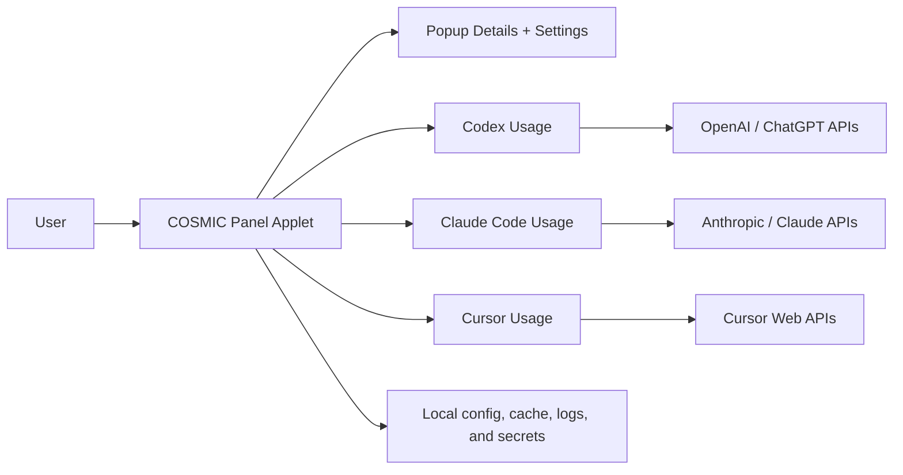

### 1.1 Scope, Positioning, and User Value

#### Scope and intent

- This document specifies YapCap, an independent Linux-native COSMIC panel applet inspired by CodexBar.
- YapCap defines its own Linux-native product behavior, architecture, and provider strategies in this document.
- The initial Linux feature scope is intentionally restricted to three providers.
- Provider 1 is Codex.
- Provider 2 is Claude Code.
- Provider 3 is Cursor.
- Additional providers beyond Codex, Claude Code, and Cursor are out of scope for v1.
- This document focuses heavily on authentication and usage retrieval mechanics.
- This document includes architecture, security, data model, UX, testing, packaging, and rollout planning.
- This document does not include implementation patches.
- This document is the implementation planning reference.

#### Product summary

- The applet displays near-real-time usage state for Codex, Claude Code, and Cursor.
- The applet lives in the COSMIC top panel.
- The panel-facing surface is compact and low-noise.
- A popup surface exposes details, account state, and auth repair actions.
- The applet supports per-provider enable or disable state.
- The applet supports automatic and manual credential sources where applicable.
- The applet prioritizes local sources first, remote calls second.
- The applet is privacy-oriented by design.
- No credentials are sent to third parties other than each provider endpoint.
- No telemetry is required for v1.

#### YapCap product goals

- Keep the source order and fallback intent internally consistent across providers.
- Keep provider terminology consistent throughout the app and documentation.
- **Keep data labels aligned where possible:** session, weekly, credits, reset.
- Preserve explicit source selection concepts.
- Preserve auto mode with ordered fallbacks.
- Preserve cookie auto import plus manual cookie header modes.
- Preserve CLI probes where they improve reliability or recoverability.
- Preserve OAuth path for Codex and Claude.
- Preserve Cursor web-only auth pattern.
- Preserve actionable user-facing error messages.

#### Non-goals for v1

- No external config import, migration, or integration path in v1.
- No mobile companion clients.
- No cloud sync for secrets.
- No team-shared configuration service.
- No provider-side write operations.
- No GNOME, KDE, tray, or other desktop frontend implementation in v1.
- No requirement to test v1 on non-COSMIC desktop environments.

#### Primary user stories

- As a Codex user, I want to see my current 5h and weekly usage in the panel.
- As a Codex user, I want to see credits when available.
- As a Claude Code user, I want OAuth usage when credentials are available.
- As a Claude Code user, I want CLI fallback when OAuth cannot be used.
- As a Claude Code user, I want optional web-cookie fallback where supported.
- As a Cursor user, I want usage summary from existing browser sessions.
- As a Cursor user, I want manual cookie header mode when auto import fails.
- As a Linux user, I want clear auth repair actions that do not assume platform-specific secret backends outside the supported Linux storage model.
- As a COSMIC user, I want the applet to look and behave like native panel applets.
- As a privacy-conscious user, I want local-only secret storage.

### 1.2 Shared Vocabulary and Provider Capability Summary

#### Global terminology

- Source mode means selected data source policy for a provider.
- Auto mode means ordered fallback evaluation.
- Manual cookie mode means using user-provided cookie header.
- OAuth mode means bearer-token API calls.
- CLI mode means subprocess + parsing.
- Web mode means cookie-backed web API or dashboard calls.
- Usage window means a normalized lane with percent-used value and reset metadata.
- Primary, secondary, and tertiary are ordinal UI lanes, not globally consistent semantic categories across providers.
- Aggregate `max(primary)` and `max(secondary)` are rough worst-headline proxies, not mathematically comparable measures across providers.
- Provider cost means billed usage amount where returned by API.

#### Provider capabilities matrix for v1

- Codex supports OAuth.
- Codex supports CLI RPC and PTY fallback.
- Codex optionally supports web dashboard extras in a later v1.x phase.
- Claude supports OAuth.
- Claude supports CLI PTY.
- Claude supports web cookie API.
- Cursor supports cookie-backed web API.
- Cursor supports stored session cookie fallback.
- Cursor does not use OAuth in v1.
- Cursor does not use CLI in v1.

## 2. COSMIC Frontend and Portable Runtime Architecture

### Runtime Architecture

v1 ships only a COSMIC frontend. Provider logic, auth, cache, scheduling, diagnostics, browser-cookie import, and CLI/PTY probing stay desktop-agnostic. The COSMIC applet is a thin frontend adapter over a shared runtime boundary.

UI state belongs to the libcosmic/iced `Application`. Background work runs behind a runtime subscription actor and communicates back to the UI only through typed runtime events.

### Architecture Decisions

| Decision | Why |
| --- | --- |
| COSMIC-only frontend in v1 | Keeps support and testing scope realistic |
| Shared runtime stays desktop-agnostic | Future GNOME/KDE/tray frontends can reuse provider/auth/cache logic |
| Backend owns `yapcap` paths and CLI | Frontend-specific branding should not leak into shared state ownership |
| `ConfigStore` is an injected abstraction | COSMIC can use `cosmic-config` without making it the core config model |
| Single-instance policy by default | Prevents concurrent refresh/token-write races against shared files |

#### Layer Boundary

**Diagram 2.1 — Layer Boundary**

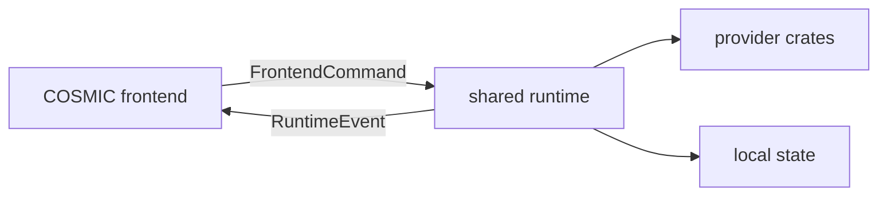

#### Frontend Boundary

**Diagram 2.2 — Frontend Boundary**

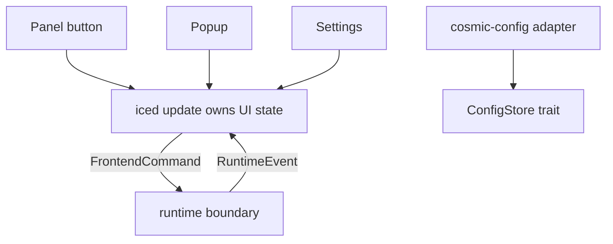

#### Runtime Internals

**Diagram 2.3 — Runtime Internals**

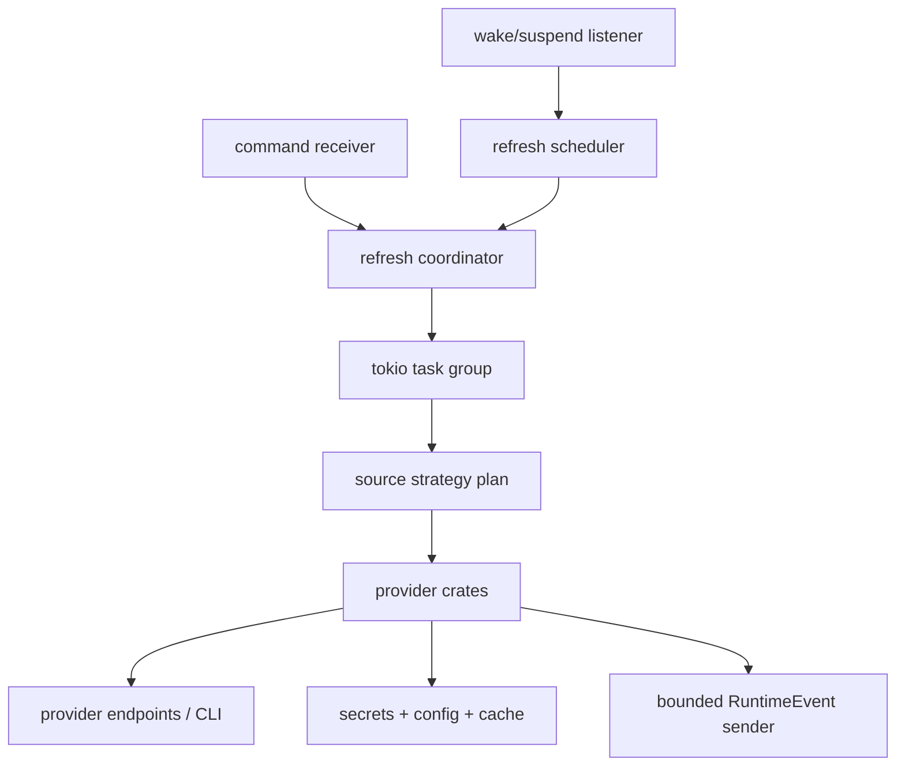

#### Future Frontends

**Diagram 2.4 — Future Frontends**

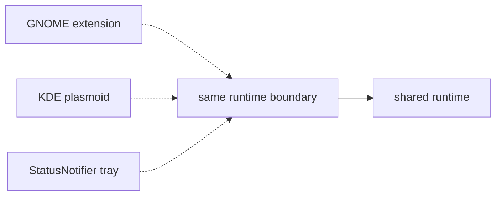

### Planned Workspace Layout

Reusable Rust code lives under `crates/`; desktop-specific presentation layers live under `frontends/`. The COSMIC applet is the only v1 frontend and lives under `frontends/` even though it is a Rust crate.

```text
yapcap/
|-- Cargo.toml
|-- crates/
|   |-- yapcap-core/            # shared models, provider traits, config schema, errors
|   |-- yapcap-runtime/         # scheduler, refresh coordinator, command/event boundary
|   |-- yapcap-auth/            # Secret Service, vault, token lifecycle
|   |-- yapcap-browser-cookies/ # Chromium/Firefox cookie import and decryptors
|   |-- yapcap-cli-probe/       # shared subprocess and PTY probing
|   |-- yapcap-cli/             # backend CLI commands such as doctor and cache ops
|   |-- yapcap-providers-codex/
|   |-- yapcap-providers-claude/
|   |-- yapcap-providers-cursor/
|   `-- yapcap-daemon/          # future optional runtime host, not v1
|-- frontends/
|   |-- cosmic-applet/            # v1 Rust/libcosmic frontend
|   |-- gnome-shell-extension/    # future JS/GJS frontend, not v1
|   |-- kde-plasmoid/             # future QML/JS frontend, not v1
|   `-- statusnotifier-tray/      # future tray frontend, not v1
|-- docs/
|   `-- spec.md
|-- packaging/
|   |-- deb/
|   |-- rpm/
|   `-- tarball/
`-- tests/
    |-- fixtures/
    |-- golden/
    `-- integration/
```

### Refresh Data Flow

**Diagram 2.5 — Refresh Data Flow**

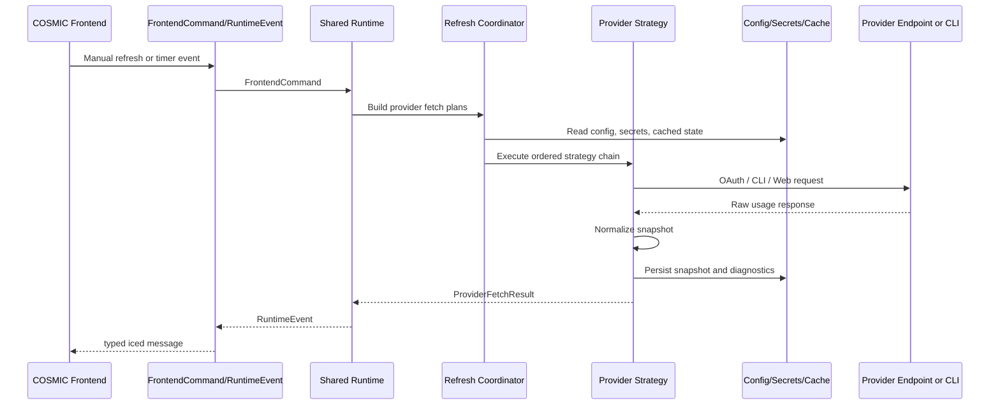

### 2.1 Desktop Portability Boundary

#### v1 support policy

- v1 supports COSMIC only.
- GNOME, KDE, Xfce, Cinnamon, MATE, LXQt, tray, Flatpak, and Snap frontends are not v1 deliverables.
- The shared runtime and provider crates must remain desktop-agnostic so those frontends can be implemented later by separate contributors.
- No v1 acceptance test requires running on non-COSMIC desktops.
- Future desktop frontends must reuse the same runtime command/event boundary instead of duplicating provider/auth logic.

#### Runtime hosting and CLI interaction

- When `yapcap-cosmic` is running, it is the sole host of `yapcap-runtime` for that user session.
- `yapcap-cli` first attempts to connect to the running runtime over a per-user Unix domain socket at `/run/user/$UID/yapcap/runtime.sock`.
- Backend-mutating CLI commands such as `provider refresh`, `cache clear`, vault operations, account operations, and path rescans must go through the running runtime when that socket is present.
- Read-only or diagnostic CLI commands such as `config show`, `config validate`, and `doctor` may run against a temporary standalone runtime when no live socket is present.
- `yapcap-cli` must not bypass `yapcap-runtime` to mutate shared state files directly.
- Standalone CLI runtime instances must respect the same backend locking and file-safety rules as the frontend-hosted runtime.

#### Core/runtime separation requirements

- Shared crates must not depend on `libcosmic`, `iced`, `cosmic-config`, COSMIC panel context types, or desktop widget types.
- Shared crates own provider fetching, source planning, auth-state mapping, token lifecycle, Secret Service/vault access, browser-cookie import, CLI/PTY probing, scheduler policy, cache format, diagnostics, and doctor checks.
- The COSMIC frontend owns only panel rendering, popup/settings rendering, COSMIC applet lifecycle, COSMIC config adapter wiring, and mapping runtime events into iced messages.
- v1 may run frontend and runtime in one process.
- The in-process boundary still uses desktop-neutral `FrontendCommand` and `RuntimeEvent` types.
- A future daemon or D-Bus service may expose the same boundary without changing provider crates.
- UI-facing models may include semantic presentation hints such as severity, label, and percent, but must not include COSMIC widget, icon, theme, or layout types.
- Provider modules must never call frontend code directly.
- Frontend code must never parse provider APIs, decrypt browser cookies, or spawn provider CLI PTYs directly.
- Tests for provider, auth, config migration, scheduler, parser, and cache behavior must run without a COSMIC session.

#### Frontend contract

- `FrontendCommand::Refresh { provider }`.
- `FrontendCommand::SetProviderEnabled { provider, enabled }`.
- `FrontendCommand::SetSourceMode { provider, mode }`.
- `FrontendCommand::SetCookieSourceMode { provider, mode }`.
- `FrontendCommand::SetRefreshInterval { interval }`.
- `FrontendCommand::SetManualCookie { provider, value }`.
- `FrontendCommand::ClearCache { scope }`.
- `FrontendCommand::RunDoctor { mode }`.
- `FrontendCommand::TestConnection { provider }`.
- `FrontendCommand::SetActiveAccount { provider, account_id }`.
- `FrontendCommand::AddAccount { provider, payload }`.
- `FrontendCommand::RenameAccount { provider, account_id, label }`.
- `FrontendCommand::RemoveAccount { provider, account_id }`.
- `FrontendCommand::TestAccount { provider, account_id }`.
- `FrontendCommand::VaultSetup { passphrase }`.
- `FrontendCommand::VaultUnlock { passphrase }`.
- `FrontendCommand::VaultLock`.
- `FrontendCommand::VaultRotate { current_passphrase, new_passphrase }`.
- `FrontendCommand::VaultReset`.
- `FrontendCommand::RepairAuth { provider, action }`.
- `FrontendCommand::RescanCliPaths`.
- `FrontendCommand::ReloadConfig { config }`.
- `RuntimeEvent::RuntimeReady`.
- `RuntimeEvent::SnapshotCommitted { provider, snapshot }`.
- `RuntimeEvent::ProviderStateChanged { provider, state }`.
- `RuntimeEvent::AuthStateChanged { provider, state }`.
- `RuntimeEvent::RefreshStarted { provider }`.
- `RuntimeEvent::RefreshFinished { provider, result }`.
- `RuntimeEvent::ConfigReloaded { result }`.
- `RuntimeEvent::VaultStateChanged { state }`.
- `RuntimeEvent::AccountListChanged { provider, accounts, active_account_id }`.
- `RuntimeEvent::TestAccountCompleted { provider, account_id, result }`.
- `RuntimeEvent::DoctorCompleted { result }`.
- `RuntimeEvent::DiagnosticWarning { warning }`.
- `RuntimeEvent::FatalError { error }`.
- `RepairAuth` is reserved for provider-specific login or credential-repair flows; cache, vault, account, and config operations are separate commands and not implicit sub-variants of `RepairAction`.
- `AccountPayload` includes label plus one credential-route payload: OAuth token bundle, cookie header, or provider-specific imported account reference.
- `TestAccountResult` includes provider, account id, success flag, validated route, elapsed timing, and optional remediation hint.

### 2.2 COSMIC Runtime Contract

#### COSMIC runtime integration references

- Use `cosmic::applet::run::<Window>(flags)` as applet entrypoint.
- Implement `cosmic::Application` for the applet window state.
- Use applet context from `core.applet`.
- Respect context fields driven by `COSMIC_PANEL_*` environment variables.
- Use `core.applet.icon_button` for panel button surfaces.
- Use `core.applet.applet_tooltip` for tooltip behavior.
- Use popup APIs and popup settings from libcosmic helpers.
- Use `core.applet.popup_container` for popup styling and autosize semantics.
- Use applet style from `cosmic::applet::style()`.
- **Follow cosmic-applets structure:** `main.rs`, `lib.rs`, `window.rs`.

#### COSMIC integration constraints

- Panel anchor can be top, bottom, left, or right.
- Panel size can vary by configuration.
- Applet icon size and padding must use suggested values from context.
- Popup positioning must honor anchor and bounds.
- Applet must tolerate startup with no provider data.
- Applet must render quickly even when network is unavailable.
- Refresh and network tasks must not block UI thread.
- Applet must survive service restarts without data corruption.
- Applet must degrade gracefully when no secrets backend is available.
- Applet must support Wayland-first desktop behavior.

### 2.3 Rust Workspace and Project Structure

#### Linux-first architecture overview

- **Architecture style:** COSMIC-only v1 frontend with desktop-agnostic shared runtime and provider crates.
- **Language:** Rust stable toolchain.
- **Async runtime:** tokio in the shared runtime, bridged to the COSMIC frontend through runtime events.
- **UI runtime:** libcosmic and iced only inside `frontends/cosmic-applet`.
- **HTTP client:** reqwest with rustls.
- **D-Bus client stack:** zbus for Secret Service and login1 integration.
- **JSON parsing:** serde and serde_json.
- **Time handling:** chrono or time crate with explicit UTC normalization.
- **Secrets storage:** Secret Service first, encrypted file fallback second.
- **Config storage:** desktop-neutral config model with COSMIC v1 adapter backed by `cosmic-config`, plus local cache/state files where needed.
- **Cache storage:** `~/.cache/yapcap/`.

#### Workspace and crate plan

- `yapcap-core` for provider abstractions, shared models, errors, config schema, migrations, and frontend-neutral presentation hints.
- `yapcap-runtime` for scheduler, refresh coordinator, runtime actors, command/event boundary, cache coordination, and doctor orchestration.
- `yapcap-auth` for secret storage and token lifecycle.
- `yapcap-providers-codex`.
- `yapcap-providers-claude`.
- `yapcap-providers-cursor`.
- `yapcap-browser-cookies` for Linux cookie import.
- `yapcap-cli-probe` shared PTY and subprocess crate used by Codex and Claude providers (required, not optional); it is isolated from `yapcap-core` so `portable-pty` and subprocess lifecycle concerns do not leak into pure model crates.
- `yapcap-cli` for backend-facing user commands such as `yapcap doctor`, `yapcap provider refresh`, `yapcap cache clear`, and `yapcap config validate`.
- `frontends/cosmic-applet` for the thin COSMIC frontend adapter and `cosmic-config` implementation.
- `frontends/gnome-shell-extension` is a future optional JavaScript/GJS frontend and is not a v1 deliverable.
- `frontends/kde-plasmoid` is a future optional QML/JS frontend and is not a v1 deliverable.
- `frontends/statusnotifier-tray` is a future optional tray frontend and is not a v1 deliverable.
- `yapcap-daemon` is a future optional runtime host for D-Bus or multi-frontend operation and is not a v1 deliverable.
- Config models and migrations live inside `yapcap-core`.
- Shared test fixtures and integration harnesses live under the top-level `tests/` directory; no separate `yapcap-tests` crate is planned for v1.

#### Data flow summary

- UI requests refresh or timer triggers refresh.
- Refresh coordinator builds provider fetch plans.
- Each provider executes source strategy chain.
- Each successful strategy returns normalized usage snapshot.
- Snapshot gets persisted to local cache.
- UI store receives state update and re-renders.
- Errors are scoped to provider and source.
- Health summary aggregates provider states only for icon severity overlay and tooltip alerts.
- User actions can force source mode or repair auth.
- Settings changes trigger re-plan and immediate refresh.

### 2.4 Execution, Scheduling, Networking, and Time

#### CLI command execution policy

- Subprocesses run with controlled environment.
- PATH is normalized using explicit search lists plus optional login-shell capture (`$SHELL -lc` probe with timeout).
- Commands run without shell interpolation.
- Timeouts are required for all subprocess probes.
- PTY sessions can be reused for short intervals when enabled.
- PTY session reuse defaults to off in v1 for safety.
- Process groups are managed for clean termination.
- On timeout, terminate process group then force kill if needed.
- Capture stdout and stderr separately.
- Redact sensitive output before logging.

#### Refresh scheduling

- Default refresh interval is 2 minutes.
- Supported intervals include manual, 1m, 2m, 5m, and 15m.
- Provider refreshes can run concurrently with bounded parallelism.
- A single provider cannot have overlapping refresh jobs.
- OAuth token refresh, delegated refresh side effects, and auth-file rewrites run inside the same per-provider no-overlap lock as the parent refresh job.
- Manual refresh bypasses regular cooldown for network but not auth prompt policy.
- **Manual refresh never violates no-overlap:** if a provider refresh is in-flight, one manual refresh is queued and coalesced to run immediately after completion.
- Backoff policy on repeated network errors is exponential with cap.
- Backoff policy resets on success.
- Auth failures use provider-specific cooldown handling.
- UI shows relative age of last successful snapshot.
- Stale snapshots remain visible with stale marker.

#### Config side-effect map

- Changes to provider enabled state, source mode, cookie source mode, manual cookie value, active account, account inventory, CLI path override, or secret-backend choice trigger provider re-plan and immediate provider-scoped refresh.
- Changes to refresh interval reschedule timers only.
- Changes to UI-only preferences such as percentages-used-vs-remaining, last selected tab, and popup presentation do not trigger provider re-plan.
- Changes to log verbosity update diagnostics behavior only.
- Vault state changes trigger backend-state refresh and provider re-plan for affected providers.

#### Strategy planning abstraction

- Each provider has planning input struct.
- Planning input includes runtime.
- Planning input includes selected source mode.
- Planning input includes source availability booleans.
- Planner returns ordered steps with inclusion reasons.
- Planner marks plausible availability per step.
- Execution path in auto mode runs available steps only.
- Execution path in explicit mode runs exact selected source.
- Planner debug lines are stable machine-readable strings.
- Planner behavior is unit tested.

#### Network client specification

- Shared reqwest client with connection pooling.
- Per-request timeout defaults by provider.
- Redirect policy follows provider defaults.
- Gzip and brotli decoding enabled.
- User-Agent per provider strategy is required to match provider endpoint expectations and reduce false anti-abuse classification, especially for cookie-backed web sources.
- Retry policy disabled for non-idempotent calls.
- Retry policy optional for GET with network errors.
- Proxy support from system env variables.
- TLS backend rustls for portability.
- Certificate pinning is not required for v1.

#### Time and timezone handling

- Parse provider reset times in UTC when given as epoch.
- Parse ISO8601 with and without fractional seconds.
- Convert to local timezone for display.
- Keep raw UTC in snapshot.
- Relative reset text is derived at render time.
- Midnight boundary handling must be timezone-safe.
- Leap seconds are ignored.
- Invalid date strings return `None` with warning.
- Date formatting is locale-aware where possible.
- Tests cover DST transitions.

### 2.5 Shared Runtime and COSMIC Iced Bridge

#### Shared runtime contract

- `yapcap-runtime` owns the command receiver, refresh coordinator, tokio task group, scheduler, cache coordination, and bounded runtime-event sender.
- `yapcap-runtime` is constructable and testable without `iced` or `libcosmic`.
- `yapcap-runtime` exposes desktop-neutral command/event channels and startup hooks only.
- A future daemon may host the same runtime object graph without changing provider crates.
- No type defined in `yapcap-runtime` may reference iced `Message`, `Task`, widget types, or libcosmic panel context.

#### COSMIC iced bridge

- UI state is owned only by the iced `Application` instance.
- Background tasks must never mutate UI state directly.
- The concrete pattern in `frontends/cosmic-applet` is a thin iced subscription bridge over a separately constructed `yapcap-runtime`.
- The iced bridge is created with the libcosmic/iced stream-subscription API exposed by the pinned dependency set in `Cargo.lock`; symbol names may vary between iced revisions.
- The iced bridge subscribes to `RuntimeEvent` values emitted by `yapcap-runtime` and maps them into iced `Message` values.
- `update()` stores a command sender handle after receiving `Message::RuntimeReady`.
- UI actions send desktop-neutral `FrontendCommand` values through that sender handle.
- One-shot `Task::perform` is used only for fire-and-forget command dispatch or tiny local async work.
- No global `Arc<Mutex<AppState>>` is used for UI state ownership.
- Provider state transitions happen only in `update()` from inbound messages.
- This is the required architecture for M0 and not optional.
- Runtime-to-UI channel is bounded (default capacity 256 messages).
- Critical events (`SnapshotCommitted`, `ProviderStateChanged`, `FatalError`) are never dropped; sender awaits capacity (backpressure).
- Non-critical progress events are coalesced per provider/source key using latest-wins semantics before enqueue.
- Channel overflow must not panic the applet; overflow incidents increment diagnostics counters and emit one throttled warning.
- Backpressure affects producer tasks only and must not block the UI thread.

### 2.6 Panel Instance Model and Wake Handling

#### Applet icon and instance model

- v1 is one applet process and one panel icon slot.
- v1 allows only one active applet instance per user session by default.
- The single-instance authority is a per-user Unix domain socket at `/run/user/$UID/yapcap/runtime.sock`.
- The process that successfully binds that socket owns the live runtime for the session.
- CLI clients detect a running instance by connecting to that socket.
- If the socket cannot be contacted but still exists, startup may replace it only after verifying that the owning process is gone.
- Multi-provider display is handled in popup tabs, not multiple panel icons.
- Panel icon metrics use aggregate worst-case function across enabled providers.
- Aggregate bars are computed as max-used percent for `primary` and `secondary` lanes across providers with data.
- Tertiary lane does not get its own bar but participates in severity and alert calculations via max-used percent across `primary`, `secondary`, and `tertiary`.
- Tooltip always includes per-provider summaries so high usage on any provider or lane is visible.
- Popup tab selection persists across restarts, but does not change icon aggregation behavior.
- Multi-instance deployment is out of scope for v1.
- Separate desktop entries per provider are out of scope for v1.
- Widget tree is designed around a single panel button.
- This resolves the earlier panel-icon ambiguity in favor of one icon.

#### Wake-from-suspend handling

- Wake handling is explicitly in scope for v1.
- App subscribes to `org.freedesktop.login1.Manager.PrepareForSleep` via zbus.
- On wake (`start=false`), scheduler posts a `ResumeDetected` message.
- `ResumeDetected` triggers one immediate refresh batch with jitter.
- Scheduler applies debounce window to suppress duplicate wake-triggered refreshes.
- Regular interval timer is resynchronized after wake-triggered refresh.
- If login1 is unavailable, fallback heuristic uses monotonic wall-clock jump detection.
- Resume handling is provider-agnostic and centrally scheduled.
- Wake-induced refreshes still respect per-provider in-flight locks.
- This behavior satisfies the wake/reliability target defined in the reliability section.

### 2.7 PTY Lifecycle, Startup Cost, and Protocol Drift

#### Protocol and header drift management

- Claude OAuth beta header is represented as versioned provider metadata, not hard-coded constant.
- Metadata includes header value, activation date, and fallback behavior.
- Beta-header rejection detection retries once without the beta header on `400` or `422` from the Claude OAuth usage endpoint, regardless of response body text.
- If no-header succeeds, app records compatibility override in local provider metadata cache.
- Codex RPC contract is treated as unstable and version-gated.
- App probes `codex --version` and maps it into compatibility matrix.
- For unknown or unsupported versions, app prefers PTY path and records warning.
- RPC method calls are feature-probed and error-classified (`method not found`, parse drift, transport).
- Compatibility matrix updates are part of routine release maintenance.
- This risk is accepted but mitigated by fallback and version checks.
- Claude beta-header metadata is shipped in provider config and can be patched in maintenance releases.
- "Local feature metadata" means a versioned static file read from `/usr/share/yapcap/features.toml` with optional user override at `~/.config/yapcap/features.toml`.
- Feature metadata is loaded at startup and on explicit `doctor --reload-features`; it is never fetched from network in v1.

#### PTY implementation and lifecycle model

- **PTY crate for v1:** `portable-pty`.
- PTY I/O runs in dedicated worker tasks using blocking adapters where needed.
- Default mode is ephemeral session per probe.
- Optional reuse mode is actor-managed with short idle timeout.
- Every PTY process is started in its own process group.
- Timeout path sends graceful termination then force-kill on deadline.
- App shutdown drops session manager and kills all managed child process groups.
- No PID files are used for lifecycle management.
- Child PTY process sets parent-death signal (`PR_SET_PDEATHSIG`) on Linux when available for direct-parent crash cases.
- Crash recovery runs a startup stale-process sweep for tagged child command lines.
- Orphan risk is primarily reduced by process-group lifecycle management and startup sweep; `PR_SET_PDEATHSIG` is only an additional safeguard.
- PTY crate choice for v1 is fixed to `portable-pty`.

#### Runtime startup and PATH probe cost control

- Startup sequence launches UI immediately and does not block on shell probe.
- Login-shell PATH probe runs in background after first render.
- Probe result is cached in runtime context for the session.
- Refresh cycles use cached resolution and do not spawn shell probes.
- Shell probe reruns only on explicit rescan or repeated launch failures.
- Probe retries use exponential backoff with upper bound.
- Cold-start performance target excludes optional shell probe completion.
- Provider status displays `discovering CLI path` while probe is pending.
- Probe command and output are redacted in logs to avoid environment leakage.
- This policy keeps CLI discovery predictable and low-overhead.
- **If user triggers manual refresh while discovery is pending:** Auto mode executes non-CLI strategies immediately and schedules one follow-up refresh when discovery completes.
- In explicit CLI mode, manual refresh waits for probe completion up to probe timeout; then it runs static path scan and returns `binary missing` if still unresolved.

## 3. Authentication, Secrets, Config, and Policy

### Local Storage Map

| Data | Primary Location | Notes |
| --- | --- | --- |
| Non-secret app settings | COSMIC v1 adapter backed by `cosmic-config` app id `com.topi.YapCap` | Core sees only the `ConfigStore` trait |
| Snapshot cache | `~/.cache/yapcap/snapshots.json` | Normalized provider snapshots |
| Debug cache | `~/.cache/yapcap/debug/` | Provider-scoped diagnostics, redacted |
| Logs | `~/.local/state/yapcap/logs/` | Redacted structured logs |
| Encrypted fallback vault | `~/.config/yapcap/secrets.enc` | Explicit opt-in when Secret Service is unavailable |
| Per-provider cookie cache | Secret Service item, vault entry, or memory-only state | Accepted normalized cookie header plus source/account metadata |
| Cursor stored session | `~/.local/share/yapcap/cursor-session.json` | 0600, atomic write, policy-disableable |

### Secret and Config Boundary

**Diagram 3.1 — Secret and Config Boundary**

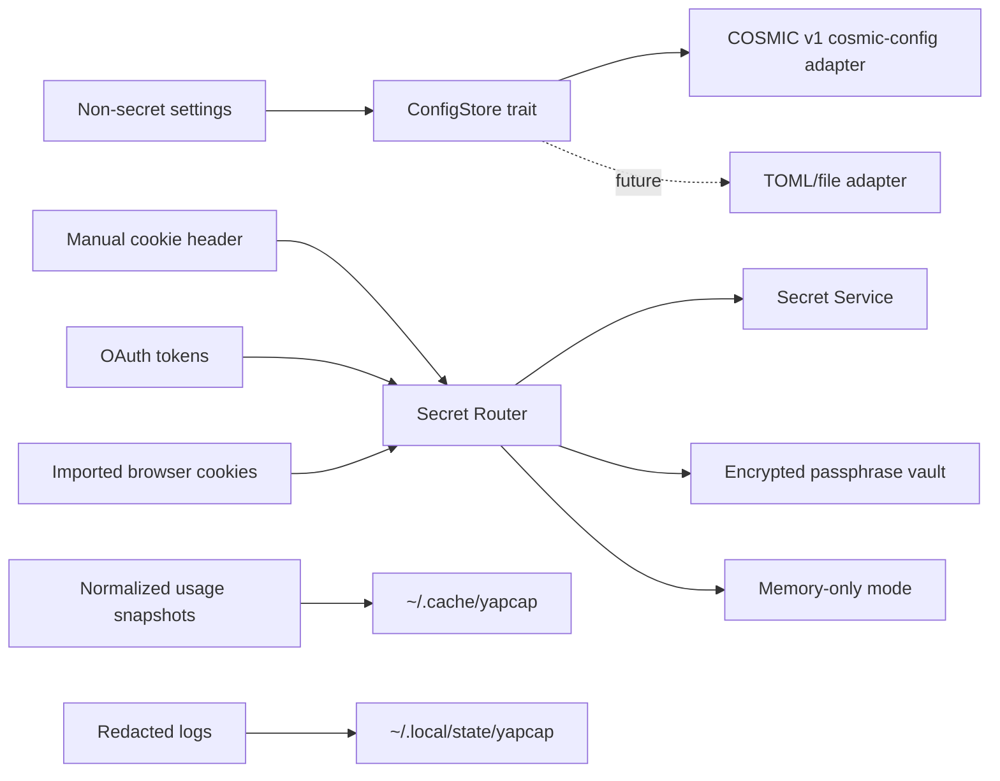

### Auth State Mapping

**Diagram 3.2 — Auth State Mapping**

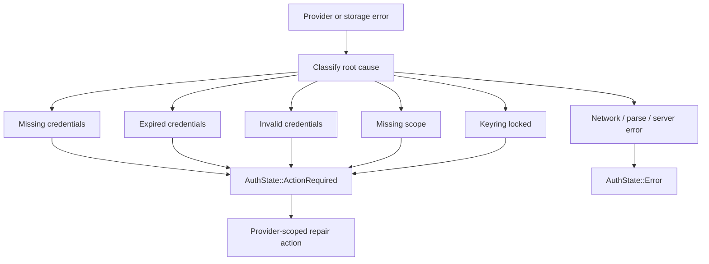

### 3.1 Authentication Principles and Secret Storage

#### Authentication architecture principles

- Authentication data is provider-scoped.
- Secrets are never logged.
- Tokens and cookie headers are treated as sensitive strings.
- Cache entries are distinct from source-of-truth secrets.
- Cached cookies are invalidated on auth errors.
- Expired OAuth credentials trigger refresh where possible.
- Refresh loops must have cooldown gates.
- Interactive auth repair must be user-initiated by default.
- Background auth repair must not spam desktop secret prompts.
- Manual secret overrides take precedence over auto import.

#### Linux secret storage strategy

- **Primary backend:** Secret Service via D-Bus.
- **Collection target:** default login collection.
- **Item label prefix:** `YapCap`.
- Item attributes include provider and key category.
- **Secondary backend:** encrypted file vault in user config dir, opt-in only.
- **Vault key management:** user passphrase is required when Secret Service is unavailable.
- Argon2id is used only for passphrase-to-KEK derivation with random salt and calibrated cost.
- Vault DEK is random 32 bytes and is wrapped by the KEK; payloads are encrypted with XChaCha20-Poly1305.
- **File fallback path:** `~/.config/yapcap/secrets.enc`.
- If Secret Service is unavailable and passphrase is not provided, app runs in explicit memory-only mode.

#### Credential classification

- Class A is OAuth access token.
- Class B is OAuth refresh token.
- Class C is ID token or account metadata token.
- Class D is cookie header.
- Class E is parsed single cookie value such as `sessionKey`.
- Class F is derived account identity from token claims.
- Class G is non-secret source metadata.
- Class H is cached normalized usage snapshot.
- Classes A-E are sensitive.
- Classes F-H are not treated as full secrets.

### 3.2 Config Model and Paths

#### Config model overview

- Core config model stores non-secret provider preferences.
- `cosmic-config` is the COSMIC v1 backend adapter, not a dependency of the core model.
- Manual cookie headers default to secret storage, not config.
- Config stores selected source mode per provider.
- Config stores refresh intervals and UI preferences.
- Config stores account-switching metadata for token accounts.
- Config schema versioning is mandatory.
- Config migration runs on startup before any fetch.
- Config writes go through the `ConfigStore` abstraction.
- Any file-backed config fallback must use 0600 permissions.
- Invalid config values are normalized with warning.
- Future frontends do not automatically share live settings with COSMIC; cross-frontend sharing in v1 happens only through explicit export/import of portable snapshots.

#### Proposed config paths

- **COSMIC v1 settings backend:** `cosmic-config` entries under app id `com.topi.YapCap`.
- **Provider token-account metadata (labels, active index):** through `ConfigStore`; COSMIC v1 persists it in `cosmic-config`.
- **Snapshot cache:** `~/.cache/yapcap/snapshots.json`.
- **Provider debug cache:** `~/.cache/yapcap/debug/`.
- **Logs:** `~/.local/state/yapcap/logs/`.
- Backend-owned cache/state/secret paths use the `yapcap` namespace regardless of which frontend is active.

#### Config backend decision: adapter plus cosmic-config for COSMIC v1

- Non-secret settings use a desktop-neutral `ConfigStore` trait.
- COSMIC v1 implements `ConfigStore` with `cosmic-config`.
- COSMIC frontend constructs the `ConfigStore` implementation at startup and injects it into `yapcap-runtime`.
- App uses typed config entries with explicit versioning.
- COSMIC applet consumes live config updates via `watch_config`, re-reads the typed settings through `ConfigStore`, and sends `FrontendCommand::ReloadConfig` carrying the new logical config payload to `yapcap-runtime`.
- v1 does not implement a parallel custom settings daemon protocol.
- Custom files remain only for caches, logs, and secret fallback vault.
- App-level schema migrations run through config-version upgrade functions.
- Cross-desktop portability mode can export or import TOML snapshots optionally.
- CLI or future daemon mode can read exported snapshot when `cosmic-config` bus is unavailable.
- `cosmic-config` integration is not optional for COSMIC applet runtime build, but it is isolated to the COSMIC adapter crate.
- This choice aligns with existing COSMIC applet ecosystem patterns.

### 3.3 Auth Repair UX and Error Policy

#### Auth repair UX model

- Popup shows provider auth status line.
- Status values map from unified state model and include ready, action required, login required, expired credentials, and parse error.
- **Codex repair action:** run `codex login`.
- **Claude repair action:** run `claude login` or `claude setup-token` guidance.
- **Cursor repair action:** open browser instructions and manual cookie field.
- For each provider, manual refresh is available.
- Auth errors include source and last attempt timestamp.
- Repair actions are explicit user operations.
- Background loops do not launch interactive login commands.
- UI never displays full token values.

#### Error taxonomy

- Auth missing.
- Auth invalid.
- Auth expired.
- Scope missing.
- Network timeout.
- Network DNS or TLS failure.
- HTTP unauthorized.
- HTTP server error.
- Parse failure.
- Binary missing.
- Error-to-auth-state mapping is deterministic and defined in this section.

#### Error handling policy

- Each error maps to user-facing one-line summary.
- Technical details are available in debug panel.
- Unauthorized errors clear relevant cookie caches.
- Unauthorized OAuth may trigger token refresh once per cycle.
- Parse errors should keep raw payload only in volatile debug memory.
- Parse errors should not expose secrets.
- Multiple failures in one refresh should preserve first primary error.
- Strategy fallback should annotate fallback reason.
- Explicit source mode failures should not silently fallback unless configured.
- Auto mode failures should continue down strategy chain.

#### Deterministic error-to-auth-state mapping

- `Auth missing` -> `AuthState::ActionRequired` with reason `MissingCredentials`.
- `Auth expired` -> `AuthState::ActionRequired` with reason `ExpiredCredentials`.
- `Auth invalid` -> `AuthState::ActionRequired` with reason `InvalidCredentials`.
- `Scope missing` -> `AuthState::ActionRequired` with reason `ScopeMissing`.
- `HTTP unauthorized` on the final attempted source for a provider -> `AuthState::ActionRequired` with reason `LoginRequired`.
- Secret backend locked read failures -> `AuthState::ActionRequired` with reason `KeyringLocked`.
- Manual input required conditions -> `AuthState::ActionRequired` with reason `ManualInputRequired`.
- Unsupported CLI version or protocol incompatibility without alternative CLI path -> `AuthState::ActionRequired` with reason `UnsupportedVersion`.
- Network timeout, DNS/TLS, HTTP 5xx, and parse failures map to `AuthState::Error` unless an auth root cause is proven.
- Binary missing maps to `AuthState::ActionRequired` with reason `BinaryMissing` when selected mode requires CLI; otherwise it is a strategy-level error with fallback.

### 3.4 Security, Privacy, and Observability

#### Security requirements

- Secrets never written to plaintext logs.
- Secrets in memory should be short-lived where feasible.
- Secret file fallback must be encrypted with authenticated encryption.
- Config and secret files require 0600 permissions.
- Network requests must enforce HTTPS.
- TLS cert validation must remain enabled.
- No insecure proxy behavior by default.
- Manual cookie headers are treated as secrets.
- UI redaction uses partial masking for tokens.
- Clipboard operations for secrets are avoided by default.

#### Privacy requirements

- No third-party analytics.
- No crash upload service in v1.
- No remote config service.
- No provider requests unless provider is enabled.
- No browser cookie import unless provider source requires it.
- No broad filesystem scans.
- Only known provider-related paths are read.
- User can clear all cached data from UI.
- User can disable specific providers entirely.
- Documentation must list all read paths.

#### Observability and logging

- Use structured logs with provider and source fields.
- Log level defaults to info.
- Debug mode can enable request timing and strategy decisions.
- Debug mode must still redact secrets.
- Keep rotating log files by size and count.
- Include refresh cycle id for correlation.
- Include source plan output in debug logs.
- Include fallback reason lines.
- Include endpoint name but not full secret query strings.
- Include subprocess exit statuses.

### 3.5 Provider-Specific Secret Mapping and Accounts

#### Codex detailed auth and storage mapping

- **Source file:** `<CODEX_HOME or ~/.codex>/auth.json`.
- **Sensitive keys:** `tokens.access_token`.
- **Sensitive keys:** `tokens.refresh_token`.
- **Optional sensitive key:** `tokens.id_token`.
- **Optional id key:** `tokens.account_id`.
- **Optional API key mode:** `OPENAI_API_KEY`.
- **Last refresh timestamp:** `last_refresh`.
- Applet does not copy codex tokens to separate secret store by default.
- Applet may cache parsed metadata in memory.
- Applet writes updated auth.json only when token refresh occurs.

#### Claude detailed auth and storage mapping

- **Source file:** `~/.claude/.credentials.json`.
- **Primary token path:** `claudeAiOauth.accessToken`.
- **Refresh token path:** `claudeAiOauth.refreshToken`.
- **Expiry path:** `claudeAiOauth.expiresAt` millis.
- **Scope path:** `claudeAiOauth.scopes`.
- **Tier path:** `claudeAiOauth.rateLimitTier`.
- **Env override token key:** `YAPCAP_CLAUDE_OAUTH_TOKEN`.
- **Env override scopes key:** `YAPCAP_CLAUDE_OAUTH_SCOPES`.
- Optional cached copy in Linux secret backend.
- Optional cookie cache for web mode in Linux secret backend.

#### Cursor detailed auth and storage mapping

- Cached cookie header stored in Linux secret backend.
- Cookie cache is stored as one secret entry per provider/account route, not one entry per raw cookie.
- Source label stored with cached header.
- Stored session file path `~/.local/share/yapcap/cursor-session.json`.
- Session file contains serialized cookies.
- Cursor auth material has two distinct token families that must not be conflated.
- Browser cookie auth is a web token route and is represented by imported cookies such as `WorkosCursorSessionToken`.
- Local `auth.json` bearer/JWT material is a separate session route used against `api2.cursor.sh`-style endpoints.
- Browser cookie auth cannot be reconstructed from `auth.json`; Cursor web usage requires a real browser session cookie.
- Manual cookie header is never stored in cosmic-config; only secret backends may persist it.
- Browser-imported cookies are not permanently copied unless accepted.
- Accepted import can update cached header.
- Auth failures clear cached header.
- Auth failures may clear stored session on explicit login invalid.
- No OAuth tokens are used for Cursor in v1.

#### Token accounts and multi-account design

- Token accounts are supported for Claude and Cursor in v1.
- Codex account switching relies on CODEX_HOME and auth file source, not token account tokens.
- Token account data structure includes id, label, token, timestamps.
- Active index picks the selected account.
- Token account tokens are treated as secrets.
- Token account metadata can be in config.
- Token account token values should be in secret backend when possible.
- Manual cookie source becomes mandatory when token account injection type is cookie header.
- Claude token account can hold OAuth token or session key.
- Routing logic determines OAuth vs web path for Claude account token.
- Popup provider tab embeds account switcher at top when provider supports token accounts.
- Switching account triggers immediate provider-scoped refresh and source replan.

#### Manual credential input rules

- Manual cookie inputs are normalized.
- Prefix `Cookie:` is optional.
- If a provider expects one cookie and bare token is provided, prepend cookie name.
- Trailing whitespace is removed.
- Quoted wrapper strings are unwrapped.
- Empty values are treated as unset.
- Values are never echoed back unmasked.
- Invalid manual values produce validation warnings before save.
- Save action can include test connection button.
- Test failures do not drop user input automatically.

### 3.6 Caching, Migration, and UX Copy

#### Caching policy

- Snapshot cache write on successful refresh only.
- Snapshot cache load on startup to avoid blank state.
- Cache schema version embedded.
- Unknown cache version triggers discard and rebuild.
- Cache writes are atomic.
- Cache corruption is non-fatal.
- Cookie cache is separate from snapshot cache.
- OAuth credential cache should have short in-memory TTL.
- In-memory caches must be invalidated on settings change.
- Cache clear action available in settings.
- Claude web `organizations` and `account` responses use the TTLs defined in the Claude web endpoints section.
- Claude web cache is partitioned by provider account identity to avoid cross-account bleed.
- Usage endpoint responses are never reused across scheduled cycles.
- Cache metadata includes age to support tooltip debug visibility.
- Read-only cache directories, disk-full conditions, and failed atomic renames are non-fatal; runtime keeps in-memory state and surfaces a diagnostics warning.
- On filesystems where atomic rename guarantees are weak or absent (for example some NFS mounts), cache writers must downgrade guarantees in diagnostics and avoid corrupting previous good files.

#### UX copy guidelines

- **Use provider names exactly:** Codex, Claude Code, Cursor.
- Distinguish source label from provider label.
- Use `Login required` for auth missing states.
- Use `Expired credentials` for refreshable failures.
- Use `No usage data yet` for empty-but-authenticated states.
- Use concise technical hints in debug panel.
- Avoid blame wording.
- Include direct repair commands where safe.
- Include path hints for file-based credentials.
- Include link buttons to provider dashboards where available.

#### Account-switching UI detail

- Popup provider tab includes account switcher when provider supports token accounts.
- Account switcher is above usage cards and below provider header.
- Switching account updates active token index and triggers immediate refresh.
- Add-account flow validates token or cookie before committing.
- Remove-account flow requires confirmation when account is currently active.
- This resolves the earlier token-account UX underspecification around popup layout and account handling.

### 3.7 Encrypted Vault, Secret Service, and Passphrase Fallback

#### Encrypted fallback key management

- The phrase "per-user local key material" is removed as an implementation basis.
- File vault fallback is passphrase-based and explicit opt-in.
- User passphrase is required to unlock vault each login session.
- Argon2id derives KEK from passphrase plus random 16-byte salt.
- KEK parameters are persisted with the vault header and are upgradable.
- Vault DEK is random 32-byte key generated on vault creation.
- DEK is wrapped by KEK using XChaCha20-Poly1305.
- Each secret entry is encrypted by DEK with a random 24-byte nonce from OS CSPRNG and AEAD tag.
- If user declines passphrase mode, app runs memory-only and non-persistent.
- If app starts in memory-only mode because Secret Service is unavailable, backend availability is rechecked periodically and on explicit retry actions.
- If Secret Service becomes available mid-session, app surfaces a non-blocking prompt to migrate from memory-only mode; automatic migration of in-memory secrets does not happen without user confirmation.
- No machine-id or UID-derived keys are allowed.
- Forgetting passphrase has no cryptographic recovery path; reset destroys vault contents.

#### Secret Service locked-state behavior

- Locked Secret Service is treated as distinct from unavailable backend.
- Backend status enum includes `Locked`.
- On startup with `Locked`, app does not auto-fallback to memory-only.
- Provider auth state surfaces `Keyring locked` with repair action.
- Repair action attempts unlock through Secret Service prompt path.
- Runtime also subscribes to lock-state property changes when backend supports it.
- If signal subscription is unavailable, app polls lock-state with capped interval.
- Once unlocked, pending credential reads are retried automatically.
- User can explicitly choose memory-only mode from locked state UI.
- Locked-state behavior is mandatory for M6, when auth repair UI exists.

#### Passphrase fallback UX specification

- Passphrase vault flow is shown only when Secret Service is unavailable or user forces fallback mode.
- When unavailable backend is detected at startup, app shows non-blocking `Persistent secrets unavailable` banner with `Set vault passphrase` action.
- First-time setup modal requires passphrase entry plus confirmation before any secrets are persisted.
- Until setup is completed, app runs in memory-only mode and marks provider auth as `Action required` when persistence is needed.
- **Minimum entropy policy is enforced:** passphrase length >= 12 and zxcvbn score >= 3.
- Unlock prompt appears once per session unless user locks vault manually.
- Settings page includes `Change passphrase` action requiring current passphrase.
- Change-passphrase flow rewraps DEK without re-encrypting every entry.
- Settings page includes `Reset vault` destructive action with confirmation.
- Reset vault deletes encrypted vault and all stored secrets; forgot-passphrase outcome is explicit data loss on reset.
- This UX is required before enabling file-vault fallback in stable builds.

## 4. Provider Implementations

### Provider Source Matrix

| Provider | Auto Source Order | Explicit Modes | Main Auth Material | CLI Role |
| --- | --- | --- | --- | --- |
| Codex | OAuth -> CLI RPC -> CLI PTY | OAuth, CLI, Off | Codex `auth.json` OAuth tokens | Required fallback via RPC and PTY `/status` |
| Claude | OAuth -> CLI PTY -> Web | OAuth, CLI, Web, Off | Claude credentials file, override token, or `sessionKey` cookie | Required fallback via PTY `/usage` |
| Cursor | Cached cookie -> browser import -> stored session | Web, Off plus cookie source modes | Browser/manual/stored cookie header | None in v1 |

### Provider Strategy Overview

**Diagram 4.1 — Provider Strategy Overview**

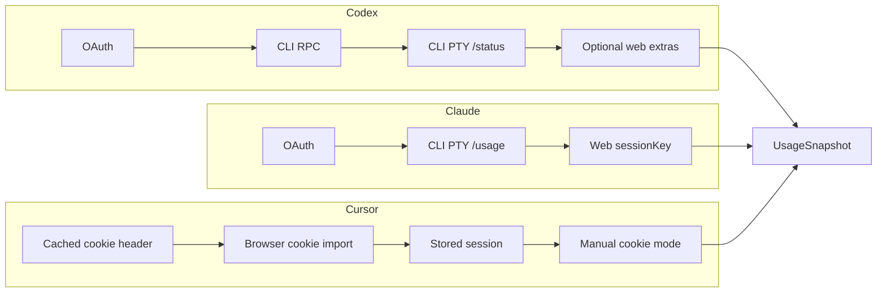

### Browser Cookie Import Flow

**Diagram 4.2 — Browser Cookie Import Flow**

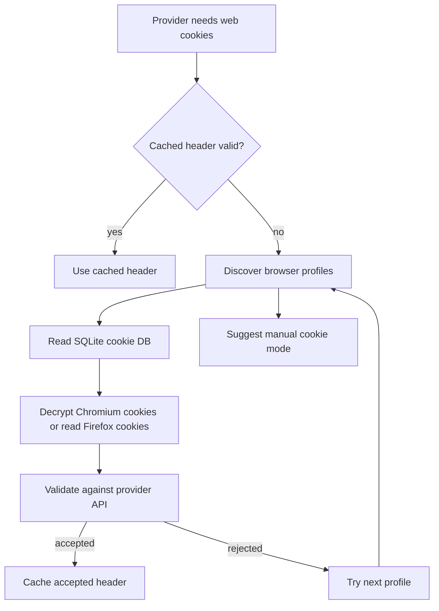

### 4.1 Codex

#### Codex authentication facts

- Codex OAuth credentials come from `auth.json` under codex home.
- Default codex home is `~/.codex`.
- If `CODEX_HOME` is set, that path is used.
- Auth file path is `<codex_home>/auth.json`.
- Auth file may include `OPENAI_API_KEY`.
- Auth file may include token object with access and refresh tokens.
- Optional id token and account id can be present.
- Codex OAuth refresh uses `https://auth.openai.com/oauth/token`.
- Codex OAuth usage endpoint defaults to `https://chatgpt.com/backend-api/wham/usage`.
- Codex OAuth requests include bearer token and optional `ChatGPT-Account-Id`.

#### Codex source strategy for Linux applet

- **App auto order:** OAuth -> CLI-RPC -> CLI-PTY.
- Explicit OAuth mode only runs OAuth strategy.
- Explicit CLI mode only runs CLI strategy.
- Optional web extras may be attached after primary success.
- Web extras are disabled by default for v1.
- If OAuth fails in auto mode, fallback to CLI.
- If OAuth is unavailable, directly run CLI.
- CLI strategy attempts RPC first.
- CLI strategy falls back to PTY `/status` parsing.

#### Codex OAuth token lifecycle rules

- Parse auth file on every refresh attempt with short memoization.
- **Determine `needs_refresh` using expiry-first policy:** refresh when token expiry is known and within 24 hours, otherwise use the 8-day `last_refresh` heuristic as a safety net.
- If refresh token is empty, skip refresh.
- On refresh success, update auth file atomically.
- Preserve unknown auth file fields when rewriting.
- Refresh errors map to user guidance.
- Expired or revoked refresh token triggers re-login instruction.
- OAuth unauthorized response invalidates access token cache.
- OAuth failures in explicit OAuth mode are terminal for that refresh.
- OAuth failures in auto mode allow fallback to CLI strategy.

#### Codex usage fetch semantics

- Decode `plan_type`.
- Decode primary and secondary rate limit windows.
- Decode credits block when present.
- Normalize used percent to float range 0..100.
- Convert reset epoch seconds to UTC timestamps.
- Keep reset description preformatted for UI.
- Build usage snapshot with provider identity if available.
- Attach credits snapshot to provider state.
- If no windows but credits exist in explicit OAuth mode, return partial usage plus credits.
- If no windows and no credits, return parse-no-limits error.

#### Codex CLI authentication and usage

- RPC command is `codex -s read-only -a untrusted app-server`.
- RPC methods include initialize, account/read, account/rateLimits/read.
- RPC stdout parsing requires line-based JSON messages.
- **CLI binary resolution uses deterministic search order:** explicit config path, ambient PATH, login-shell PATH capture, then known manager paths (`~/.nvm`, `~/.volta/bin`, `~/.local/share/fnm`, npm global bins).
- RPC startup failure should not crash provider loop.
- PTY fallback command runs codex with same safety args.
- PTY sends `/status`.
- PTY parser extracts credits, 5h limit, weekly limit, reset text.
- PTY parser detects update prompts and raises update-needed error.
- PTY parse retries once with larger terminal dimensions.
- RPC initialize has hard timeout and incompatible-protocol fallback to PTY.

#### Codex account identity resolution

- Identity source order starts from latest usage snapshot identity.
- Next source is auth file id token claims.
- Parse JWT payload safely without signature verification for local display fields only.
- Extract email claim.
- Extract plan claim.
- Optionally extract account id claim.
- Mark identity provenance for debugging.
- Never use unresolved identity to overwrite known scoped identity.
- Identity mismatches should surface warning icon in popup details.
- Identity is optional for usage display.

#### Codex web extras in Linux plan

- v1 does not require web extras.
- v1.1 optional feature gate can add dashboard extras.
- Linux cannot depend on WKWebView.
- If implemented, use HTTP plus HTML or JSON extraction only.
- Cookie import domains would be `chatgpt.com` and `openai.com`.
- Manual cookie header mode must be supported.
- Signed-in email matching should be strict when target email is known.
- Dashboard ownership policy should fail closed on ambiguity.
- Web extras must never replace primary usage strategy in v1.
- Web extras should be attach-only when primary usage exists.

#### Codex provider state machine

- Codex uses the canonical provider runtime model defined in the data-model section: `ProviderRefreshPhase`, `AuthState`, and `ProviderHealth`.
- Typical Codex success path is `Idle -> Refreshing -> Idle` with `AuthState::Ready` and `ProviderHealth::Ok`.
- Auth file missing, expired, revoked, keyring-locked, or user-input-required failures set `AuthState::ActionRequired` with the mapped reason while refresh phase returns to `Idle`.
- Parse, network, unsupported-version, and transport failures set `ProviderHealth::Error` while leaving `AuthState` unchanged unless an auth root cause is proven.
- Disabled provider state is represented by provider settings, not by a separate runtime enum variant.

#### Parser requirements for Codex CLI PTY

- Strip ANSI control sequences.
- Recognize `Credits:` numeric line.
- Recognize `5h limit` line.
- Recognize `Weekly limit` line.
- Parse percent-left values.
- Parse reset description suffixes.
- Parse fallback with relaxed spacing and punctuation patterns.
- Detect update prompt patterns.
- Retry parse with wider terminal when initial parse fails.
- Unit tests include old and new CLI output samples.

#### Failure mode and effects - Codex

- Missing `auth.json` in OAuth mode causes login-required state.
- Invalid auth JSON causes parse-error state.
- OAuth 401 leads to CLI fallback in auto.
- CLI missing binary causes source-unavailable error.
- RPC startup failure leads to PTY fallback.
- PTY parse failure with no windows surfaces parse error.
- Endpoint unavailable surfaces network error and stale cache.
- Refresh token expired surfaces re-login instruction.
- Account mismatch in optional web extras results in extras rejection only.
- All failures keep last known good snapshot visible.

#### Detailed milestone acceptance - M2 Codex

- OAuth auth file parser implemented.
- OAuth usage endpoint fetch implemented.
- Refresh token endpoint integration implemented.
- CLI RPC client implemented.
- PTY fallback parser implemented.
- Auto source planning matches specified order.
- Error mapping implemented.
- Snapshot rendering for Codex implemented.
- Unit and integration tests pass for Codex.
- Manual regression checklist for Codex passes.

#### Codex CLI discovery algorithm

- Resolution order starts with explicit configured binary path.
- Next source is `YAPCAP_CODEX_PATH` environment override.
- Next source is ambient `PATH` lookup.
- Next source is login-shell PATH capture using `$SHELL -lc 'command -v codex'`.
- Login-shell probe has strict timeout (default 1200 ms) and runs once per app session by default.
- **Next source is static candidate scan:** `~/.volta/bin/codex`.
- **Next source is static candidate scan:** `~/.nvm/versions/node/*/bin/codex`.
- **Next source is static candidate scan:** `~/.local/share/fnm/*/bin/codex` and `~/.fnm/*/bin/codex`.
- **Next source is static candidate scan:** `~/.local/bin/codex`, `/usr/local/bin/codex`, `/usr/bin/codex`.
- Resolved path is cached in memory and invalidated on launch failure.
- On launch failure, resolver retries with fresh login-shell probe using backoff.
- Manual `Rescan CLI Paths` action forces immediate re-probe.

#### Codex RPC initialize handshake and negotiation

- RPC session start timeout default is 6000 ms.
- Initialize request timeout default is 8000 ms.
- Initialize request payload includes client name and app version.
- Initialize request optionally includes protocol version hint when supported.
- App sends `initialized` notification only after successful initialize result.
- Method availability is feature-probed after initialize.
- If initialize times out or errors, RPC path is marked incompatible for current cycle.
- Incompatible RPC immediately falls back to PTY strategy.
- RPC incompatibility state is cached with short TTL to avoid repeated hangs.
- Debug diagnostics include initialize error category and elapsed timing.
- Timeouts are configurable via advanced settings and env overrides for slow systems.
- First failure on scheduled refresh falls through directly to PTY to preserve live-refresh budget; optional doubled-timeout retry is only used on explicit manual refresh or diagnostic runs.

### 4.2 Claude

#### Claude authentication facts

- Claude OAuth endpoint is `https://api.anthropic.com/api/oauth/usage`.
- **OAuth request uses `Authorization:** Bearer`.
- **OAuth request includes `anthropic-beta:** oauth-2025-04-20` in the current supported behavior.
- Claude OAuth credentials can come from environment override.
- Credential file path is `~/.claude/.credentials.json`.
- Required scope includes `user:profile` for usage endpoint.
- Claude OAuth credentials include access token, optional refresh token, scopes, expiry, and tier.
- Claude CLI can refresh or rewrite credentials in some flows.
- YapCap relies only on the Linux credential sources and secret-storage model defined in this spec.

#### Claude source strategy for Linux applet

- **Auto order in app runtime:** OAuth then CLI then Web.
- Explicit OAuth runs only OAuth.
- Explicit CLI runs only CLI.
- Explicit Web runs only Web.
- In auto mode, only plausibly available steps are executed.
- OAuth availability requires discoverable credentials or override token.
- CLI availability requires executable Claude CLI.
- Web availability requires sessionKey cookie in manual or imported cookies.
- If OAuth fails in auto mode, fallback to CLI.
- If CLI fails in auto mode and web is available, fallback to web.

#### Claude OAuth on Linux design

- Primary credential source is `~/.claude/.credentials.json`.
- Environment token override key is `YAPCAP_CLAUDE_OAUTH_TOKEN`.
- Optional scopes override key is `YAPCAP_CLAUDE_OAUTH_SCOPES`.
- Parse credentials into internal typed model.
- Validate access token presence.
- Validate required scope when calling usage.
- Treat missing scope as hard error with actionable message.
- Direct refresh path is optional and feature-gated because endpoint/client contract is undocumented.
- Default recovery path is delegated CLI re-auth touch plus credential re-read.
- Apply cooldown to delegated refresh attempts.

#### Claude OAuth refresh strategy

- **Default mode:** skip direct refresh and use delegated CLI repair flow.
- **Experimental mode:** try direct refresh if refresh token exists and endpoint contract is validated by versioned feature flag.
- Experimental endpoint is `https://platform.claude.com/v1/oauth/token`.
- If direct refresh unsupported or fails, attempt delegated CLI touch.
- Delegated touch runs Claude CLI status path to trigger credential refresh side effects.
- After delegated touch, re-read credential file.
- Verify credential change before concluding success.
- Use short cooldown for failed delegated attempts.
- Use longer cooldown for successful delegated attempts.
- Keep refresh policy options user-configurable and optionally overridable only by local, versioned feature metadata shipped with the binary (no remote runtime override service in v1).
- In explicit OAuth mode, delegated refresh failure is terminal for that refresh cycle and leaves the provider in `AuthState::ActionRequired`; CLI or web fallback is not attempted.

#### Claude CLI auth and usage strategy

- Run Claude CLI in PTY session.
- Use `--allowed-tools ""` to minimize side effects.
- Send `/usage`.
- Retry `/usage` once if initial output appears to be startup noise.
- Optionally send `/status` for identity enrichment.
- Parse current session percent.
- Parse current week percent where present.
- Parse model-specific weekly percent where present.
- Parse account and org identity hints where present.
- Return parse errors with short raw tail sample in debug mode only.

#### Claude web auth and usage strategy

- Domain is `claude.ai`.
- Required cookie is `sessionKey`.
- Manual mode accepts raw cookie header or bare token.
- Bare token is normalized to `sessionKey=<value>`.
- Auto mode imports browser cookies from known profiles.
- Web endpoint 1 gets organizations.
- Web endpoint 2 gets organization usage.
- Web endpoint 3 gets overage spend limit.
- Web endpoint 4 gets account email and plan hints.
- Web auth failures clear cookie cache and retry import on next cycle.

#### Claude web endpoints and mapping

- `GET https://claude.ai/api/organizations`.
- `GET https://claude.ai/api/organizations/{org_id}/usage`.
- `GET https://claude.ai/api/organizations/{org_id}/overage_spend_limit`.
- `GET https://claude.ai/api/account`.
- Session utilization maps to primary usage window.
- Weekly utilization maps to secondary usage window.
- Sonnet or Opus utilization maps to tertiary usage window where provided.
- Overage spend maps to provider cost snapshot.
- Account email maps to identity email.
- Plan hints map to identity login method text.
- Per-refresh required endpoint is usage; organizations and account are session-cached.
- `organizations` cache TTL is 30 minutes or until auth identity changes.
- `account` cache TTL is 30 minutes or until auth identity changes.
- `overage_spend_limit` cache TTL is 10 minutes.
- Manual refresh bypasses TTL for usage and overage but keeps organizations/account cache unless user requests full revalidate.

#### Claude provider state machine

- Claude uses the canonical provider runtime model defined in the data-model section: `ProviderRefreshPhase`, `AuthState`, and `ProviderHealth`.
- Missing OAuth scope maps to `AuthState::ActionRequired` with reason `ScopeMissing`.
- Refresh-token or delegated-refresh failures that need user intervention map to `AuthState::ActionRequired`.
- Locked backend reads map to `AuthState::ActionRequired` with reason `KeyringLocked`.
- Parse and network failures map to `ProviderHealth::Error` where user action is not required.
- Successful fallback from CLI or web restores `AuthState::Ready` and `ProviderHealth::Ok` while refresh phase returns to `Idle`.
- Repeated delegated-refresh failures remain in `AuthState::ActionRequired` with cooldown hint.
- User repair actions (`Run Claude Login`, `Unlock Keyring`, `Update Manual Cookie`) drive refresh phase back to `Refreshing`.

#### Parser requirements for Claude CLI PTY

- Strip ANSI control sequences.
- Trim to most recent usage panel.
- Find `Current session` percent.
- Find `Current week` percent where present.
- Find model-specific weekly percent where present.
- Parse percent tokens with used vs remaining heuristics.
- Extract account lines where present.
- Extract reset strings near matching labels.
- Ignore status-line context meter noise.
- Unit tests include enterprise and non-enterprise variants.

#### Failure mode and effects - Claude

- Missing credentials in OAuth mode causes login-required state.
- Missing `user:profile` scope causes explicit scope-error state.
- OAuth unauthorized triggers delegated refresh attempt with cooldown.
- Delegated refresh failure leads to CLI fallback in auto mode.
- CLI missing binary skips CLI step.
- CLI parse failure can still fallback to web in auto.
- Web no-session-key failure keeps auto chain behavior.
- Web unauthorized clears cookie cache.
- All sources unavailable reports no-source-available.
- Last known good snapshot remains visible with stale marker.

#### Detailed milestone acceptance - M3 and M4 Claude

- Claude credentials parser implemented.
- Scope validation implemented.
- OAuth usage fetch implemented.
- CLI PTY usage parser implemented.
- Delegated refresh coordinator implemented.
- Web cookie extraction and API fetch implemented.
- Auto and explicit planning implemented.
- Source labels and identity mapping implemented.
- Unit and integration tests pass for Claude.
- Manual regression checklist for Claude passes.

#### Claude CLI minimum version policy

- v1 uses compatibility-matrix policy, not a single hard-coded semantic version floor.
- `claude --version` is collected before PTY probe when feasible and matched against tested ranges in provider metadata.
- If version is unknown, app runs one capability probe (`/usage` parse signature check) before deciding support.
- If capability probe fails, CLI source is marked `unsupported_version`.
- User-facing message includes tested-version guidance and update command hint.
- If version parsing fails, app can still attempt one guarded capability probe.
- Parser fixtures include enterprise and non-enterprise shapes for each tested version range.
- Unsupported CLI version does not block OAuth or web strategies.
- Compatibility matrix lives in provider metadata and is updateable in maintenance releases.
- Initial tested-version ranges are finalized at M3 gate and must be documented in release notes.
- Capability-probe result is cached for the session per `(resolved_cli_path, cli_version_string)` tuple.
- Capability-probe cache is invalidated on CLI path change, manual rescan, or explicit cache clear.

### 4.3 Cursor

#### Cursor authentication facts

- Cursor is treated as web-only source.
- Primary endpoint is `https://cursor.com/api/usage-summary`.
- Secondary identity endpoint is `https://cursor.com/api/auth/me`.
- Optional legacy endpoint is `https://cursor.com/api/usage?user=ID`.
- Domain filters include `cursor.com` and `cursor.sh`.
- Known session cookie names include WorkOS and next-auth variants.
- Auto flow first uses cached cookie header if valid.
- Next it attempts browser cookie import in configured order.
- Last it falls back to stored session cookies.
- Manual cookie header mode bypasses import.

#### Cursor source strategy for Linux applet

- Cursor strategy type is web.
- Auto mode uses same internal flow as explicit mode.
- Source order is cached header then browser import then stored session.
- Known-session-name pass runs first.
- Domain-cookie fallback pass runs second.
- API acceptance decides whether to keep imported cookie set.
- Invalid cookies from a browser do not block trying next browser.
- Not-logged-in response clears cached header.
- Stored session is cleared only on auth invalid errors.
- Manual cookie mode errors are explicit and non-destructive.

#### Cursor stored session design on Linux

- **Store file path:** `~/.local/share/yapcap/cursor-session.json`.
- **Store content:** serialized cookie properties list.
- **Store permissions:** 0600.
- **Store update path:** atomic write and fsync best effort.
- **Store read path:** lazy load on first use.
- Store clear on invalid auth.
- Store format should include schema version field.
- Store format should preserve expiration and secure flags.
- Store must never be logged.
- Store can be disabled by policy.

#### Cursor API mapping

- `usage-summary` yields included plan and on-demand usage.
- Included plan percent maps to primary window.
- Auto usage percent maps to secondary window where available.
- API usage percent maps to tertiary window where available.
- Billing cycle end maps to reset timestamp for all windows.
- On-demand used and limit map to provider cost.
- `auth/me` email maps to identity email.
- `auth/me` name maps to identity display details in popup.
- Legacy request usage can map to supplemental request metrics.
- Legacy request metrics do not replace primary window unless configured.

#### Cursor provider state machine

- Cursor uses the canonical provider runtime model defined in the data-model section: `ProviderRefreshPhase`, `AuthState`, and `ProviderHealth`.
- Missing valid session cookie maps to `AuthState::ActionRequired` with reason `LoginRequired`.
- Repeated browser import or decrypt failures that require manual cookie entry map to `AuthState::ActionRequired` with reason `ManualInputRequired`.
- Exhausting automatic cookie-import paths emits `RuntimeEvent::AuthStateChanged` with `AuthState::ActionRequired` and reason `ManualInputRequired`, which is the concrete path by which the UI suggests manual cookie mode.
- Locked backend reads map to `AuthState::ActionRequired` with reason `KeyringLocked`.
- Non-auth network and parse failures map to `ProviderHealth::Error`.
- Successful browser import, stored-session use, or manual-cookie validation restores `AuthState::Ready` and `ProviderHealth::Ok`.
- User actions (`Import Cookies`, `Set Manual Cookie`, `Unlock Keyring`) transition refresh phase back to `Refreshing`.

#### Parser requirements for Cursor JSON APIs

- Decode usage summary JSON with optional fields.
- Convert cents to USD for cost metrics.
- Bound percentages to 0..100.
- Decode billing cycle timestamps.
- Decode user info JSON.
- Decode legacy usage JSON.
- Compose combined snapshot with optional lanes.
- Preserve raw JSON in debug-only field.
- Parse errors include concise context.
- Unit tests cover missing fields and schema drift.

#### Failure mode and effects - Cursor

- No cached header and no browser cookies leads to login-required state.
- Cached header unauthorized clears cache and retries other sources next cycle.
- Browser import failure on one browser attempts next candidate.
- Domain-only cookie candidates are validated by API before acceptance.
- Stored session unauthorized clears stored session.
- Stored session network failure does not clear stored session.
- JSON decode failure surfaces parse error.
- Endpoint timeout surfaces network timeout.
- Partial success without user info still returns usage snapshot.
- Last known good snapshot remains visible with stale marker.

#### Detailed milestone acceptance - M5 Cursor

- Cursor cookie importer abstraction implemented.
- Cached header strategy implemented.
- Browser import strategy with candidate scanning implemented.
- Stored session file fallback implemented.
- Usage-summary and auth/me parsing implemented.
- Legacy usage endpoint support implemented.
- Snapshot mapping implemented.
- Settings controls for cookie source implemented.
- Unit and integration tests pass for Cursor.
- Manual regression checklist for Cursor passes.

### 4.4 Browser Cookie Import Shared by Web Providers

#### Browser cookie import on Linux

- Implement browser import abstraction independent of desktop toolkit.
- Chromium path discovery must support stable, beta, and dev channels.
- Firefox profile discovery must support profiles.ini and default profile fallback.
- Browser import should support custom path overrides in config.
- SQLite read should use immutable mode where possible.
- Locked database fallback should use copy-to-temp read.
- Decryption support for Chromium cookies is required in v1 for GNOME Keyring and KWallet-backed profiles.
- If decryption cannot be performed, app surfaces actionable error and immediately suggests manual cookie mode.
- Import order should be configurable per provider.
- Imported cookie records should include source label metadata.
- Chromium decryptor implementation is in-repo, not delegated to shell tools.
- `yapcap-browser-cookies` does not depend on `yapcap-auth`; it returns candidate cookie headers and metadata to the provider/runtime layer, which performs validation and persistence.

#### Browser path defaults for Linux

- **Chromium default path:** `~/.config/chromium/Default/Cookies`.
- **Chrome default path:** `~/.config/google-chrome/Default/Cookies`.
- **Brave default path:** `~/.config/BraveSoftware/Brave-Browser/Default/Cookies`.
- **Edge default path:** `~/.config/microsoft-edge/Default/Cookies`.
- **Vivaldi default path:** `~/.config/vivaldi/Default/Cookies`.
- **Firefox profiles root:** `~/.mozilla/firefox/`.
- **Firefox cookie db per profile:** `cookies.sqlite`.
- Additional browser support is pluggable.
- Path discovery failures must not be fatal.
- The applet should show which source was used.

#### Cookie cache strategy for Linux

- Cookie cache reduces repeated expensive imports.
- Cache entries are provider-scoped.
- Cache entries include normalized header string.
- Cache entries include source label and stored timestamp.
- Cache entries include optional account scope and credential route metadata.
- Cache entries are secret and should live in secrets backend.
- If Secret Service is available, cookie cache is stored as one secret item per provider/account route.
- If Secret Service is unavailable and encrypted vault is configured, cookie cache is stored as one vault entry per provider/account route.
- If neither Secret Service nor vault persistence is available, cookie cache is memory-only for the session.
- Cache invalidation on auth errors is mandatory.
- Cache invalidation can be manual via UI action.
- Vault reset clears all cookie-cache entries stored in the vault.
- Cache TTL is optional because validity is auth-checked by API.
- Cache read and write operations must be lock-safe.

#### Chromium cookie decryption scope for v1

- Full Chromium decryption support is in scope for v1.
- Cursor v1 acceptance requires browser-import success on at least one common Chromium profile.
- Decryption implementation must support GNOME Keyring-backed and KWallet-backed profiles.
- Decryption implementation is an in-repo module inside the shared browser-cookie import crate.
- Importer must support Chrome, Chromium, Brave, and Edge default Linux profiles.
- Importer must support Firefox plaintext sqlite cookies without decryption path.
- Import failure must classify as "no cookies", "decrypt failed", or "db access failed".
- Decrypt-failed errors must include actionable manual-cookie instructions.
- Manual cookie mode remains a first-class path, not debug-only.
- Cookie importer dependencies are separate from applet secret storage backend.
- Linux Chromium decrypt path uses AES-CBC (Chromium Linux OSCrypt-compatible), not AES-GCM.
- Key derivation uses PBKDF2-HMAC-SHA1 with Chromium Linux parameters (salt `saltysalt`, one iteration, Linux OSCrypt key size).
- Cookie `encrypted_value` prefixes (`v10` and `v11`) must be detected and stripped before decrypt.
- Key retrieval supports Secret Service and KWallet paths for `Chrome Safe Storage` / `Chromium Safe Storage`, with explicit legacy fallback to literal `peanuts` when keyring-backed key is unavailable, matching Chromium Linux compatibility behavior.
- In-repo decryptor uses `rusqlite`, D-Bus keyring access, `aes` + `cbc` (or equivalent), `pbkdf2`, `hmac`, and `sha1` primitives.
- This is custom integration code, not shelling out to browser internals.

#### Multi-browser support priority and Linux implementation notes

- Browser-cookie import must support Firefox and Chromium-based browsers in v1.
- Priority order is Firefox import first, Chromium-family import second, and manual cookie entry third.
- Manual cookie mode remains the escape hatch for unsupported browser packaging, decryption failures, and unusual profiles.
- Snap and Flatpak browser cookie stores are out of scope for v1 and should be documented as unsupported rather than half-supported.

#### Firefox import path

- Firefox is the low-complexity path on Linux and should be attempted before Chromium-family decryptors.
- Firefox cookies are read directly from `cookies.sqlite` without an app-managed decryption path.
- Default profile discovery starts from `~/.mozilla/firefox/`.
- Importer should glob profiles and query `moz_cookies` for `.cursor.com` and the provider cookie name.
- Cursor web auth currently depends on the `WorkosCursorSessionToken` browser cookie.
- Firefox support is required for the first browser-import milestone.

#### Chromium-family import path

- Chromium-family browsers share one decryption strategy with browser-specific profile paths and keyring labels.
- Initial browser set is Chrome, Chromium, Brave, Edge, Vivaldi, and Opera.
- Default cookie DB path shape is `~/.config/<browser>/<profile>/Cookies`.
- Importer reads the `encrypted_value` field from the SQLite cookie store.
- Secret retrieval uses Secret Service first on GNOME-style systems.
- KWallet support is desirable but lower priority than Secret Service-backed Chromium import.
- Importer should classify browser path discovery, DB access, key retrieval, decrypt, and validation failures separately for diagnostics.

#### Chromium-family Linux crypto notes

- Linux Chromium OSCrypt compatibility uses PBKDF2-HMAC-SHA1 with salt `saltysalt`, one iteration, and a 16-byte derived key for the legacy CBC path.
- Legacy Linux cookie blobs use AES-128-CBC with `v10`-style prefixes after prefix stripping.
- Newer prefix variants must be detected explicitly before attempting decrypt.
- The implementation must keep browser-path enumeration separate from the shared decryptor code path.
- Recommended crate set for the importer is `rusqlite`, `glob`, `secret-service`, `aes`, `cbc`, `pbkdf2`, and `sha1`.

#### Browser support policy

- Browser import order should prefer the cheapest reliable path, not browser popularity guesses.
- Firefox should be tried before Chromium-family browsers because it avoids keyring and decrypt complexity.
- Chromium-family import should enumerate known browser paths deterministically.
- Unsupported desktop keyring setups, including unimplemented KWallet cases, should fall back to actionable manual-cookie guidance.

## 5. User Interface and Local Operations

### UI Surface Model

**Diagram 5.1 — UI Surface Model**

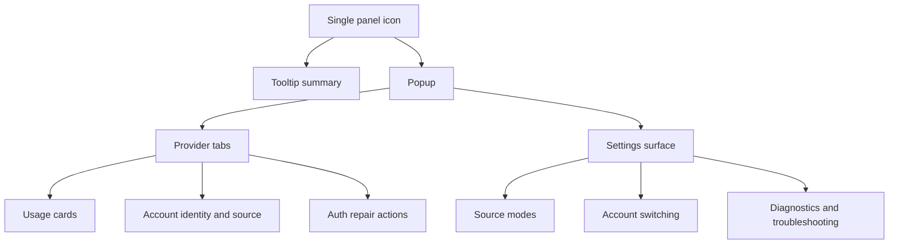

### 5.1 Panel, Popup, and Settings Surfaces

#### UI specification - panel surface

- Panel surface is one icon total for the applet process.
- Icon shape uses simple bars.
- Icon bars reflect aggregate usage across enabled providers, not one selected provider.
- Aggregate primary bar is `max(primary_percent_used)` across enabled providers with data.
- Aggregate secondary bar is `max(secondary_percent_used)` across enabled providers with data.
- Icon severity overlay reflects worst provider health state and worst lane utilization across `primary`, `secondary`, and `tertiary`.
- If no provider has data yet, bars show neutral empty state with stale marker.
- Hover tooltip shows one-line summary for each enabled provider plus aggregate worst-case line.
- Click opens provider popup.
- Middle-click optional quick refresh.
- Right-click optional context menu in v1.1.
- No pin-source selector exists in v1; popup tabs provide provider-specific detail.

#### UI specification - popup surface

- Popup includes provider selector tabs when multiple providers enabled.
- Popup default tab is last active provider.
- Popup header shows provider name and source label.
- Popup shows account email if available.
- Popup shows login method or plan hint.
- Popup shows primary, secondary, and tertiary windows.
- Popup shows reset timestamps in local time.
- Popup shows provider cost block where available.
- Popup includes refresh button.
- Popup includes provider settings shortcut.
- `QueuedRefresh` shows the normal refreshing affordance plus a small `Refresh queued` hint in popup details; the panel icon does not use a separate queued visual state.
- Popup includes account switcher row for providers with token accounts.
- Account switcher supports add, select, rename, remove, and test actions.
- Codex does not use token-account objects in v1; its account switching UX is file/home based and should be presented differently from Claude/Cursor token-account management.
- If no last-active tab exists yet, default tab is provider with highest primary used percent, then Codex/Claude/Cursor tie-break order.

#### UI specification - settings surface

- Source mode picker per provider.
- Cookie source picker where provider supports cookies.
- Manual cookie header input field where relevant.
- OAuth repair command actions where relevant.
- PTY session reuse (`keep CLI sessions alive`) is not part of the normal v1 settings surface; if exposed at all, it is an advanced/debug option and defaults to off.
- Toggle for show percentages used vs remaining.
- Refresh interval selector.
- Toggle for debug logs.
- Toggle for enable provider.
- Data-clear actions for caches and sessions.
- Secret backend status row (`ready`, `locked`, `unavailable`, `memory-only`).
- Passphrase vault setup, unlock, lock, rotate, and reset actions.
- CLI path diagnostics and rescan action.
- Packaging channel and capability diagnostics for native installs.

### 5.2 Applet Metadata, Assets, and User-Facing Commands

#### COSMIC applet metadata and assets

- **App id proposed:** `com.topi.YapCap`.
- Desktop entry should identify as panel applet.
- Symbolic icon for panel rendering.
- Branded icon for settings and about page.
- Localized app name strings.
- Localized short descriptions.
- Version surfaced in settings and debug section.
- Build commit hash optionally surfaced in debug section.
- License and source URL in about section.
- Status page links per provider in details view.

#### CLI helper commands for user operations

- Backend CLI binary is `yapcap`.
- COSMIC frontend binary produced by `frontends/cosmic-applet` is `yapcap-cosmic`.
- `yapcap auth codex login`.
- `yapcap auth claude login`.
- `yapcap auth cursor clear-session`.
- `yapcap provider refresh <provider>`.
- `yapcap config show`.
- `yapcap config validate`.
- `yapcap debug dump-state`.
- `yapcap cache clear`.
- `yapcap secrets backend-status`.
- `yapcap doctor`.
- `yapcap doctor --reload-features`.

### 5.3 Troubleshooting Surface

#### Troubleshooting playbook summary

- **Codex login issues:** verify `codex login` and auth file readability.
- **Codex CLI missing:** verify installation path and PATH.
- **Claude scope issues:** regenerate token with required scope.
- **Claude web issues:** verify `sessionKey` and cookie import permissions.
- **Cursor no session:** verify browser login and cookie availability.
- **Secret backend issues:** verify Secret Service daemon health.
- **Permission issues:** verify file mode 0600.
- **Parsing issues:** capture debug raw output and compare with fixtures.
- **Time reset oddities:** verify system timezone and NTP sync.
- **High CPU:** inspect refresh interval and stuck subprocesses.

## 6. Data Models and Reference Contracts

### Snapshot Shape

**Diagram 6.1 — Snapshot Shape**

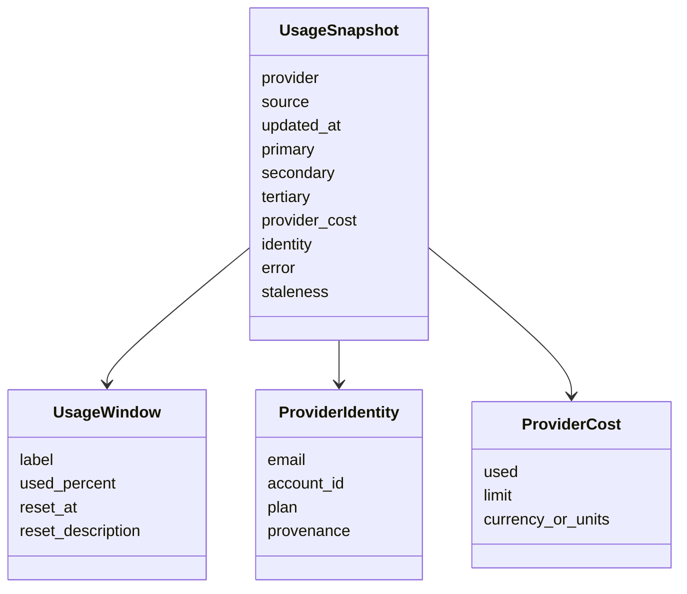

### 6.1 Snapshot Model

#### Snapshot model

- Snapshot has provider id.
- Snapshot has source label.
- Snapshot has primary window optional.
- Snapshot has secondary window optional.
- Snapshot has tertiary window optional.
- Snapshot has provider cost optional.
- Snapshot has account identity optional.
- Snapshot has updated_at timestamp.
- Snapshot has fetch diagnostics summary.
- Snapshot must be serializable for cache.
- `ProviderHealth` and `AuthState` are orthogonal dimensions.
- `Stale` is a health/staleness concept, not an auth state.
- `SnapshotStaleness` thresholds are computed from the effective refresh interval: `Fresh <= 2x interval`, `Stale <= 10x interval`, otherwise `Expired`.
- In manual-refresh-only mode, staleness uses fixed thresholds: `Fresh <= 10 minutes`, `Stale <= 60 minutes`, otherwise `Expired`.

#### Canonical provider runtime model

- Provider runtime state is the product of `ProviderRefreshPhase`, `AuthState`, and `ProviderHealth`.
- `ProviderRefreshPhase` is the only state dimension that models `Idle`, `Refreshing`, and queued refresh work.
- `AuthState` models whether user action is required for credentials or secret access.
- `ProviderHealth` models whether the most recent completed fetch result is healthy, stale, or failed for non-auth reasons.
- UI labels such as `Success`, `Error`, and `Action required` are derived views over those three dimensions and are not separate canonical runtime states.
- Last known good snapshot may coexist with `ProviderHealth::Error` or `AuthState::ActionRequired`.

### 6.2 Logical Settings and Enums

#### Proposed logical settings keys (illustrative)

- This section defines logical key names for documentation and test fixtures.
- It is not a promise of a direct on-disk TOML file for applet runtime settings.
- When exporting/importing portability snapshots, these keys map to TOML fields.
- `version = 1`
- `refresh.interval_seconds = 120`
- `providers.codex.enabled = true`
- `providers.codex.source = auto`
- `providers.codex.web_extras_enabled = false`
- `providers.claude.enabled = true`
- `providers.claude.source = auto`
- `providers.claude.cookie_source = auto`
- `providers.cursor.enabled = true`
- `providers.cursor.cookie_source = auto`

#### Proposed provider source enums

- `enum ProviderSourceMode { Auto, OAuth, Cli, Web, Off }`
- `enum CookieSourceMode { Auto, Manual, Off }`
- `enum RuntimeKind { Applet, Cli }`
- `enum FetchKind { OAuth, CliRpc, CliPty, WebApi }`
- `FetchKind` is expected to grow as new provider acquisition paths are added in future releases; adding new variants is not considered a breaking architectural change for v1.
- `enum ProviderRefreshPhase { Idle, Refreshing, QueuedRefresh }`
- `enum AuthState { Ready, ActionRequired, Error }`
- `enum AuthActionReason { MissingCredentials, ExpiredCredentials, InvalidCredentials, ScopeMissing, LoginRequired, KeyringLocked, ManualInputRequired, UnsupportedVersion, BinaryMissing }`
- `enum RepairAction { RunCodexLogin, RunClaudeLogin, OpenCursorCookieHelp, UnlockSecretBackend, RetryOAuthRefresh, ReimportBrowserCookies, ClearInvalidCookieCache, OpenManualCookieEntry, RescanCliPath }`
- `enum ProviderHealth { Ok, Stale, Error }`
- `enum CredentialRoute { None, OAuthToken, CookieHeader }`
- `enum SnapshotStaleness { Fresh, Stale, Expired }`
- `enum LogVerbosity { Info, Debug, Trace }`
- `enum SecretsBackend { SecretService, EncryptedFile, MemoryOnly }`

### 6.3 Provider Trait, Snapshot Schema, and Diagnostics Schema

#### Proposed provider trait contracts

- `fn plan(input) -> Vec<Step>`.
- `async fn fetch(step, context) -> Result<ProviderFetchResult, ProviderError>`.
- `fn should_fallback(error, mode, runtime) -> bool`.
- `fn availability(context) -> Availability`.
- `fn normalize(raw) -> UsageSnapshot` is a provider-internal helper or test seam; the shared runtime does not dispatch normalization generically.
- `fn auth_status(context) -> AuthState`.
- `fn repair_actions(context) -> Vec<RepairAction>`.
- `fn validate_settings(settings) -> Vec<ValidationIssue>`.
- `fn redact_debug(raw) -> String`.
- `fn source_label(step) -> &'static str`.

#### Proposed snapshot JSON schema keys

- `provider`.
- `source`.
- `updated_at`.
- `primary`.
- `secondary`.
- `tertiary`.
- `provider_cost`.
- `identity`.
- `error`.
- `staleness`.

#### Proposed diagnostics bundle keys

- `provider`.
- `selected_mode`.
- `planned_order`.
- `executed_steps`.
- `final_source`.
- `auth_backend`.
- `credential_origin`.
- `last_error_code`.
- `last_error_summary`.
- `timings_ms`.

#### Boundary payload summaries

- `ProviderRuntimeState` includes `refresh_phase`, `auth_state`, `auth_reason`, `health`, `last_success_at`, and `active_source_label`.
- `RefreshResultSummary` includes provider id, attempted steps, final source, success flag, auth-state delta, health delta, and elapsed timing.
- `DiagnosticWarning` includes machine code, provider scope, human summary, throttling key, and optional remediation hint.
- `RuntimeFatalError` includes machine code, summary, component, and whether restart is required.
- `DoctorResult` includes top-level overall status, per-check results, remediation hints, and optional JSON payload for export.
- `VaultState` includes backend kind, availability, locked/unlocked status, memory-only status, and whether migration is available.
- `AccountSummary` includes provider, account id, label, credential route, validity summary, and active flag.
- `ConfigReloadResult` includes revision, source backend, validation issues, and whether runtime re-plan was required.
- `AccountPayload` includes label, credential route, secret material reference or inline manual credential value, and optional provider-specific metadata.
- `TestAccountResult` includes provider, account id, success flag, validated route, elapsed timing, and optional validation or remediation messages.

## 7. Testing, QA, and Operational Quality

### Verification Layers

**Diagram 7.1 — Verification Layers**

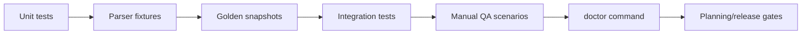

### 7.1 Test Strategy, Fixtures, and Security Cases

#### Testing strategy summary

- Unit tests for planners.
- Unit tests for normalizers.
- Unit tests for each parser.
- Unit tests for credential routing.
- Unit tests for config migration.
- Property-based tests for percent normalization, lane ordering, and stale/fresh classification boundaries.
- Fuzz tests for parsers, cookie/header normalization, and diagnostic bundle serialization.
- Chaos-style retry and failure-injection tests for network, cache I/O, and secret-backend transitions.
- Concurrency tests for refresh coalescing, no-overlap guarantees, and account-switch races.
- Integration tests with mocked HTTP servers.
- Integration tests with fixture PTY outputs.
- Integration tests for cache invalidation.
- End-to-end golden snapshot tests that execute representative provider flows and assert exported snapshot + diagnostics bundles.
- Observability acceptance tests that verify a broken refresh can be diagnosed from the exported bundle alone.
- Soak tests in a VM for 24-72h to catch PTY leaks, memory growth, and log bloat.
- Upgrade and migration tests for config, cache, and encrypted-vault version changes.
- Environment-diversity tests for non-UTF-8 PTY output, non-English locales, read-only cache dirs, NFS-backed homes, and both GNOME Keyring and KWallet setups.
- Manually gated `tests/live/` maintenance harness re-runs representative live provider requests and CLI probes, compares response shapes to fixtures, and is part of the maintenance release checklist when provider versions or contracts drift.
- UI snapshot tests for core states.
- End-to-end smoke tests in COSMIC session.

#### Test fixtures and golden files

- Codex OAuth usage sample responses.
- Codex RPC result samples.
- Codex PTY output samples.
- Claude OAuth response samples.
- Claude web response samples.
- Claude PTY output samples.
- Cursor usage summary samples.
- Cursor auth/me samples.
- Cursor legacy usage samples.
- Browser cookie sqlite mock snapshots.
- Unknown-field forward-compat samples for each provider response shape.
- Diagnostic bundle golden outputs for success, stale-cache, auth-required, and parse-failure cases.

#### Security test cases

- Ensure logs never contain full tokens.
- Ensure debug dumps redact cookie values.
- Ensure config permissions are 0600.
- Ensure session file permissions are 0600.
- Ensure encrypted fallback file cannot be parsed without key.
- Ensure cache clear removes secret entries.
- Ensure unauthorized responses clear cookie cache.
- Ensure refresh token failures do not leak payload in UI.
- Ensure subprocess environment strips unrelated sensitive vars where needed.
- Ensure manual input fields are masked in UI.

### 7.2 Performance and Reliability Targets

#### Performance targets

- Cold startup to first cached render under 500 ms on mid hardware, excluding optional keyring unlock interaction.
- **First live refresh target is split:** under 5 seconds for OAuth/JSON providers and under 10 seconds for fallback-chain providers (for example Claude web plus delegated repair), using the scheduled-refresh timeout policy defined in the Codex RPC negotiation section.
- Single provider refresh average under 1.5 seconds for OAuth and JSON APIs.
- CLI fallback refresh under 6 seconds median.
- Popup open under 16 ms from panel click when data cached.
- CPU idle overhead under 0.5 percent average.
- Memory steady state under 80 MB RSS.
- No runaway subprocesses across refresh cycles.
- Browser import should short-circuit once accepted session found.
- Logs should not exceed 10 MB total by default.
- Login-shell PATH probe must not run per refresh cycle.

#### Reliability targets

- Applet should survive network outages.
- Applet should survive missing provider binaries.
- Applet should survive corrupted cache files.
- Applet should survive malformed API responses.
- Applet should survive read-only cache and state directories without crashing.
- Applet should survive disk-full conditions by falling back to in-memory state and warning the user.
- Applet should degrade safely on NFS or other filesystems where atomic rename/fsync semantics are weaker.
- Applet should recover on next cycle after transient failures.
- Applet should avoid deadlocks in concurrent refreshes.
- Applet should avoid duplicate refresh storms after wake-from-suspend by listening to login1 sleep signals and applying resume debounce.
- Applet should revalidate stale sessions without requiring restart.
- Applet should handle system timezone changes.
- Applet should handle provider endpoint HTTP 5xx gracefully.

### 7.3 Manual QA Scenarios

#### Manual QA scenarios - Codex

- Fresh system with no codex install.
- Codex installed but not logged in.
- Codex logged in with valid auth file.
- Auth file has expired token and valid refresh token.
- Auth file has expired token and invalid refresh token.
- RPC unavailable but PTY available.
- PTY parse output with update prompt.
- Weekly window missing in response.
- Credits-only response in OAuth mode.
- Network offline with cached snapshot present.

#### Manual QA scenarios - Claude

- Claude CLI not installed.
- Credentials file missing.
- Credentials file present without `user:profile`.
- OAuth success path.
- OAuth unauthorized and delegated refresh success.
- OAuth unauthorized and delegated refresh failure with CLI fallback success.
- CLI `/usage` parse with weekly and model lanes.
- CLI `/usage` parse with session only.
- Web fallback success with imported sessionKey.
- All sources unavailable state.

#### Manual QA scenarios - Cursor

- Browser logged in and import succeeds.
- Cached cookie header valid path.
- Cached cookie header expired then browser fallback succeeds.
- Browser cookie names missing but domain-cookie fallback succeeds.
- Browser cookies stale, stored session valid.
- Stored session stale and cleared on auth failure.
- Manual cookie header valid.
- Manual cookie header invalid.
- usage-summary missing optional fields.
- auth/me endpoint temporarily failing.

### 7.4 Planning Exit Criteria and Doctor Checks

#### Exit criteria for planning phase

- Stakeholder review accepts provider scope and source strategy order.
- Stakeholder review accepts Linux auth storage approach.
- Stakeholder review accepts COSMIC applet UI and interaction model.
- Stakeholder review accepts milestone plan and non-goals.
- Stakeholder review accepts security and privacy constraints.
- Open technical decisions are resolved or explicitly deferred.
- Config schema is approved.
- Test plan is approved.
- Packaging targets are approved.
- Implementation can begin without additional architectural discovery.

#### Doctor command checks

- Verify `ConfigStore` access and schema version compatibility; COSMIC v1 additionally verifies `cosmic-config` read/write access.
- Verify Secret Service availability and lock state.
- Verify fallback vault status when enabled (header parse and decrypt test with supplied passphrase session).
- Verify Codex and Claude CLI discovery paths and executable permissions.
- Verify minimum supported CLI versions for Codex RPC and Claude PTY parsers.
- Verify browser cookie DB path presence and readable permissions for enabled providers.
- Verify Chromium decrypt prerequisites (keyring backend availability and decrypt probe result).
- Verify network DNS and TLS reachability for enabled provider base endpoints.
- Verify snapshot cache and log directory writability.
- Verify whether the home/config/cache paths appear to be on a filesystem with degraded rename/fsync guarantees and report reduced durability if detected.
- Emit provider-scoped remediation hints and machine-readable status codes.
- **Status code enum is part of this spec:** `OK`, `WARN_KEYRING_LOCKED`, `WARN_VERSION_UNTESTED`, `ERR_CONFIG_IO`, `ERR_SECRET_BACKEND`, `ERR_CLI_NOT_FOUND`, `ERR_CLI_UNSUPPORTED`, `ERR_COOKIE_DB_ACCESS`, `ERR_COOKIE_DECRYPT`, `ERR_NETWORK`, `ERR_CACHE_IO`.
- Doctor output supports both human summary and JSON mode with these codes.

## 8. Packaging, Release Planning, and Future Scope

### Release Flow

**Diagram 8.1 — Release Flow**


### 8.1 Packaging and Distribution Policy

#### Packaging and distribution

- Build target is Linux x86_64 and aarch64.
- Packaging format candidate 1 is deb.
- Packaging format candidate 2 is rpm.
- Flatpak and Snap are out of scope for v1 packaging.
- Include desktop applet metadata required by COSMIC.
- Include icon assets in symbolic and full-color forms.
- Provide release tarballs with checksums.
- Provide signature verification instructions.
- Provide install and uninstall scripts.
- Document dependency requirements with apt/cargo preference.
- Release-gating packages for v1 are deb and rpm only.
- No sandboxed package channel is a release target in v1.

#### Packaging channel policy for v1

- v1 ships as native Linux packages only (`deb`, `rpm`, tarball).
- Flatpak is not implemented in v1.
- Snap is not implemented in v1.
- This avoids host-escape requirements for CLI subprocess features.
- This keeps runtime behavior aligned with the native security model.
- Packaging and install docs focus on apt-compatible and rpm-compatible paths.
- Future sandboxed channels require a separate capability and threat-model review.
- M8 release gate excludes Flatpak and Snap deliverables.
- CI matrix for v1 excludes Flatpak and Snap build jobs.
- Re-evaluation can happen after stable native release.

#### Dependency sourcing policy

- Prefer Rust crates from `crates.io` as the default dependency source.
- Prefer Linux system dependencies that are commonly available via `apt` when native libs are required.
- Avoid custom vendored native libraries unless no maintained alternative exists.
- Avoid distro-specific package manager lock-in beyond apt/rpm availability.
- Keep optional native dependencies minimal and explicitly documented.
- Every non-Rust native dependency must have installation instructions for apt-based systems.
- Rust-only implementations are preferred when security and maintenance are comparable.
- Git dependencies are discouraged; pin to released versions whenever possible, with explicit exception for COSMIC stack crates that are only shipped as git dependencies (for example `libcosmic` and its pinned iced revision).
- For v1, the exact COSMIC stack git revisions pinned in `Cargo.lock` are normative for the build and review target; drift requires an explicit maintenance update.
- New dependencies require explicit maintenance and security review notes.
- Flatpak/Snap-specific runtime dependencies are out of scope for v1.

### 8.2 Implementation Milestones and Acceptance Gates

#### Implementation milestones

- M0 project scaffolding and applet shell.
- M1 core models, config, and snapshot store.
- M2 Codex provider with OAuth and CLI paths.
- M3 Claude provider with OAuth and CLI paths.
- M4 Claude web cookie path.
- M5 Cursor provider with cookie import and session store.
- M6 settings UI and auth repair actions.
- M7 integration testing and hardening.
- M8 packaging and release candidate.
- M9 post-release bugfix cycle.

#### Detailed milestone acceptance - M0

- Applet launches in COSMIC panel.
- Tooltip and popup skeleton render correctly.
- Settings scaffold exists.
- Refresh loop skeleton exists.
- Structured logging initialized.
- `ConfigStore` entries are created with defaults through the COSMIC `cosmic-config` adapter.
- Snapshot cache read and write pipeline compiles.
- Build pipeline produces runnable artifact.
- CI checks run fmt, clippy, and tests.
- No provider-specific functionality required yet.

#### Detailed milestone acceptance - M1

- `yapcap-core`, `yapcap-runtime`, `yapcap-auth`, and the `ConfigStore` trait compile and are testable without `libcosmic` or `iced`.
- Snapshot schema, canonical provider runtime state model, logical enums, and diagnostics payload types are defined and serialization-tested.
- Config loading, validation, defaulting, and migration run before any provider fetch path is enabled.
- Snapshot cache load and atomic write-back succeed for normal, corrupted, unknown-version, and read-only-cache cases.
- Secret backend routing works for Secret Service, encrypted vault, and explicit memory-only mode without frontend-only code paths.
- Runtime command/event boundary supports config reload, refresh, cache clear, doctor, account operations, and vault operations at the type level.
- Snapshot staleness classification and lane-order semantics are covered by unit or property tests.
- Mocked runtime flows can persist, reload, and re-emit normalized snapshots without any provider-specific fetch implementation.
- `yapcap-cli` builds against the shared backend crates and can execute at least non-provider commands such as config validation and doctor scaffolding.

#### Detailed milestone acceptance - M6

- Settings UI exposes the v1-supported provider toggles, source selectors, refresh interval, cache-clear actions, and secret-backend status.
- Auth repair actions render from provider-supplied `RepairAction` lists and dispatch correctly through `FrontendCommand::RepairAuth`.
- Vault setup, unlock, lock, rotate, and reset flows are wired end-to-end through the runtime boundary.
- Account add, select, rename, remove, and test flows work for providers that support token-account management.
- Manual credential entry validates without echoing secrets and persists through the configured secret backend path.
- Locked and unavailable secret-backend states surface actionable UI and update live when backend status changes.
- UI-only settings changes do not trigger unnecessary provider re-plan or refresh work.
- Advanced/debug-only settings remain hidden from the normal v1 settings surface unless explicitly enabled in debug builds.

#### Detailed milestone acceptance - M7

- Integration coverage includes representative success, stale-cache, auth-required, parse-failure, and backend-unavailable flows across all enabled v1 providers.
- End-to-end golden snapshot tests pass for representative Codex, Claude, and Cursor flows.
- Observability acceptance tests confirm that exported diagnostic bundles are sufficient to explain at least one broken refresh per provider class.
- Concurrency and hardening tests verify no-overlap refresh guarantees, queued manual refresh behavior, account-switch races, and cache or secret invalidation edge cases.
- Doctor command reports the expected machine-readable status codes for missing CLI, locked keyring, cookie-db access problems, cache I/O failure, and degraded filesystem durability.
- Soak or long-running stability evidence exists for PTY lifecycle, memory growth, and log growth targets before release-candidate sign-off.
- Multi-instance behavior is validated: a second frontend instance does not start, and CLI-to-runtime IPC behaves correctly against a live runtime socket.

#### Detailed milestone acceptance - M8

- Native release artifacts are produced for the approved v1 target formats: `deb`, `rpm`, and tarball.
- COSMIC applet metadata, icons, install paths, and runtime dependencies are correct in packaged artifacts.
- Install, upgrade, uninstall, and rollback behavior is documented and manually verified for at least one apt-compatible and one rpm-compatible environment.
- Release artifacts include checksums and the documented signature-verification flow.
- Packaging does not require Flatpak or Snap support and does not advertise sandboxed channels as v1 deliverables.
- Release checklist confirms pinned COSMIC git revisions, feature metadata packaging, and doctor command availability in shipped artifacts.

### 8.3 Fixed Scope, Future Extensions, Compliance, and Docs

#### Scope decisions fixed for v1

- Codex web extras are deferred to v1.1.
- Keep-CLI-session mode exists but default is off.
- Built-in guided login web view is deferred to v1.1.
- Optional CLI-only binary is deferred to v1.1.
- Advanced debug panels stay limited in release builds.
- Additional browser importers beyond Chrome/Chromium/Brave/Edge/Firefox are deferred to v1.1.
- Provider-specific notification hooks are deferred to v1.1.
- Resume-debounce settings remain internal in v1.
- Per-provider notification thresholds are deferred to v1.1.
- Pinned-provider auto-rotation is removed from v1 because panel icon uses aggregate semantics.

#### Future extensions beyond v1

- Add OpenRouter provider parity.
- Add Gemini provider parity.
- Add Perplexity or other cookie-based providers.
- Add GNOME Shell extension frontend using the shared runtime boundary.
- Add KDE Plasma widget frontend using the shared runtime boundary.
- Add StatusNotifier/AppIndicator tray frontend using the shared runtime boundary.
- Optionally move the shared runtime behind a daemon or D-Bus service without changing provider crates.
- Add merged provider icon mode.
- Add historical usage charts in popup.
- Add cost-usage local log scanning parity.
- Add provider status page polling overlays.
- Add account-switcher compact panel mode.
- Add JSON export of usage snapshots.
- Add plugin/provider extension interface.

#### Compliance and legal notes

- Respect provider terms for API and session usage.
- Do not bypass provider anti-bot protections.
- Require user-owned credentials and sessions only.
- No credential sharing features.
- No scraping beyond needed usage endpoints in v1.
- Document all endpoint calls clearly.
- Include OSS license notices for dependencies.
- Keep user data local unless explicitly exported.
- Provide data deletion actions.
- Provide transparent privacy statement.

#### Documentation deliverables

- `README.md` for install and quick start.
- `docs/providers/codex.md`.
- `docs/providers/claude.md`.
- `docs/providers/cursor.md`.
- `docs/authentication.md`.
- `docs/configuration.md`.
- `docs/troubleshooting.md`.
- `docs/security.md`.
- `docs/developer-architecture.md`.
- `docs/release-process.md`.

### 8.4 Final Requirements and Review Checklist

#### Explicit behavior checklist

- Codex OAuth from auth.json.
- Codex refresh endpoint contract.
- Codex usage endpoint path.
- Codex CLI RPC method set.
- Codex PTY `/status` fallback.
- Claude OAuth endpoint and beta header.
- Claude required scope policy.
- Claude CLI `/usage` plus optional `/status`.
- Claude web org and usage endpoints.
- Cursor usage-summary and auth/me endpoint usage.
- Cursor known cookie names strategy.
- Cookie cache semantics per provider.
- Manual cookie header override behavior.
- Auto source planning model.
- Explicit source mode behavior.

#### Final implementation-ready requirement set

- Must run as a COSMIC panel applet using libcosmic applet runtime.
- Must keep provider/auth/runtime logic desktop-agnostic.
- Must keep the COSMIC applet as a thin frontend over `FrontendCommand` and `RuntimeEvent`.
- Must support Codex, Claude Code, and Cursor only in v1.
- Must include source planning and fallback chains specified in this doc.
- Must include detailed auth handling specified in this doc.
- Must include Linux-appropriate secret storage with Secret Service primary backend.
- Must include safe fallback when secret backend is unavailable.
- Must include provider caches and invalidation logic.
- Must include settings for source and cookie modes.
- Must include robust parsing and test coverage.
- Must ship with documentation and troubleshooting guides.

#### Review checklist for next planning iteration

- Confirm source orders for all three providers.
- Confirm Linux secret backend choice and fallback policy.
- Confirm Codex web extras scope for v1.
- Confirm Cursor login flow UX on Linux.
- Confirm config schema keys and default values.
- Confirm packaging target formats.
- Confirm release signing strategy.
- Confirm CI matrix.
- Confirm milestone dates and owners.
- Confirm acceptance test environments.
