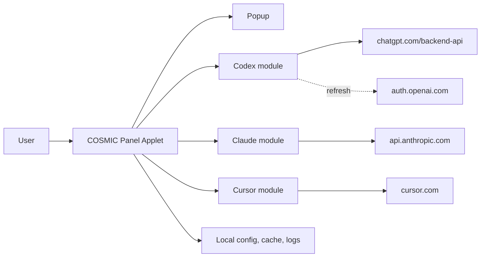
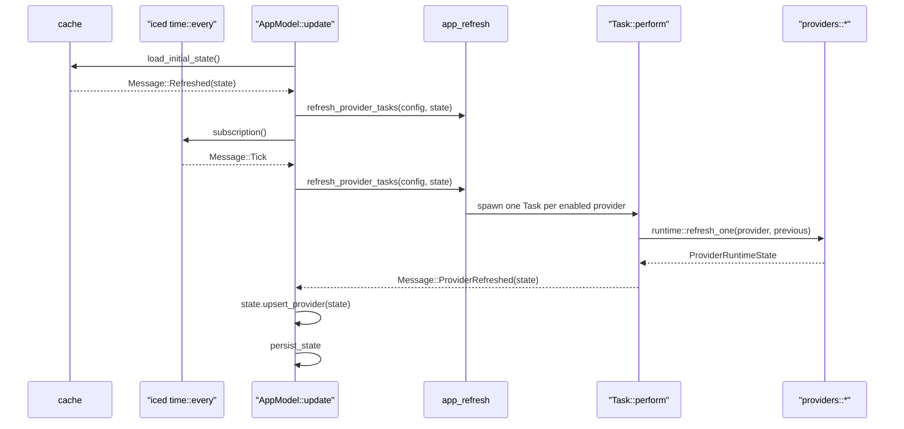

# YapCap — COSMIC Panel Applet Architecture

**Status:** As-built v0.2 · **Last updated:** 2026-04-20

## Document Metadata

| Field | Value |
| --- | --- |
| Status | Describes current main branch |
| Target desktop | COSMIC |
| Target language | Rust (edition 2024) |
| Target runtime | libcosmic applet runtime |
| Providers | Codex, Claude Code, Cursor |

## Document Map

| Area | Subsections |
| --- | --- |
| 1. Product Definition | 1.1 Scope and Non-Goals<br>1.2 Supported Sources |
| 2. Architecture | 2.1 System Context<br>2.2 Crate Layout<br>2.3 Runtime and Message Flow |
| 3. Providers | 3.1 Codex<br>3.2 Claude<br>3.3 Cursor |
| 4. Auth, Browser Cookies, and Config | 4.1 OAuth Credential Files<br>4.2 Browser Cookie Import<br>4.3 Configuration |
| 5. Data Model | 5.1 UsageSnapshot<br>5.2 ProviderRuntimeState and Health<br>5.3 Stale/Fresh Rules |
| 6. Persistence, Logging, Paths | |
| 7. User Interface | 7.1 Panel<br>7.2 Popup |
| 8. Localization | |
| 9. Testing | |

## 1. Product Definition

### 1.1 Scope and Non-Goals

- YapCap is a native Linux COSMIC panel applet that shows local usage state for Codex, Claude Code, and Cursor.
- Ships only on COSMIC. No GNOME, KDE, tray, or generic indicator paths exist.
- Reads locally available credentials and caches. No user account, no cloud sync, no telemetry.
- Out of scope: additional providers, historical charts, notifications, plugin architecture, doctor command, secret vault, alternative DEs.

### 1.2 Supported Sources

| Provider | Primary | Fallback |
| --- | --- | --- |
| Codex | OAuth token at `~/.codex/auth.json` | Codex OAuth token refresh via `auth.openai.com/oauth/token` (one retry on 401/403 when `refresh_token` exists) |
| Claude | OAuth token at `$CLAUDE_CONFIG_DIR/.credentials.json` or `~/.claude/.credentials.json` | Claude Code credential refresh via `claude auth status --json` |
| Cursor | `WorkosCursorSessionToken` cookie from a local browser | — |

One primary path and at most one fallback per provider. There is no PTY parsing, no web-cookie path for Claude, and no forced-source environment variable.

## 2. Architecture

### 2.1 System Context



### 2.2 Crate Layout

Single-crate workspace. Binary:

- `yapcap` — the released applet, driven by libcosmic's applet runtime.

Binary-only modules (`src/`, compiled only into the applet binary):

| Module | Purpose |
| --- | --- |
| `app` | `AppModel`, `Message`, libcosmic `Application` impl. Panel button, popup open/close, tick scheduling. |
| `app_refresh` | Dispatches one `Task::perform` per enabled provider. |
| `popup_view` | `popup_content` renders the popup. Tabs, status badge, usage bars, cost block. All strings via `fl!()`. |
| `provider_assets` | Embedded SVG icon handles; dark/light variant selection. |
| `i18n` | `fl!()` macro, `i18n_embed` loader wired to `i18n/en/yapcap.ftl`. |

Library modules (`src/`, also usable from tests):

| Module | Purpose |
| --- | --- |
| `app_state` | Methods on `AppState` for provider upsert and "mark refreshing." |
| `runtime` | `refresh_one(provider)`, `refresh_provider(...)`, `load_initial_state`, `persist_state`. |
| `providers::codex` | OAuth + refresh-on-401/403. |
| `providers::claude` | OAuth path + credential refresh via `claude auth status`. |
| `providers::claude_refresh` | Token expiry check and `claude` CLI credential refresh. |
| `providers::cursor` | Cursor web API via imported browser cookie. |
| `auth` | Parses `~/.codex/auth.json` and Claude Code `.credentials.json`. |
| `browser` | Chromium AES-GCM/CBC cookie decrypt; Firefox cookies.sqlite read. |
| `config` | COSMIC config entry, provider toggles, browser choice, browser profile discovery. |
| `cache` | Load/save `snapshots.json`. |
| `model` | `UsageSnapshot`, `ProviderRuntimeState`, `ProviderHealth`, `AuthState`, `AppState`. |
| `updates` | GitHub release check; `UpdateStatus` and `UpdateDisplay` types. |
| `usage_display` | Shared "expired window" percent/label formatting. |
| `logging` | `tracing` subscriber + file appender init. |
| `error` | `thiserror` enums: `AppError` and per-subsystem types. |

### 2.3 Runtime and Message Flow

The applet is a libcosmic `Application`. Messages flow:



- On startup, `Message::Refreshed` loads cached state and immediately dispatches a refresh for enabled providers.
- `Message::Tick` fires on a fixed interval (`refresh_interval_seconds.max(10)`).
- `Message::RefreshNow` is the popup's "Refresh now" button and uses the same dispatcher.
- Provider HTTP calls use a shared `reqwest::Client` with a 5s connect timeout and 20s total request timeout.
- Per-provider results arrive independently; the popup rerenders on each.
- `runtime::refresh_provider` keeps the previous snapshot on error so the UI never drops data on a transient failure. It instead flips `ProviderHealth::Error`.

## 3. Providers

### 3.1 Codex

Primary: `GET https://chatgpt.com/backend-api/wham/usage` with:

- `Authorization: Bearer <tokens.access_token>`
- `ChatGPT-Account-Id: <tokens.account_id>` (when present)

Response shape (subset consumed):

- `rate_limit.primary_window.used_percent` / `reset_at` → 5h window.
- `rate_limit.secondary_window.used_percent` / `reset_at` → 7d window.
- `credits.balance` (string) → parsed into a `ProviderCost { units: "credits" }`.

OAuth refresh (one retry):

- If the usage endpoint returns HTTP 401 or 403 and `tokens.refresh_token` exists in `~/.codex/auth.json`, YapCap calls `POST https://auth.openai.com/oauth/token` with `grant_type=refresh_token` and the Codex client id, updates `auth.json`, and retries the usage request once.
- If no refresh token is available, YapCap reports an actionable error prompting the user to run `codex login` (or `codex login --device-auth` on headless/remote machines).

### 3.2 Claude

Primary: `GET https://api.anthropic.com/api/oauth/usage` with:

- `Authorization: Bearer <claudeAiOauth.accessToken>`
- `anthropic-beta: oauth-2025-04-20`
- Token must carry scope `user:profile`; otherwise `MissingProfileScope` is returned before the request.
- Before the request, YapCap checks `claudeAiOauth.expiresAt`. If the access token expires within 5 minutes, it runs `claude auth status --json`, then reloads `.credentials.json`.
- If the usage endpoint returns HTTP 401, YapCap runs `claude auth status --json` once, reloads `.credentials.json`, and retries the usage request once.

Response shape:

- `five_hour.utilization` / `resets_at` → 5h window (utilization is 0..100).
- `seven_day.utilization` / `resets_at` → 7d window.
- `extra_usage.utilization` → tertiary window.
- `extra_usage.used_credits` / `monthly_limit` → `ProviderCost` in dollars (both fields divided by 100).

Claude usage windows are partially tolerant because the endpoint can return null fields for inactive or account-specific windows. A window with no `utilization` is skipped. A window with `utilization` but no `resets_at` is kept without reset metadata. For the `five_hour` session window, `utilization = 0` with `resets_at = null` is treated in display code as a reset/inactive session and labeled `Reset`. If both primary windows are absent after normalization, the provider returns `NoUsageData`.

Usage fallback: none. Claude usage is OAuth-only because the CLI does not expose reliable machine-readable usage data.

Credential refresh is delegated to Claude Code. YapCap shells out directly to the `claude` binary, without a shell, and lets Claude Code manage its own OAuth refresh flow and credential file. YapCap does not call Claude's private token endpoint directly.

HTTP 401 surfaces as `ClaudeError::Unauthorized` after the one refresh retry fails (user action required). HTTP 429 surfaces as `ClaudeError::RateLimited` and is marked transient so the badge shows "Stale" rather than "Error."

### 3.3 Cursor

- Resolves a `WorkosCursorSessionToken` cookie from the configured browser (`config.cursor_browser`) and optional profile (`config.cursor_profile_id`).
- Sends `Cookie: WorkosCursorSessionToken=<value>` to:
  - `GET https://cursor.com/api/usage-summary`
  - `GET https://cursor.com/api/auth/me`
- Maps:
  - `individualUsage.plan.totalPercentUsed` → primary window.
  - `autoPercentUsed` → tertiary/secondary dimension.
  - `billingCycleEnd` → `reset_at`.
  - `membershipType` → `identity.plan`.
- No OAuth fallback; if the browser cookie can't be read, the provider reports `BrowserError` and the popup shows an actionable error.

## 4. Auth, Browser Cookies, and Config

### 4.1 OAuth Credential Files

`auth::load_codex_auth`:

- Respects `CODEX_HOME`, otherwise `~/.codex`.
- Reads `auth.json` and extracts `tokens.access_token` and `tokens.account_id`.

`auth::load_claude_auth`:

- Respects `CLAUDE_CONFIG_DIR`, then `CLAUDE_HOME`, otherwise `~/.claude`.
- Reads `.credentials.json` and extracts `claudeAiOauth.{accessToken, scopes, subscriptionType, expiresAt}`.

YapCap never writes these credential files directly. It can run `claude auth status --json`, which may cause Claude Code to update its own `.credentials.json`. Errors are typed (`AuthError` / provider errors) and bubble up as `requires_user_action = true` when user login or local CLI repair is needed.

### 4.2 Browser Cookie Import

Chromium family (Brave / Chrome / Edge):

- Copy `Cookies` SQLite file to a tempfile (the live DB is locked by the running browser).
- Look up `WorkosCursorSessionToken` for host `cursor.com` or `.cursor.com`.
- If the stored `value` column is non-empty, use it as plaintext (older blobs).
- Otherwise decrypt `encrypted_value`:
  - `v10` / `v11` prefix → AES-CBC with a PBKDF2(secret, salt="saltysalt", iters=1, 16B key) key derived from the browser's Safe Storage secret. The single iteration is mandated by OSCrypt compatibility, not a mistake.
  - Alternative GCM blobs are decrypted with AES-GCM.
- Safe Storage secret is retrieved via `secret-service` using the per-browser application name (`brave`, `chrome`, `Microsoft Edge`). Some secret-service implementations (KWallet, COSMIC) append trailing terminators; those are stripped before key derivation.

Firefox:

- Locates `cookies.sqlite` via `profiles.ini`. The `[Install<hash>]` section's `Default=` path takes precedence over any legacy `Default=1` profile entry.
- Accepts both `~/.mozilla/firefox` and `~/.config/mozilla/firefox` (XDG/Flatpak layouts).
- Reads the cookie value directly; Firefox does not encrypt cookies at rest.

Browser profile selection:

- Chromium-family browsers discover every profile directory under the browser root that contains a `Cookies` database, with `Default` tried first and other profiles tried in sorted order.
- Firefox discovers profiles from `profiles.ini` in priority order: install default, profile default, then remaining profile paths.
- If exactly one discovered profile contains the Cursor cookie, YapCap can use it automatically.
- If multiple profiles contain Cursor cookies and no `cursor_profile_id` is configured, the provider should require explicit profile selection rather than picking an arbitrary account.
- Browser cookie tests should use synthetic SQLite fixtures under `fixtures/browser` instead of real browser databases.

### 4.3 Configuration

Provider settings are stored through the COSMIC template's `cosmic_config`
entry for app ID `com.topi.YapCap`. The template rebuild intentionally expands
the existing `Config` entry instead of carrying over the old standalone TOML
config file. The settings keep the same user-facing function as before:
refresh interval, provider enable toggles, Cursor browser selection, and log
level.

```toml
refresh_interval_seconds = 60
codex_enabled = true
claude_enabled = true
cursor_enabled = true
cursor_browser = "brave"
cursor_profile_id = null
log_level = "info"
```

- `cursor_browser` ∈ `brave | chrome | chromium | edge | firefox` (also accepts `microsoft-edge`).
- `cursor_profile_id = null` means automatic profile discovery.
- If `cursor_profile_id` is set, Cursor cookie import uses only that discovered profile.
- `YAPCAP_CURSOR_BROWSER` overrides `cursor_browser` at runtime.
- The refresh interval is clamped to a 10-second floor at subscription time.

## 5. Data Model

The runtime state is intentionally layered. `AppState` is the cacheable root,
each provider has one `ProviderRuntimeState`, and successful refreshes attach a
`UsageSnapshot` with one to three usage windows.

```text
AppState
  updated_at
  providers: Vec<ProviderRuntimeState>
    |
    +-- ProviderRuntimeState
          provider: ProviderId
          enabled / is_refreshing
          health: ProviderHealth
          auth_state: AuthState
          source_label
          last_success_at
          error
          snapshot: Option<UsageSnapshot>
            |
            +-- UsageSnapshot
                  provider: ProviderId
                  source
                  updated_at
                  headline: UsageHeadline
                    |
                    +-- selects one of:
                          primary: Option<UsageWindow>
                          secondary: Option<UsageWindow>
                          tertiary: Option<UsageWindow>
                  provider_cost: Option<ProviderCost>
                  identity: ProviderIdentity

UsageWindow
  label
  used_percent
  reset_at
  reset_description
```

`ProviderRuntimeState` describes refresh/auth health around the data.
`UsageSnapshot` is the provider's last successful usage payload normalized into
YapCap's common shape. `UsageHeadline` is not another window; it is a selector
that says which optional window should drive the status line and headline
percentage.

### 5.1 UsageSnapshot

```rust
struct UsageSnapshot {
    provider: ProviderId,          // Codex | Claude | Cursor
    source: String,                // "OAuth" | "RPC" | "Brave" | ...
    updated_at: DateTime<Utc>,
    headline: UsageHeadline,       // which window drives the panel badge
    primary: Option<UsageWindow>,  // 5h for Codex/Claude; total for Cursor
    secondary: Option<UsageWindow>,// 7d for Codex/Claude
    tertiary: Option<UsageWindow>, // Extra/Auto for Claude/Cursor
    provider_cost: Option<ProviderCost>,
    identity: ProviderIdentity,    // email, account_id, plan, display_name
}

struct UsageWindow {
    label: String,                 // "5h" | "7d" | "Extra"
    used_percent: f64,
    reset_at: Option<DateTime<Utc>>,
    reset_description: Option<String>,
}

struct ProviderCost { used: f64, limit: Option<f64>, units: String }
```

`UsageSnapshot::applet_windows` returns `(primary, secondary)` for Codex/Claude and `(primary, tertiary)` for Cursor. The panel shows at most two bars.

### 5.2 ProviderRuntimeState and Health

```rust
enum ProviderHealth { Ok, Error }
enum AuthState     { Ready, ActionRequired, Error }

struct ProviderRuntimeState {
    provider: ProviderId,
    enabled: bool,
    is_refreshing: bool,
    health: ProviderHealth,
    auth_state: AuthState,
    source_label: Option<String>,
    last_success_at: Option<DateTime<Utc>>,
    snapshot: Option<UsageSnapshot>,
    error: Option<String>,
}
```

- `refresh_provider` on Ok: clears `error`, sets `health = Ok`, `auth_state = Ready`, updates `last_success_at`.
- On Err: preserves the previous `snapshot` and `last_success_at`, sets `health = Error`, and classifies `auth_state` via `AppError::requires_user_action`.
- Transient errors (`ClaudeError::RateLimited`) are logged at `warn` instead of `error`.

### 5.3 Stale/Fresh Rules

`STALE_AFTER = 10 minutes` governs the popup status badge.

| Condition | Badge |
| --- | --- |
| `!enabled` | Disabled |
| `is_refreshing` | Refreshing |
| `health=Ok`, snapshot present, `now - last_success_at < STALE_AFTER` | Live |
| snapshot present, any other condition | Stale |
| `health=Error`, no snapshot | Error |
| `health=Ok`, no snapshot | … |

`ProviderRuntimeState::status_line` applies the same rule and appends `(stale)` to the headline line when appropriate. This prevents "Live · Updated 21 hours ago" on cold-start from the cache.

## 6. Persistence, Logging, Paths

All paths come from `config::paths()`:

- Config: managed by `cosmic_config` under app ID `com.topi.YapCap` (not a hand-rolled file)
- Snapshot cache: `~/.cache/yapcap/snapshots.json`
- Logs: `~/.local/state/yapcap/logs/yapcap.log`

Snapshot cache serializes `AppState` (providers + `updated_at`) via `serde_json`. It is rewritten whenever any provider state changes and loaded on startup so the popup has something to show while the immediate startup refresh runs.

Logging uses `tracing` with `tracing-subscriber` `EnvFilter` and `tracing-appender` for the log file. No credentials, bearer tokens, or cookie values are logged.

Log level is hardcoded to `"info"` in `main` because config is not available before the applet loop starts. `RUST_LOG` still overrides this at runtime. A `config.log_level` field exists but currently has no effect until a future restart-aware approach is added.

`tracing_appender::non_blocking` returns a `WorkerGuard` that must stay alive for background log flushing. It is held in `main` as `let _log_guard`; the applet runtime blocks until process exit so the guard lives for the full process lifetime.

## 7. User Interface

### 7.1 Panel

- A single button with the selected provider icon and two compact usage bars.
- Installed panel applets launch through `cosmic::applet::run` with `LaunchMode::Panel`; the panel view wraps the button in `core.applet.autosize_window` so COSMIC can size the applet surface around the rectangular icon-plus-bars content.
- Local `cargo run` launches through `cosmic::app::run` with `LaunchMode::Standalone`; `applet_settings()` gives the standalone preview the same calculated button dimensions without using the applet autosize wrapper.
- Both launch modes share the same button sizing helpers. The usage bar width is at least `suggested_height * APPLET_BAR_WIDTH_HEIGHT_MULTIPLIER`.
- The bars use `UsageSnapshot::applet_windows()` and `usage_display::displayed_percent` so fully-elapsed windows render as 0%.
- Clicking toggles the popup.
- Provider icons have a Default (dark panel) and Reversed (light panel) SVG variant. `provider_assets::provider_icon_variant()` calls `cosmic::theme::is_dark()` at render time to select the correct variant. Note: full white-theme icon polish is deferred.

### 7.2 Popup

`popup_view::popup_content`:

- Header: "YapCap" + "Refresh now" button.
- Tab row: one entry per provider with its icon and headline percent.
- Detail panel for the selected provider:
  - Title row: provider name + plan.
  - Subtitle row: "Updated Xm ago" + status badge (Live / Stale / Refreshing / Error / Disabled).
  - Source label.
  - Primary window bar (e.g. "Session", "Total") with reset description.
  - Secondary window bar (e.g. "Weekly").
  - Tertiary + cost block (Claude "Extra", Cursor "Auto").
  - Error body when no snapshot is available.
- Settings view with provider toggles and About/update-check status.
- Footer: "Quit" + "Settings" / "Done".

The popup uses a fixed 420×720 surface because xdg-popup surfaces cannot grow after creation. Content overflow is handled by a scrollable region.

To avoid visual jitter on open and when switching tabs, YapCap pins both the Wayland popup size limits and libcosmic's autosize measurement limits to the fixed popup height. This ensures layout and compositor constraints match from the first frame.

Settings writes go through a `cosmic_config::Config` context acquired with the app ID — there is no `config.save()` method. The same context is used in `AppModel::init` and in `Message::SetProviderEnabled`.

## 8. Localization

Most user-visible strings in `popup_view.rs` use the `fl!()` macro backed by `i18n_embed` + `i18n_embed_fl` + Mozilla Fluent. (Some provider-facing status strings are still produced in the model layer.)

- String catalog: `i18n/en/yapcap.ftl` — buttons, section titles, status badges, update-check states, last-updated timestamps, and usage reset labels.
- The `i18n/` directory is compiled into the binary at build time via `rust-embed`; no runtime file access is needed.
- `i18n::init()` in `main` reads the system's requested languages and selects the best match. If no match, falls back to `en`.
- Adding a language requires only creating `i18n/<lang>/yapcap.ftl`; the binary picks it up automatically on a matching system locale.
- Missing Fluent messages are typically caught during development (e.g. by tooling/editor diagnostics), but the safest way to validate coverage is to build and run the app while exercising the UI paths.
- UI helper functions that build elements (`info_block`, `usage_block`, `credit_section`, etc.) take `String` for their title parameter and return `Element<'static, Message>`. This avoids tying the element lifetime to a temporary `fl!()` result.

## 9. Testing

- `cargo test` runs 87 unit and integration tests covering: config defaults, browser profile discovery, browser fixture contracts (Chromium + Firefox), usage display formatting, app-state helpers, model status/headline helpers, all three provider normalizers against JSON fixtures, Claude credential refresh with fake CLI binaries, runtime refresh state machine, error classification, update check version parsing, and app-level state transitions.
- No tests hit real provider APIs. Provider response fixtures under `fixtures/{codex,claude,cursor}/*.json` cover the OAuth response shapes and edge cases.
- Browser cookie fixtures under `fixtures/browser/*.sql` are synthetic and sanitized. Real browser databases must not be committed.
- `cargo clippy` and `cargo fmt --check` are expected clean on main.
- Manual QA should cover: install via `just install`, each provider's auth refresh flow, transient provider failures showing "Stale" not "Error", stale snapshot display on cold-start, settings persistence across restarts, update-check UI states, and dark/light theme icon variants.
