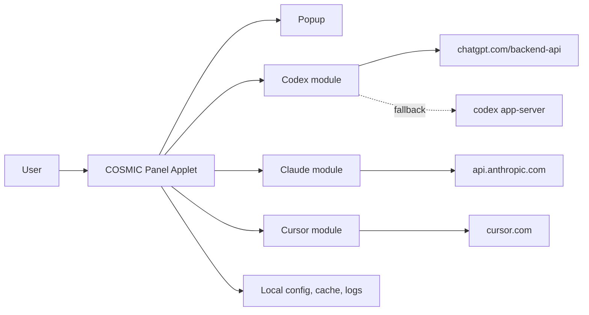

# YapCap — COSMIC Panel Applet Architecture

**Status:** As-built v0.1 · **Last updated:** 2026-04-18

## Document Metadata

| Field | Value |
| --- | --- |
| Status | Describes current main branch |
| Target desktop | COSMIC |
| Target language | Rust (edition 2024) |
| Target runtime | libcosmic applet runtime |
| Providers | Codex, Claude Code, Cursor |

## Document Map

| Area | Subsections |
| --- | --- |
| 1. Product Definition | 1.1 Scope and Non-Goals<br>1.2 Supported Sources |
| 2. Architecture | 2.1 System Context<br>2.2 Crate Layout<br>2.3 Runtime and Message Flow |
| 3. Providers | 3.1 Codex<br>3.2 Claude<br>3.3 Cursor |
| 4. Auth, Browser Cookies, and Config | 4.1 OAuth Credential Files<br>4.2 Browser Cookie Import<br>4.3 Configuration |
| 5. Data Model | 5.1 UsageSnapshot<br>5.2 ProviderRuntimeState and Health<br>5.3 Stale/Fresh Rules |
| 6. Persistence, Logging, Paths | |
| 7. User Interface | 7.1 Panel<br>7.2 Popup |
| 8. Testing |  |

## 1. Product Definition

### 1.1 Scope and Non-Goals

- YapCap is a native Linux COSMIC panel applet that shows local usage state for Codex, Claude Code, and Cursor.
- Ships only on COSMIC. No GNOME, KDE, tray, or generic indicator paths exist.
- Reads locally available credentials and caches. No user account, no cloud sync, no telemetry.
- Out of scope: additional providers, historical charts, notifications, plugin architecture, update checks, doctor command, secret vault, alternative DEs.

### 1.2 Supported Sources

| Provider | Primary | Fallback |
| --- | --- | --- |
| Codex | OAuth token at `~/.codex/auth.json` | Codex CLI `app-server` JSON-RPC |
| Claude | OAuth token at `$CLAUDE_CONFIG_DIR/.credentials.json` or `~/.claude/.credentials.json` | Claude Code credential refresh via `claude auth status --json` |
| Cursor | `WorkosCursorSessionToken` cookie from a local browser | — |

One primary path and at most one fallback per provider. There is no PTY parsing, no web-cookie path for Claude, and no forced-source environment variable.

## 2. Architecture

### 2.1 System Context



### 2.2 Crate Layout

Single-crate workspace. Binaries:

- `yapcap-cosmic` — the released applet, driven by libcosmic's applet runtime.
- `yapcap-dev` — the same `AppModel` run as a standalone cosmic window, for faster iteration without reinstalling the applet.

Library modules under `src/`:

| Module | Purpose |
| --- | --- |
| `cosmic_app` | `AppModel`, `Message`, libcosmic `Application` impl. Panel button, popup open/close, tick scheduling. |
| `popup_view` | `popup_content` renders the popup. Tabs, status badge, usage bars, cost block. |
| `app_state` | Methods on `AppState` for provider upsert and "mark refreshing." |
| `app_refresh` | Dispatches one `Task::perform` per enabled provider. |
| `runtime` | `refresh_one(provider)`, `refresh_provider(...)`, `load_initial_state`, `persist_state`. |
| `providers::codex` | OAuth + JSON-RPC CLI fallback. |
| `providers::claude` | OAuth path. |
| `providers::cursor` | Cursor web API via imported browser cookie. |
| `auth` | Parses `~/.codex/auth.json` and Claude Code `.credentials.json`. |
| `browser` | Chromium AES-GCM/CBC cookie decrypt; Firefox cookies.sqlite read. |
| `config` | `AppConfig`, `Browser`, XDG paths. |
| `cache` | Load/save `snapshots.json`. |
| `model` | `UsageSnapshot`, `ProviderRuntimeState`, `ProviderHealth`, `AuthState`, `AppState`. |
| `usage_display` | Shared "expired window" percent/label formatting. |
| `provider_assets` | Embedded SVG icon handles. |
| `logging` | `tracing` subscriber + file appender init. |
| `error` | `thiserror` enums: `AppError` and per-subsystem types. |

### 2.3 Runtime and Message Flow

The applet is a libcosmic `Application`. Messages flow:

```mermaid
sequenceDiagram
    participant Timer as iced time::every
    participant App as AppModel::update
    participant Refresh as app_refresh
    participant Task as Task::perform
    participant Provider as providers::*
    App->>Timer: subscription()
    Timer-->>App: Message::Tick
    App->>Refresh: refresh_provider_tasks(config, state)
    Refresh->>Task: spawn one Task per enabled provider
    Task->>Provider: runtime::refresh_one(provider, previous)
    Provider-->>Task: ProviderRuntimeState
    Task-->>App: Message::ProviderRefreshed(state)
    App->>App: state.upsert_provider(state); persist_state
```

- `Message::Tick` fires on a fixed interval (`refresh_interval_seconds.max(10)`).
- `Message::RefreshNow` is the popup's "Refresh now" button and uses the same dispatcher.
- Per-provider results arrive independently; the popup rerenders on each.
- `runtime::refresh_provider` keeps the previous snapshot on error so the UI never drops data on a transient failure. It instead flips `ProviderHealth::Error`.

## 3. Providers

### 3.1 Codex

Primary: `GET https://chatgpt.com/backend-api/wham/usage` with:

- `Authorization: Bearer <tokens.access_token>`
- `ChatGPT-Account-Id: <tokens.account_id>` (when present)

Response shape (subset consumed):

- `rate_limit.primary_window.used_percent` / `reset_at` → 5h window.
- `rate_limit.secondary_window.used_percent` / `reset_at` → 7d window.
- `credits.balance` (string) → parsed into a `ProviderCost { units: "credits" }`.

Fallback: `codex -s read-only -a untrusted app-server` spoken over stdio JSON-RPC.

- Sends `initialize` (id 1) then `account/rateLimits/read` (id 2).
- Reader thread over an mpsc channel enforces the 8s timeout.
- Returns the same `UsageSnapshot` shape as OAuth with `source = "RPC"`.

Codex binary lookup: PATH → `bash -lc which` → `~/.volta/bin` → `~/.local/share/fnm/current/bin` → `$NVM_DIR/versions/node/*/bin` (newest first) → `~/.npm-global/bin`.

### 3.2 Claude

Primary: `GET https://api.anthropic.com/api/oauth/usage` with:

- `Authorization: Bearer <claudeAiOauth.accessToken>`
- `anthropic-beta: oauth-2025-04-20`
- Token must carry scope `user:profile`; otherwise `MissingProfileScope` is returned before the request.
- Before the request, YapCap checks `claudeAiOauth.expiresAt`. If the access token expires within 5 minutes, it runs `claude auth status --json`, then reloads `.credentials.json`.
- If the usage endpoint returns HTTP 401, YapCap runs `claude auth status --json` once, reloads `.credentials.json`, and retries the usage request once.

Response shape:

- `five_hour.utilization` / `resets_at` → 5h window (utilization is 0..100).
- `seven_day.utilization` / `resets_at` → 7d window.
- `extra_usage.utilization` → tertiary window.
- `extra_usage.used_credits` / `monthly_limit` → `ProviderCost` in dollars (both fields divided by 100).

Usage fallback: none. Claude usage is OAuth-only because the CLI does not expose reliable machine-readable usage data.

Credential refresh is delegated to Claude Code. YapCap shells out directly to the `claude` binary, without a shell, and lets Claude Code manage its own OAuth refresh flow and credential file. YapCap does not call Claude's private token endpoint directly.

HTTP 401 surfaces as `ClaudeError::Unauthorized` after the one refresh retry fails (user action required). HTTP 429 surfaces as `ClaudeError::RateLimited` and is marked transient so the badge shows "Stale" rather than "Error."

### 3.3 Cursor

- Resolves a `WorkosCursorSessionToken` cookie from the configured browser (`config.cursor_browser`).
- Sends `Cookie: WorkosCursorSessionToken=<value>` to:
  - `GET https://cursor.com/api/usage-summary`
  - `GET https://cursor.com/api/auth/me`
- Maps:
  - `individualUsage.plan.totalPercentUsed` → primary window.
  - `autoPercentUsed` → tertiary/secondary dimension.
  - `billingCycleEnd` → `reset_at`.
  - `membershipType` → `identity.plan`.
- No OAuth fallback; if the browser cookie can't be read, the provider reports `BrowserError` and the popup shows an actionable error.

## 4. Auth, Browser Cookies, and Config

### 4.1 OAuth Credential Files

`auth::load_codex_auth`:

- Respects `CODEX_HOME`, otherwise `~/.codex`.
- Reads `auth.json` and extracts `tokens.access_token` and `tokens.account_id`.

`auth::load_claude_auth`:

- Respects `CLAUDE_CONFIG_DIR`, then `CLAUDE_HOME`, otherwise `~/.claude`.
- Reads `.credentials.json` and extracts `claudeAiOauth.{accessToken, scopes, subscriptionType, expiresAt}`.

YapCap never writes these credential files directly. It can run `claude auth status --json`, which may cause Claude Code to update its own `.credentials.json`. Errors are typed (`AuthError` / provider errors) and bubble up as `requires_user_action = true` when user login or local CLI repair is needed.

### 4.2 Browser Cookie Import

Chromium family (Brave / Chrome / Edge):

- Copy `Cookies` SQLite file to a tempfile (the live DB is locked by the running browser).
- Look up `WorkosCursorSessionToken` for host `cursor.com` or `.cursor.com`.
- If the stored `value` column is non-empty, use it as plaintext (older blobs).
- Otherwise decrypt `encrypted_value`:
  - `v10` / `v11` prefix → AES-CBC with a PBKDF2(secret, salt="saltysalt", iters=1, 16B key) key derived from the browser's Safe Storage secret. The single iteration is mandated by OSCrypt compatibility, not a mistake.
  - Alternative GCM blobs are decrypted with AES-GCM.
- Safe Storage secret is retrieved via `secret-service` using the per-browser application name (`brave`, `chrome`, `Microsoft Edge`). Some secret-service implementations (KWallet, COSMIC) append trailing terminators; those are stripped before key derivation.

Firefox:

- Locates `cookies.sqlite` via `profiles.ini`. The `[Install<hash>]` section's `Default=` path takes precedence over any legacy `Default=1` profile entry.
- Accepts both `~/.mozilla/firefox` and `~/.config/mozilla/firefox` (XDG/Flatpak layouts).
- Reads the cookie value directly; Firefox does not encrypt cookies at rest.

### 4.3 Configuration

File: `~/.config/yapcap/config.toml`. Created with defaults on first run.

```toml
refresh_interval_seconds = 60
codex_enabled = true
claude_enabled = true
cursor_enabled = true
cursor_browser = "brave"
log_level = "info"
```

- `cursor_browser` ∈ `brave | chrome | edge | firefox` (also accepts `chromium`, `microsoft-edge`).
- `YAPCAP_CURSOR_BROWSER` overrides `cursor_browser` at runtime.
- The refresh interval is clamped to a 10-second floor at subscription time.

## 5. Data Model

### 5.1 UsageSnapshot

```rust
struct UsageSnapshot {
    provider: ProviderId,          // Codex | Claude | Cursor
    source: String,                // "OAuth" | "RPC" | "Brave" | ...
    updated_at: DateTime<Utc>,
    headline: UsageHeadline,       // which window drives the panel badge
    primary: Option<UsageWindow>,  // 5h for Codex/Claude; total for Cursor
    secondary: Option<UsageWindow>,// 7d for Codex/Claude
    tertiary: Option<UsageWindow>, // Extra/Auto for Claude/Cursor
    provider_cost: Option<ProviderCost>,
    identity: ProviderIdentity,    // email, account_id, plan, display_name
}

struct UsageWindow {
    label: String,                 // "5h" | "7d" | "Extra"
    used_percent: f64,
    reset_at: Option<DateTime<Utc>>,
    reset_description: Option<String>,
}

struct ProviderCost { used: f64, limit: Option<f64>, units: String }
```

`UsageSnapshot::applet_windows` returns `(primary, secondary)` for Codex/Claude and `(primary, tertiary)` for Cursor. The panel shows at most two bars.

### 5.2 ProviderRuntimeState and Health

```rust
enum ProviderHealth { Ok, Error }
enum AuthState     { Ready, ActionRequired, Error }

struct ProviderRuntimeState {
    provider: ProviderId,
    enabled: bool,
    is_refreshing: bool,
    health: ProviderHealth,
    auth_state: AuthState,
    source_label: Option<String>,
    last_success_at: Option<DateTime<Utc>>,
    snapshot: Option<UsageSnapshot>,
    error: Option<String>,
}
```

- `refresh_provider` on Ok: clears `error`, sets `health = Ok`, `auth_state = Ready`, updates `last_success_at`.
- On Err: preserves the previous `snapshot` and `last_success_at`, sets `health = Error`, and classifies `auth_state` via `AppError::requires_user_action`.
- Transient errors (`ClaudeError::RateLimited`) are logged at `warn` instead of `error`.

### 5.3 Stale/Fresh Rules

`STALE_AFTER = 10 minutes` governs the popup status badge.

| Condition | Badge |
| --- | --- |
| `!enabled` | Disabled |
| `is_refreshing` | Refreshing |
| `health=Ok`, snapshot present, `now - last_success_at < STALE_AFTER` | Live |
| snapshot present, any other condition | Stale |
| `health=Error`, no snapshot | Error |
| `health=Ok`, no snapshot | … |

`ProviderRuntimeState::status_line` applies the same rule and appends `(stale)` to the headline line when appropriate. This prevents "Live · Updated 21 hours ago" on cold-start from the cache.

## 6. Persistence, Logging, Paths

All paths come from `config::paths()`:

- Config: `~/.config/yapcap/config.toml`
- Snapshot cache: `~/.cache/yapcap/snapshots.json`
- Logs: `~/.local/state/yapcap/logs/yapcap.log`

Snapshot cache serializes `AppState` (providers + `updated_at`) via `serde_json`. It is rewritten whenever any provider state changes and loaded on startup so the popup has something to show before the first refresh completes.

Logging uses `tracing` with `tracing-subscriber` `EnvFilter` (level from config) and `tracing-appender` for the log file. No credentials, bearer tokens, or cookie values are logged.

## 7. User Interface

### 7.1 Panel

- A single button with the YapCap icon and an optional percent label.
- The percent shown is `snapshot.headline_window().used_percent`, passed through `usage_display::displayed_percent` so fully-elapsed windows render as 0%.
- Clicking toggles the popup. `applet_tooltip` shows "YapCap" on hover.

### 7.2 Popup

`popup_view::popup_content`:

- Header: "YapCap" + "Refresh now" button.
- Tab row: one entry per provider with its icon and headline percent.
- Detail panel for the selected provider:
  - Title row: provider name + plan.
  - Subtitle row: "Updated Xm ago" + status badge (Live / Stale / Refreshing / Error / Disabled).
  - Source label.
  - Primary window bar (e.g. "5h 31%") with reset description.
  - Secondary window bar (e.g. "7d 90%").
  - Tertiary + cost block (Claude "Extra", Cursor "Auto").
  - Error body when no snapshot is available.
- Footer: "Quit".

The popup's height is computed from visible sections to avoid flicker when switching tabs.

## 8. Testing

- `cargo test` runs ~38 unit tests: provider normalizers against recorded fixtures (`fixtures/{codex,claude,cursor}/*.json`), browser cookie extraction against temporary SQLite DBs, stale/fresh status rules, and the `refresh_provider` snapshot-preservation behavior.
- No integration tests hit real provider APIs; fixtures were captured from real responses and are committed alongside the code.
- `cargo fmt --check` and `cargo clippy --all-targets -- -D warnings` are expected clean on main. A single `#[allow(clippy::large_enum_variant)]` exists on `cosmic_app::Message` because the `Surface` variant is a function-pointer handoff to libcosmic.
- Manual QA scenarios live in `docs/current-plan.md` under "Manual Testing."
